# LabPilot Architecture

## Overview

LabPilot is a linear-pipeline research engine. A single CLI command drives a fixed sequence of stages. Each stage is an independent module with a narrow input/output contract. Stages write artifacts to disk under `runs/<run_id>/`, making every step inspectable and resumable.

No multi-agent orchestration, vector stores, or autonomous planning in P0 — just a deterministic DAG.

---

## Pipeline Flow

```mermaid
flowchart LR
    CLI[CLI / Orchestrator]
    CP[Competition Parser]
    DM[Data Manager]
    DP[Dataset Profiler]
    RB[Research Brief]
    BS[Baseline Selector]
    CG[Code Generator]
    TR[Trainer]
    EV[Evaluator]
    SG[Submission Generator]
    KC[Kaggle Client]
    ET[Experiment Tracker]
    RF[Reflection]

    CLI --> CP --> DM --> DP --> RB --> BS --> CG --> TR --> EV --> SG --> KC --> ET --> RF
```



### Stage Sequence

| # | Stage | Module | Output |
|---|-------|--------|--------|
| 1 | `parse_competition` | `competition/parser.py` | `competition.json` |
| 2 | `download_data` | `data/downloader.py` | `data/raw/` |
| 3 | `profile_dataset` | `profiler/tabular.py` | `profile.json`, `profile.md` |
| 4 | `generate_brief` | `brief/generator.py` | `brief.md` |
| 5 | `select_baseline` | `baseline/selector.py` | `baseline_choice.json` |
| 6 | `generate_code` | `codegen/renderer.py` | `pipeline/` |
| 7 | `train_model` | `training/runner.py` | `models/`, `oof.csv` |
| 8 | `evaluate_cv` | `evaluation/metrics.py` | `metrics.json` |
| 9 | `generate_submission` | `submission/formatter.py` | `submission.csv` |
| 10 | `upload_submission` | `kaggle/client.py` | `submission_result.json` |
| 11 | `log_experiment` | `tracking/logger.py` | `experiment/record.json` |
| 12 | `write_reflection` | `reflection/generator.py` | `reflection.md` |

The orchestrator lives in `orchestrator/pipeline.py`. Stage order is configurable via `configs/default.yaml` under `pipeline.stages`.

---

## Run Artifact Layout

Every run writes to `runs/<run_id>/`:

```
runs/<run_id>/
├── manifest.json              # Stage status, timestamps, errors
├── competition.json           # Parsed competition metadata
├── data/
│   ├── raw/                   # Downloaded competition files
│   └── processed/             # Reserved for future preprocessing
├── profile.json               # Structured dataset profile
├── profile.md                 # Human-readable profile
├── brief.md                   # AI-generated research brief
├── baseline_choice.json       # Selected template + target/id columns
├── pipeline/                  # Generated training code
│   ├── train.py
│   └── config.yaml
├── models/                    # Trained fold models
├── oof.csv                    # Out-of-fold predictions
├── metrics.json               # CV scores
├── submission.csv             # Kaggle submission file
├── submission_result.json     # Upload result + LB score
├── training.log               # Subprocess stdout/stderr
├── experiment/
│   └── record.json            # Params, metrics, artifact paths
└── reflection.md              # Post-run analysis + next steps
```

Run IDs follow the pattern `{timestamp}-{competition-slug}` (e.g. `20260711-143022-<slug>`).

---

## Module Catalog

### 1. CLI / Orchestrator

| | |
|---|---|
| **Path** | `cli/main.py`, `orchestrator/pipeline.py`, `orchestrator/manifest.py` |
| **Responsibility** | Entry point, stage sequencing, run state |
| **Input** | `--competition`, config file |
| **Output** | `manifest.json`, stage logs |
| **P0 status** | Implemented |

Commands:

- `research run --competition <slug>` — full pipeline
- `research run --competition <slug> --submit` — full pipeline plus Kaggle upload
- `research status --run-id <id>` — inspect stage progress
- `research list-runs` — list all runs

### 2. Competition Parser

| | |
|---|---|
| **Path** | `competition/parser.py`, `competition/models.py` |
| **Responsibility** | Fetch and structure competition metadata |
| **Input** | Competition slug |
| **Output** | `competition.json` (`CompetitionSpec`) |
| **P0 status** | Implemented via a local, per-competition contract at `configs/competitions/<slug>.yaml` |

`CompetitionSpec` fields include `slug`, `title`, `evaluation_metric`, `problem_type`,
`submission_columns`, URLs, deadline, and tags. Competitions without a local contract
file fail clearly in P0. See `configs/competitions/README.md` for the schema; long
term this should be resolved automatically from the Kaggle URL/slug instead of a
locally authored file.

### 3. Data Manager

| | |
|---|---|
| **Path** | `data/downloader.py`, `data/layout.py` |
| **Responsibility** | Download and organize competition datasets |
| **Input** | Competition slug, Kaggle credentials |
| **Output** | `data/raw/`, `data/processed/` |
| **P0 status** | Implemented through the official Kaggle API |

### 4. Dataset Profiler

| | |
|---|---|
| **Path** | `profiler/tabular.py`, `profiler/report.py` |
| **Responsibility** | Schema, stats, distributions, target/id detection |
| **Input** | `data/raw/` paths |
| **Output** | `profile.json`, `profile.md` |
| **P0 status** | Implemented for one train, test, and sample-submission CSV |

`DatasetProfile` records file roles, train/test row counts, column profiles,
`target_column`, `id_column`, and the expected submission columns.

### 5. Research Brief Generator

| | |
|---|---|
| **Path** | `brief/generator.py`, `brief/prompts/` |
| **Responsibility** | AI problem framing, risks, strategy |
| **Input** | `CompetitionSpec` + `DatasetProfile` |
| **Output** | `brief.md` |
| **P0 status** | Implemented — OpenAI or Gemini via `llm/client.py`; falls back to template text if no key/package/call succeeds |

### 6. Baseline Selector

| | |
|---|---|
| **Path** | `baseline/selector.py`, `baseline/registry.py` |
| **Responsibility** | Map problem type to template |
| **Input** | `CompetitionSpec` + `DatasetProfile` |
| **Output** | `baseline_choice.json` |
| **P0 status** | Implemented — rule-based, defaults to tabular classification |

Selection rules use competition `problem_type` when known, otherwise infer from target column dtype.

### 7. Code Generator

| | |
|---|---|
| **Path** | `codegen/renderer.py`, `codegen/validators.py` |
| **Responsibility** | Render training pipeline from Jinja2 templates |
| **Input** | `BaselineChoice`, training config |
| **Output** | `pipeline/train.py`, `pipeline/config.yaml` |
| **P0 status** | Implemented |

Templates live in `templates/` (not inside the Python package). The renderer passes `data_dir`, `output_dir`, `cv_folds`, and `random_seed` as template context.

### 8. Trainer

| | |
|---|---|
| **Path** | `training/runner.py`, `training/artifacts.py` |
| **Responsibility** | Execute generated pipeline as subprocess |
| **Input** | `pipeline/train.py` |
| **Output** | `models/`, `oof.csv`, `metrics.json`, `training.log` |
| **P0 status** | Implemented with fold-fitted preprocessing and serialized models |

### 9. Evaluator

| | |
|---|---|
| **Path** | `evaluation/metrics.py`, `evaluation/cv.py` |
| **Responsibility** | CV metrics aligned to competition metric |
| **Input** | OOF predictions, metric spec |
| **Output** | `metrics.json` |
| **P0 status** | Validates the metric artifact produced by training |

Supported metrics: AUC, log loss, accuracy, RMSE.

### 10. Submission Generator

| | |
|---|---|
| **Path** | `submission/formatter.py`, `submission/validator.py` |
| **Responsibility** | Format and validate submission file |
| **Input** | Predictions, id/target columns |
| **Output** | `submission.csv` |
| **P0 status** | Validates schema, row count, nulls, and integer labels |

### 11. Kaggle Client

| | |
|---|---|
| **Path** | `kaggle/client.py` |
| **Responsibility** | Upload submission, fetch score |
| **Input** | `submission.csv`, competition slug |
| **Output** | `submission_result.json` |
| **P0 status** | Implemented; upload requires explicit `--submit` |

### 12. Experiment Tracker

| | |
|---|---|
| **Path** | `tracking/logger.py`, `tracking/store.py` |
| **Responsibility** | Log params, metrics, artifact paths |
| **Input** | Run context |
| **Output** | `experiment/record.json` |
| **P0 status** | Implemented — local JSON store |

### 13. Reflection Generator

| | |
|---|---|
| **Path** | `reflection/generator.py`, `reflection/prompts/` |
| **Responsibility** | Post-mortem + next-step recommendations |
| **Input** | Full run context (profile, metrics, submission result) |
| **Output** | `reflection.md` |
| **P0 status** | Implemented — OpenAI or Gemini via `llm/client.py`; falls back to template text if no key/package/call succeeds |

---

## Repository Structure

```
labpilot/
├── pyproject.toml
├── README.md
├── .env.example
├── .gitignore
│
├── src/labpilot/
│   ├── cli/                   # Typer CLI entry point
│   ├── orchestrator/          # Pipeline DAG + manifest
│   ├── competition/           # Parser + CompetitionSpec models
│   ├── data/                  # Download + directory layout
│   ├── profiler/              # Tabular EDA + profile reports
│   ├── brief/                 # Research brief generation + prompts
│   ├── llm/                   # Provider-agnostic LLM client (OpenAI, Gemini)
│   ├── baseline/              # Template registry + selector
│   ├── codegen/               # Jinja2 renderer + syntax validation
│   ├── training/              # Subprocess runner + artifact collection
│   ├── evaluation/            # CV metrics
│   ├── submission/            # Formatter + validator
│   ├── kaggle/                # Kaggle API client
│   ├── tracking/              # Experiment logger + store
│   ├── reflection/            # Reflection generation + prompts
│   └── config.py              # AppConfig + Settings
│
├── templates/                 # Baseline code templates (Jinja2)
│   ├── tabular_classification/
│   └── tabular_regression/
│
├── configs/
│   ├── default.yaml           # Default pipeline + training config
│   └── competitions/
│       ├── README.md          # Contract schema; files below are not committed
│       └── <slug>.yaml        # Created locally per competition, git-ignored
│
├── tests/
│   ├── unit/
│   └── integration/           # Mocked end-to-end pipeline run
│
└── docs/
    ├── ARCHITECTURE.md        # This file
    ├── MILESTONES.md          # Roadmap index
    └── milestones/
        ├── COMPLETED.md       # P0 shipped
        ├── IN-PROGRESS.md     # P1 active work
        └── TODO.md            # P2+ planned
```

---

## Configuration

Configuration merges two sources:

1. **YAML file** (`configs/default.yaml`) — pipeline stages, CV folds, profiler limits, LLM model
2. **Environment variables** (`.env`) — API credentials and optional overrides

| Variable | Purpose |
|----------|---------|
| `KAGGLE_API_TOKEN` | Preferred Kaggle API token |
| `KAGGLE_USERNAME` | Legacy Kaggle API username |
| `KAGGLE_KEY` | Legacy Kaggle API key |
| `OPENAI_API_KEY` | LLM key when `llm.provider` is `openai` (default) |
| `GEMINI_API_KEY` | LLM key when `llm.provider` is `gemini` |
| `LABPILOT_RUNS_DIR` | Override runs directory |
| `LABPILOT_LLM_PROVIDER` | Override `llm.provider` (`openai` \| `gemini`) |
| `LABPILOT_LLM_MODEL` | Override LLM model name |

Neither `OPENAI_API_KEY` nor `GEMINI_API_KEY` is required — `create_llm_client()` (see
`llm/client.py`) returns `None` when no key is set for the configured provider, or when the
matching optional package (`openai` / `google-genai`, both in the `llm` extra) isn't installed,
and `BriefGenerator`/`ReflectionGenerator` fall back to template-only text instead of failing.

`Settings` reads `.env`; `load_config()` merges environment credentials and overrides
into the YAML-backed application config. Secrets are excluded from serialized config output.

---

## Baseline Templates

Templates are Jinja2 files in `templates/`, rendered into `runs/<id>/pipeline/`.

| Template | Model | CV | Metric |
|----------|-------|-----|--------|
| `tabular_classification` | LightGBM binary classifier | StratifiedKFold (5) | Accuracy |
| `tabular_regression` | LightGBM regressor | KFold (5) | RMSE |

Preprocessing in all templates:

- Fold-fitted ordinal encoding with unknown-category handling
- Fold-fitted numeric median and categorical most-frequent imputation
- No feature engineering beyond defaults

Templates are executed as a subprocess with `cwd=pipeline/`. Paths to `data/raw/` and the run output directory are injected at render time.

---

## Tech Stack

| Layer | Choice | Rationale |
|-------|--------|-----------|
| Language | Python 3.11+ | Kaggle ecosystem |
| CLI | Typer | Typed, simple |
| Schemas | Pydantic v2 | Module contracts |
| Templates | Jinja2 | Baseline codegen |
| ML | LightGBM + scikit-learn | Fast tabular baselines |
| LLM | OpenAI or Gemini API | Brief + reflection only; optional, falls back to templates |
| Kaggle | `kaggle` Python API | Download + submit |
| Tracking | Local JSON (P0) | No MLflow dependency |
| Testing | pytest | Per-module + integration |
| Linting | ruff | Fast Python linter |

### Optional dependency extras

Defined in `pyproject.toml` — not required for tabular-only runs. Install with
`uv sync --extra <name>` (see [README.md](../README.md#optional-installs) for full details).

| Extra | Packages | Purpose |
|-------|----------|---------|
| `llm` | `openai`, `google-genai` | AI-generated `brief.md` / `reflection.md` |
| `image` | `torch`, `torchvision`, `pillow` | Lightweight `image_classification` baseline |
| `deep` | above + `transformers` | Opt-in `*_deep` transfer-learning templates |
| `dev` | `pytest`, `pytest-cov`, `ruff` | Local development and CI |

---

## Design Principles

1. **Linear pipeline, not agents** — fixed DAG; orchestrator calls modules in order.
2. **Artifacts over state** — every stage writes files; easy to inspect and resume.
3. **Templates over generation** — LLM optionally writes brief/reflection (falls back to template text without one); training code always comes from Jinja2 templates.
4. **Subprocess training** — generated `pipeline/` runs in isolation; failures are contained.
5. **Fail loud, log everything** — manifest records per-stage status; no silent fallbacks.
6. **One competition archetype first** — tabular proved the loop; P1 expands to text/image (see [milestones/IN-PROGRESS.md](milestones/IN-PROGRESS.md)).

---

## P1 Additions (shipped in v0.2)

Planned modules and template expansions for v0.2 — see [milestones/IN-PROGRESS.md](milestones/IN-PROGRESS.md).

| Area | New / changed | Purpose |
|------|---------------|---------|
| `competition/metrics.py` | `MetricSpec.key`, LLM tie-breaker | Map Kaggle metric strings to canonical eval keys |
| `evaluation/metrics.py` | Extended `compute_metric` | AUC, log loss, F1, MAE, RMSLE; sklearn RMSE fix |
| `brief/context.py` | Competition context block | Deterministic rules/metric section prepended to `brief.md` |
| `profiler/modality.py` | Modality detector | Tabular / text / image signals + LLM tie-breaker |
| `templates/text_classification/` | TF-IDF + LogisticRegression | NLP baseline |
| `templates/image_classification/` | ResNet18 features + LightGBM | Image baseline (optional `image` extra) |
| `templates/*_deep/` | Fine-tuned DistilBERT / ResNet18 | Opt-in transfer learning (optional `deep` extra) |

Remote runtime scheduling (P2) is documented in [milestones/TODO.md](milestones/TODO.md) — not part of P1.

---

## Module Dependency Graph

Modules depend only on artifacts from prior stages, never on in-memory shared state:

```
competition.json ──────────────────────────┐
                                           ├──► brief.md
profile.json ──────────────────────────────┤
                                           ├──► baseline_choice.json
                                           ├──► pipeline/
                                           │         │
                                           │         ▼
                                           │    models/, oof.csv, metrics.json
                                           │         │
                                           │         ▼
                                           ├──► submission.csv
                                           │         │
                                           │         ▼
                                           └──► submission_result.json
                                                     │
                                                     ▼
                                                reflection.md
```

This artifact-driven design means any stage can be re-run independently once its inputs exist on disk.
