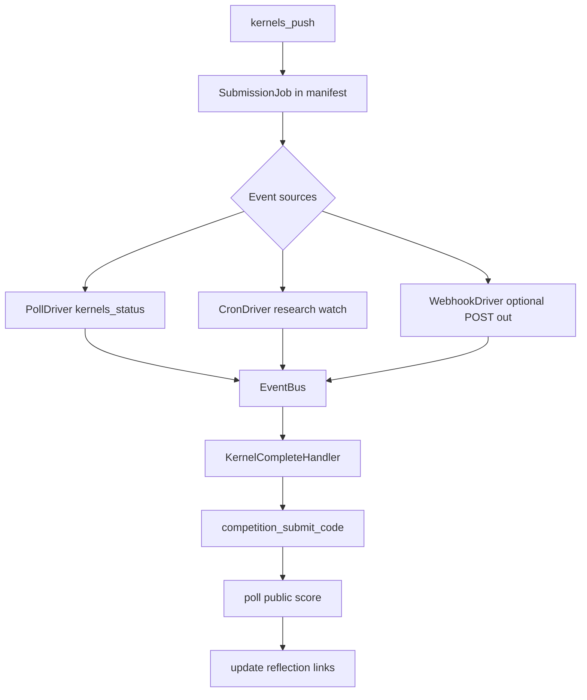

# Backlog — Future Work

Back to [MILESTONES.md](../MILESTONES.md).

Items here are **not scheduled** for the current kernel-submission slice (P1.5). They extend P1.5b once synchronous push/poll/submit is proven, or land in P2/P3.

---

## Async kernel submission watcher (event-driven)

**Problem:** Kernel-only competitions can run for **hours or days** on Kaggle (GPU queues, large image/text deep baselines, re-execution on submit). P1.5b will use **synchronous in-process polling** (`kernel_poll_timeout` in `configs/default.yaml`) — sufficient for smoke tests and short runs, not for production unattended multi-day jobs.

**Goal:** Detach after `kernels_push`, track job state out-of-band, and **resume the pipeline** when the kernel finishes (run complete → `competition_submit_code` → score poll → reflection update).

### Proposed UX

| Command | Purpose |
|---------|---------|
| `research submit --run-id <id>` | Push kernel + register async job; exit immediately with links |
| `research watch --run-id <id>` | Foreground watcher: poll Kaggle until kernel run completes, then finish submit |
| `research watch --run-id <id> --daemon` | Background watcher writing events to `runs/<id>/events.jsonl` |
| `research resume --run-id <id>` | Re-enter pipeline from last incomplete stage (including `awaiting_kernel`) |

After async push, CLI prints:

```
Kernel pushed — run may take hours or days.
Submissions: https://www.kaggle.com/competitions/<slug>/submissions
Kernel:      https://www.kaggle.com/code/<owner>/<slug>
Watch:       research watch --run-id <id>
```

Manifest / `submission_result.json` status progression:

```
kernel_pushed → kernel_running → kernel_complete → submitted → scored
```

### Event-driven architecture

Kaggle does **not** expose user-facing webhooks for kernel completion today. Design for **pluggable event sources** with polling as the default driver:



**Event types** (append to `runs/<id>/events.jsonl`):

| Event | Payload | Triggers |
|-------|---------|----------|
| `kernel.pushed` | slug, version, kernel_url | — |
| `kernel.running` | session_id, started_at | — |
| `kernel.complete` | exit_status, duration | `competition_submit_code` |
| `kernel.error` | message | manifest `failed`, notify webhook |
| `submission.scored` | public_score | reflection footer update |
| `watch.timeout` | elapsed | optional webhook, stay `kernel_running` |

**Webhook (outbound):** optional `webhook_url` in config or `--webhook-url` on watch/submit. LabPilot POSTs JSON on terminal events (`kernel.complete`, `kernel.error`, `submission.scored`). Enables Slack/Discord/CI integration without blocking the CLI.

**Webhook (inbound):** optional local `research events listen --port 8765` for external triggers (e.g. GitHub Action cron hits `/resume/<run_id>`). Low priority — polling driver covers v1.

### Data model (sketch)

```python
# runs/<id>/submission_job.json
{
  "run_id": "...",
  "competition": "aerial-cactus-identification",
  "submission_mode": "kernel",
  "kernel_slug": "owner/slug",
  "kernel_version": 3,
  "kernel_url": "https://www.kaggle.com/code/...",
  "submissions_url": "https://www.kaggle.com/competitions/.../submissions",
  "status": "kernel_running",
  "pushed_at": "2026-07-12T...",
  "last_polled_at": "2026-07-12T...",
  "poll_interval_seconds": 300,
  "webhook_url": null
}
```

### Implementation notes

- Reuse [`KaggleClient._poll_public_score`](../src/labpilot/kaggle/client.py) patterns for kernel session polling; separate timeouts: `kernel_poll_timeout` (short, P1.5b) vs `kernel_watch_max_age` (days, backlog).
- `upload_submission` stage splits: **sync path** (current plan) vs **async path** (sets `awaiting_kernel`, skips blocking poll).
- `research resume` already re-enters incomplete stages — extend manifest `StageStatus` or add substates for `upload_submission`.
- Reflection [`links.py`](../src/labpilot/reflection/links.py) footer updated when `submission.scored` fires (idempotent append).
- Tests: fake event bus + mock gateway; no live multi-day test required.

### Dependencies

- **Requires:** P1.5b kernel push + `competition_submit_code` + submission URLs in reflection (see [kernel-only submission plan](../../.cursor/plans/kernel-only_submission_ux_50f5004a.plan.md)).
- **Overlaps:** P2 remote runtime scheduling ([TODO.md](TODO.md)) — watcher can later dispatch to Colab/Kaggle notebook runtimes, not only post-train submit.

### Out of scope (for this backlog item)

- Kaggle-native inbound webhooks (not available).
- Running training remotely for days (P2 `--remote-train`).
- Auto-retry failed kernel runs without user `research resume`.

---

## Other backlog candidates

| Item | Notes |
|------|-------|
| Inbound webhook server | `research events listen` for external cron/CI |
| Notification plugins | Slack, email, ntfy.sh via webhook_url |
| Multi-run watch | `research watch --all` for all `kernel_running` jobs |
