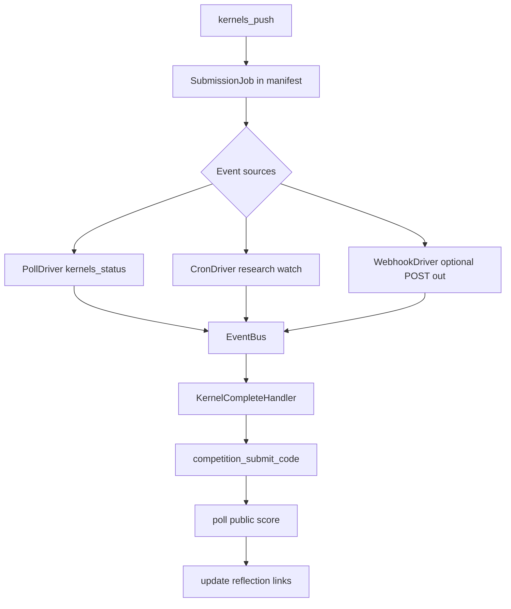

# Backlog — Future Work

Back to [MILESTONES.md](../MILESTONES.md).

Items here are **not scheduled** for the current milestone. Pick them up in follow-up PRs (P3.1, P2, etc.) when prioritised.

---

## Deferred from P3 v0.4 (explicitly out of scope)

These were intentionally excluded from the v0.4 iteration loop. Keep them here for future planning — do not expand v0.4 scope to include them without a new milestone slice.

| Item | Target / notes |
|------|----------------|
| **P2 remote runtimes / Colab / `--remote-train`** | **Config shipped in P2 v0.3 / P4** (`research runtime`, `configs/runtimes/`). **Execution** (dispatch, polling, sync) deferred — [TODO.md](TODO.md). |
| **AutoML / neural architecture search** | Full search over many configs or architectures; v0.4 uses a fixed 12-point LightGBM grid step only. |
| **LLM-generated arbitrary Python feature code** | v0.4 feature work is predefined recipes only (`target_encoding`, `log_numeric`), not free-form codegen. |
| **Multi-model ensembles** | Single model per run remains the default. |
| **Text/image template tuning** | Tabular-first in v0.4; extend `training_overrides` + tuner to text/image templates in **P3.1**. |
| **Kernel slug fix** | Done in P4 v1.0 — see [COMPLETED.md](COMPLETED.md). |
| **Packaging & PyPI** | Bundle templates/configs in wheel; `importlib.resources` path helper; PyPI publish workflow. Deferred post-1.0. |

**Related but already tracked elsewhere:**

- Async kernel watcher → [Async kernel submission watcher](#async-kernel-submission-watcher-event-driven) below
- Remote training-only (not submit) → overlaps P2 in [TODO.md](TODO.md)

---

## Async kernel submission watcher (event-driven)

**Problem:** Kernel-only competitions can run for **hours or days** on Kaggle (GPU queues, large image/text deep baselines, re-execution on submit). P1.5b will use **synchronous in-process polling** (`kernel_poll_timeout` in `configs/default.yaml`) — sufficient for smoke tests and short runs, not for production unattended multi-day jobs.

**Goal:** Detach after `kernels_push`, track job state out-of-band, and **resume the pipeline** when the kernel finishes (run complete → `competition_submit_code` → score poll → reflection update).

### Proposed UX

| Command | Purpose |
|---------|---------|
| `research submit --run-id <id>` | Push kernel + register async job; exit immediately with links |
| `research watch --run-id <id>` | Foreground watcher: poll Kaggle until kernel run completes, then finish submit |
| `research watch --run-id <id> --daemon` | Background watcher writing events to `runs/<id>/events.jsonl` |
| `research resume --run-id <id>` | Re-enter pipeline from last incomplete stage (including `awaiting_kernel`) |

After async push, CLI prints:

```
Kernel pushed — run may take hours or days.
Submissions: https://www.kaggle.com/competitions/<slug>/submissions
Kernel:      https://www.kaggle.com/code/<owner>/<slug>
Watch:       research watch --run-id <id>
```

Manifest / `submission_result.json` status progression:

```
kernel_pushed → kernel_running → kernel_complete → submitted → scored
```

### Event-driven architecture

Kaggle does **not** expose user-facing webhooks for kernel completion today. Design for **pluggable event sources** with polling as the default driver:



**Event types** (append to `runs/<id>/events.jsonl`):

| Event | Payload | Triggers |
|-------|---------|----------|
| `kernel.pushed` | slug, version, kernel_url | — |
| `kernel.running` | session_id, started_at | — |
| `kernel.complete` | exit_status, duration | `competition_submit_code` |
| `kernel.error` | message | manifest `failed`, notify webhook |
| `submission.scored` | public_score | reflection footer update |
| `watch.timeout` | elapsed | optional webhook, stay `kernel_running` |

**Webhook (outbound):** optional `webhook_url` in config or `--webhook-url` on watch/submit. LabPilot POSTs JSON on terminal events (`kernel.complete`, `kernel.error`, `submission.scored`). Enables Slack/Discord/CI integration without blocking the CLI.

**Webhook (inbound):** optional local `research events listen --port 8765` for external triggers (e.g. GitHub Action cron hits `/resume/<run_id>`). Low priority — polling driver covers v1.

### Data model (sketch)

```python
# runs/<id>/submission_job.json
{
  "run_id": "...",
  "competition": "aerial-cactus-identification",
  "submission_mode": "kernel",
  "kernel_slug": "owner/slug",
  "kernel_version": 3,
  "kernel_url": "https://www.kaggle.com/code/...",
  "submissions_url": "https://www.kaggle.com/competitions/.../submissions",
  "status": "kernel_running",
  "pushed_at": "2026-07-12T...",
  "last_polled_at": "2026-07-12T...",
  "poll_interval_seconds": 300,
  "webhook_url": null
}
```

### Implementation notes

- Reuse [`KaggleClient._poll_public_score`](../src/labpilot/kaggle/client.py) patterns for kernel session polling; separate timeouts: `kernel_poll_timeout` (short, P1.5b) vs `kernel_watch_max_age` (days, backlog).
- `upload_submission` stage splits: **sync path** (current plan) vs **async path** (sets `awaiting_kernel`, skips blocking poll).
- `research resume` already re-enters incomplete stages — extend manifest `StageStatus` or add substates for `upload_submission`.
- Reflection [`links.py`](../src/labpilot/reflection/links.py) footer updated when `submission.scored` fires (idempotent append).
- Tests: fake event bus + mock gateway; no live multi-day test required.

### Dependencies

- **Requires:** P1.5b kernel push + `competition_submit_code` + submission URLs in reflection (see [kernel-only submission plan](../../.cursor/plans/kernel-only_submission_ux_50f5004a.plan.md)).
- **Overlaps:** P2 remote runtime scheduling ([TODO.md](TODO.md)) — watcher can later dispatch to Colab/Kaggle notebook runtimes, not only post-train submit.

### Out of scope (for this backlog item)

- Kaggle-native inbound webhooks (not available).
- Running training remotely for days (P2 `--remote-train`).
- Auto-retry failed kernel runs without user `research resume`.

---

## Kernel submission reliability (P1.5b follow-up)

**Discovered during:** live retry on `aerial-cactus-identification` (2026-07-12).

**Symptoms:**
- Kaggle submissions page shows **0 submissions** after `research resume --submit`.
- First attempt silently recorded `kernel_pushed` with a guessed slug (no kernel on account).
- Retry with push validation surfaced: `Kaggle kernels_push failed: Invalid slug: 'aerial-cactus-identification-labpilot-baseline'`.

**Root causes (confirmed / suspected):**

| Issue | Detail |
|-------|--------|
| **Kernel metadata slug invalid** | `kernel-metadata.json` `id` uses `{competition-slug}-labpilot-baseline` (43 chars). Kaggle rejects this slug on push. Need shorter, slugified id aligned with `title` (Kaggle slugify rules). |
| **Missing `owner/slug` in metadata** | Exporter writes bare slug; should embed `username/slug` or rely on authenticated user with validated slug. |
| **False-success on push** | Addressed: check `push_response.error`, require URL/version before code-submit. |
| **Status poll gave up early** | Addressed: retry `kernels_status` until timeout; require `COMPLETE` before code-submit. |
| **Closed competition / API 403** | Earlier `competition_submit_code` returned 403; may be deadline or rules — separate from slug error. Re-test after slug fix. |

**Proposed fixes (defer to next PR):**

1. **`kernel/exporter.py`:** generate short slug, e.g. `{competition[:20]}-lp` or hash suffix; set `id` to `{username}/{slug}` when username known; slugify `title` to match `id`.
2. **`kaggle/client.py`:** `_validate_push_response` and poll retry landed; slug generation still open.
3. **Preflight:** surface `submissions_disabled` and kernels-only deadline limitations with actionable CLI message (link to rules page).
4. **Tests:** push response with `error` field; invalid slug metadata; slug length regression.
5. **Smoke:** re-run `aerial-cactus-identification --submit` after slug fix; document in `COMPLETED.md`.

**Workaround for users today:** manually push kernel via `kaggle kernels push` with a valid slug, then `research resume --submit` if `kernel_pushed` retry path works.

---

## Other backlog candidates

| Item | Notes |
|------|-------|
| **Graph database migration** | Keep SQLite SoR + logical Research Graph. Move to Neo4j/etc. **only if** SQL graph queries become a bottleneck. Design: [design/research-graph.md](../design/research-graph.md). |
| **Cross-competition shared knowledge** | Aggregate technique evidence across competitions by modality (e.g. SpecAugment ✓ audio / ✗ tabular, overall conf). Planner seeds new comps from shared priors. Local precursor: Evidence Card `reusable_for`. Design: [design/evidence-card.md](../design/evidence-card.md). |
| **P3.1 — tabular grid search (pick best)** | Train all grid combos and select best CV score (v0.4 only advances one grid step). |
| **P3.1 — text/image hyperparameter tuning** | Extend `improve --strategy tune` beyond tabular templates. |
| Inbound webhook server | `research events listen` for external cron/CI |
| Notification plugins | Slack, email, ntfy.sh via webhook_url |
| Multi-run watch | `research watch --all` for all `kernel_running` jobs |
