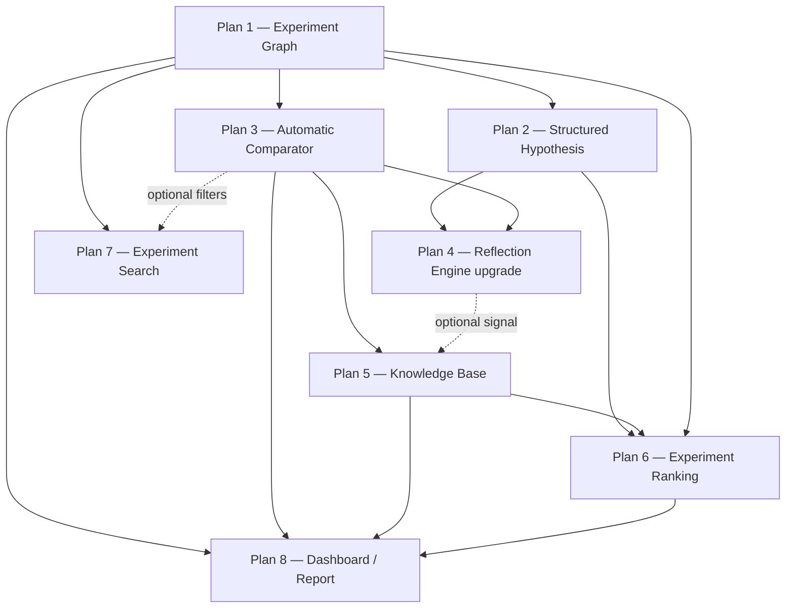

# Milestone 2 — Experiment Scientist

Back to [MILESTONES.md](../../MILESTONES.md).

**Status:** In progress — Plans 1–4 shipped, Plans 5–8 still design-only. This directory is the
architecture/design workspace for Milestone 2. Each `plan-N-*.md` is meant to be reviewed and
built independently, in order, as its own PR.

---

## 1. What this milestone is (and isn't)

LabPilot today (P0–P4) is a **linear pipeline**: one command runs a fixed DAG from competition
to submission to reflection, and `research improve` can fork one child run from one parent.
That proved the loop, but the system has no memory across experiments — it can't tell you
*why* run 41 beat run 38, or *what it has learned* about `SpecAugment` across five competitions.

Milestone 2 is about closing that gap:

```
Milestone 1 (shipped)              Milestone 2 (this doc)
──────────────────────             ───────────────────────────────
Execute one experiment       →     Manage many experiments like a research engineer

Competition                        Current State
   ↓                                   ↓
Research Brief                     Analyze Results
   ↓                                   ↓
Baseline                           Generate Hypotheses
   ↓                                   ↓
Training                           Prioritize
   ↓                                   ↓
Evaluation                         Execute
   ↓                                   ↓
Submission                         Compare
   ↓                                   ↓
Reflection                          Reflect
                                        ↓
                                    Update Knowledge
```

**There is still no planner.** `research run` / `research improve` remain the only ways an
experiment gets executed, and a human still decides which experiment to run next. Milestone 2
gives that human (and, later, a Milestone-3 planner) the memory, comparison, and ranking tools
to make that decision well — it does not make the decision autonomously.

### Guiding decisions (carried over from our discussion)

1. **No `agents/` package.** No multi-agent orchestration, no message-passing between LLM
   "roles." The system's nouns are `Experiment`, `Hypothesis`, `Evidence`/`Comparison`,
   `Knowledge` — not chats or prompts. The LLM is one reasoning component that reads/writes
   those objects, not the control flow.
2. **No LLM code generation.** Jinja2 templates remain the only way training code is produced.
   Nothing in this milestone touches `templates/` or asks an LLM to write `train.py`.
3. **LLM usage is scoped to exactly one place: the Reflection Engine (Plan 4).** Everywhere
   else — the graph, the comparator, the ranking — is deterministic engineering, matching the
   "no LLM required" framing for those tasks. The knowledge base (Plan 5) and hypothesis
   drafting (Plan 2) can *optionally* be enriched by the LLM output from Plan 4, but must work
   without it (mirrors the existing template-fallback pattern in `brief/` and `reflection/`).
4. **Evolve the existing repo, don't fork a new one.** We will **not** create a new top-level
   `research-engine/` project or rename the `labpilot` package. We add a new
   `src/labpilot/experiments/` subpackage (sibling to `improvement/`, `tracking/`,
   `reflection/`) and extend those existing modules in place. This is explicitly the
   "stick to current repo structure and evolve it" option from the brief, chosen because
   `tracking/`, `improvement/`, and `reflection/` already cover ~40% of what Milestone 2 asks
   for (see §3) — rewriting them would be pure churn.
5. **Artifacts over state, still.** Every new object (`Hypothesis`, `ExperimentComparison`,
   `KnowledgeEntry`) is a plain JSON file on disk, not a database. `Experiment` itself is not
   a new persisted file at all — it's assembled by reading the artifacts a run already
   produces (`manifest.json`, `experiment/record.json`, `metrics.json`, ...), so there is a
   single source of truth per field. This matches Design Principle #2 in `ARCHITECTURE.md`.

---

## 2. Repository shape after Milestone 2

```
src/labpilot/
├── experiments/                # NEW package — the aggregation/reasoning layer
│   ├── models.py                #   Experiment, ExperimentComparison, Hypothesis, KnowledgeEntry
│   ├── graph.py                 #   Plan 1 — assemble Experiments, parent/child traversal
│   ├── hypothesis.py            #   Plan 2 — hypothesis store, status transitions
│   ├── comparator.py            #   Plan 3 — deterministic A/B comparison + verdict
│   ├── knowledge.py             #   Plan 5 — cross-experiment knowledge base
│   ├── ranking.py               #   Plan 6 — candidate scoring
│   ├── search.py                #   Plan 7 — predicate search over the graph
│   └── report.py                #   Plan 8 — terminal + HTML dashboard
│
├── tracking/                   # UNCHANGED public API; diff_runs() becomes a thin
│                                #   backward-compatible wrapper around comparator.py (Plan 3)
├── improvement/                # EXTENDED — `--hypothesis <id>` wiring (Plan 2)
├── reflection/                 # EXTENDED — structured reflection.json (Plan 4)
├── report/                     # EXTENDED — reused for the HTML dashboard (Plan 8)
└── cli/main.py                 # EXTENDED — `experiments_app`, `hypothesis_app`

knowledge/                      # NEW top-level data directory, sibling to runs/
└── <competition-slug>/
    ├── hypotheses/
    │   ├── H-001.json
    │   └── H-002.json
    ├── knowledge_base.json
    └── dashboard.html           # generated on demand, not committed (gitignored like runs/)
```

Nothing under `runs/<run_id>/` is removed; Plan 3 adds one new artifact
(`runs/<run_id>/comparison.json`) and Plan 4 adds one new artifact
(`runs/<run_id>/reflection.json`) alongside the existing `reflection.md`.

---

## 3. What already exists that we're building on

| Milestone-2 ask | Already shipped as | Gap this milestone closes |
|---|---|---|
| Experiment object with parent/child | `improvement/fork.py` sets `parent_run_id`/`iteration` in `manifest.json`; `tracking/index.py:scan_runs` reads it | No `children` reverse-index, no graph traversal/visualization, no `git_commit`, single-parent-chain only ever exercised (Plan 1) |
| Config diff / metric diff between two runs | `tracking/index.py:diff_runs` → `RunDiff` | No categorization (augmentation/model/training), no cost deltas, no verdict, computed on-demand only, not persisted (Plan 3) |
| Post-run recommendations | `reflection/generator.py` → `reflection.json` + rendered `reflection.md` (Plan 4 shipped) | — |
| "What should I try next" plan | `improvement/planner.py` → `ImprovementPlan` (LLM or `--strategy tune\|features`) | Produces a plan for **one specific child run about to execute**, not a ranked backlog of candidate ideas; no persistent hypothesis object; this stays as-is — Milestone 2 does not replace it (Plan 6 complements it) |
| Cross-run comparison CLI | `research runs diff --base --compare` | Kept as-is; becomes a thin wrapper over the new comparator (Plan 3) |

This table is why the milestone can be scoped as *extensions* rather than a rewrite.

---

## 4. Plan sequence and dependencies



| Order | Plan | Can start in parallel with | Delivers value standalone? |
|---|---|---|---|
| 1 | [Experiment Graph](plan-1-experiment-graph.md) | — (foundational) | Yes — `research experiments graph/show` |
| 2 | [Structured Hypothesis](plan-2-hypothesis.md) | Plan 1 | Yes — hypothesis tracking, even unused by anything else |
| 3 | [Automatic Comparator](plan-3-comparator.md) | Plan 2 | Yes — `research experiments compare` |
| 4 | [Reflection Engine upgrade](plan-4-reflection-engine.md) | — | Yes — structured `reflection.json`, hypothesis auto-update |
| 5 | [Knowledge Base](plan-5-knowledge-base.md) | — | Yes — `research experiments knowledge list` |
| 6 | [Experiment Ranking](plan-6-ranking.md) | — | Yes — `research experiments rank` |
| 7 | [Experiment Search](plan-7-search.md) | Can move to slot 2–3, low coupling | Yes — `research experiments search` |
| 8 | [Dashboard / Report](plan-8-dashboard-report.md) | — (capstone) | Composes everything — the milestone's "deliverable" |

Plan 7 has the fewest dependencies and could be pulled forward if we want an early, cheap win;
it's placed last only because it's less valuable until Plan 3's verdict/technique tags exist to
filter on.

---

## 5. CLI surface added by this milestone

Two new Typer sub-apps, following the existing `runs_app` / `workspace_app` / `runtime_app`
pattern in `cli/main.py`:

```
research experiments graph --competition <slug>            # Plan 1
research experiments show <run_id>                         # Plan 1
research experiments compare <base_id> <compare_id>        # Plan 3
research experiments knowledge list [--technique <tag>]    # Plan 5
research experiments rank --competition <slug>             # Plan 6
research experiments search --competition <slug> [filters] # Plan 7
research experiments report --competition <slug>           # Plan 8
research experiments dashboard --competition <slug>        # Plan 8 (HTML)

research hypothesis add --observation ... --prediction ... # Plan 2
research hypothesis list [--status testing]                # Plan 2
research hypothesis show <id>                               # Plan 2
```

`research runs diff`, `research improve`, `research run` all keep working unchanged; `improve`
gains one optional flag (`--hypothesis <id>`, Plan 2).

---

## 6. Non-goals (explicitly out of scope for Milestone 2)

These are called out in the brief as "later" and are deliberately **not** part of this
milestone, to keep each plan small and reviewable:

- **Planner / autonomous execution.** Ranking (Plan 6) produces a scored recommendation; a
  human still runs `research improve` to act on it. No auto-execution loop.
- **Experiment Specification → config generator.** The YAML-abstraction-over-Jinja idea from
  the broader discussion is real and good, but it's an extension of `codegen/` +
  `improvement/planner.py`, not of the experiment-memory system. Revisit alongside the
  Milestone-3 planner.
- **New top-level `research-engine/` project or package rename.** See decision #4 above.
- **Multi-competition knowledge transfer.** Knowledge base (Plan 5) is scoped per
  competition (`knowledge/<slug>/`) in v1; cross-competition transfer is a plausible Plan 5
  follow-up, not required to hit the milestone deliverable.
- **A query language / general `--where` parser** for Plan 7. v1 ships composable flag
  filters; a mini expression parser is called out as an explicit stretch option in that plan.

---

## 7. Milestone-closing deliverable

Once Plans 1, 3, 5, 6, 8 land, this should work:

```
$ research experiments report --competition birdclef-2026

BirdCLEF-2026 — 142 experiments, best cv_macro_f1 0.851

Top Discoveries
  SpecAugment   +0.010
  EMA           +0.006
  ConvNeXt      +0.012

Known Failures
  Large ViT
  Heavy CutMix
  Warmup > 10 epochs

Current Best Pipeline
  baseline → ConvNeXt → SpecAugment → EMA → Focal Loss → Pseudo Labels

Recommended Next
  Self-Distillation (expected +0.004, confidence 78%) — run:
  research improve --run-id 20260712-...-pseudo-labels --hypothesis H-014
```

Every line above is traceable to a real artifact on disk (an `Experiment`, a
`KnowledgeEntry`, a `Hypothesis`) — nothing here is free-text generated by an LLM at report
time.
