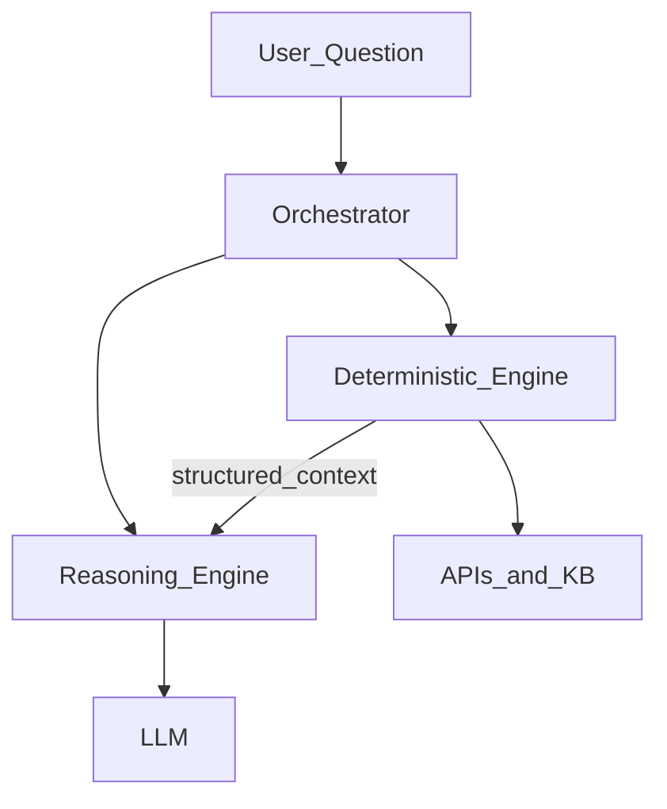
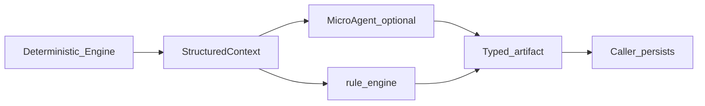
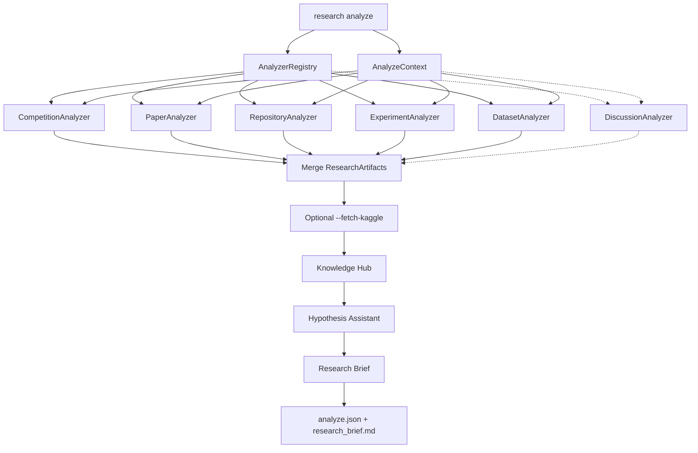
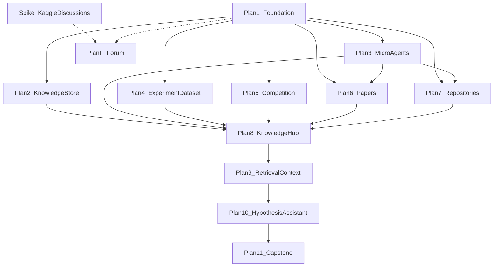

# Milestone 3 — Research Intelligence

Back to [MILESTONES.md](../../MILESTONES.md).

**Status:** Design Phase A locked; **Phase 1 (Plans 1–11) implemented.** Spike + Plan F
(Forum) remain future. Capstone gate: seeded fixture answers README §1 Q1–Q5 offline.
**Depends on:** Milestone 2 shipped (Plans 1–8). **Unlocks:** faster, better hypothesis
formation before any training code runs.

This directory is the architecture/design workspace for Milestone 3. Phase A is **this
README** plus the Knowledge System storage design
([knowledge-system.md](knowledge-system.md)). Phase B plans are the sequenced
`plan-N-*.md` files below — same ship-and-review style as Milestone 2.

---

## 1. What this milestone is (and isn't)

Milestone 1 shipped a **linear execution pipeline**. Milestone 2 shipped **local research
memory** — graph, hypotheses, comparator, reflection, knowledge base, ranking, search, and a
competition dashboard. Together they are a Research Execution Platform: you can run
experiments, remember what happened, and rank what to try next *from your own history*.

What they still cannot do: reduce the time to form a *good* hypothesis when you open a new
(or sparsely run) competition. That work today is manual — related Kaggle comps, writeups,
papers, GitHub repos — then you translate signal into `research hypothesis add` and
`research improve`.

Milestone 3 is about closing that gap:

```
Milestone 2 (shipped)                 Milestone 3 (this doc)
─────────────────────                 ───────────────────────
Local experiment memory          →    External + local research intelligence
Graph / compare / KB / rank      →    Analyze competition landscape
Human picks next experiment      →    Partner proposes ranked next experiments
Execute via run / improve        →    Still execute via run / improve (unchanged)
```

**There is still no autonomous planner and no LLM code generation.** `research run` /
`research improve` remain the only executors. A human still decides what to run. Milestone 3
gives that human a research partner that synthesizes external evidence *with* local M2 memory
so the next hypothesis is better and faster — it does not run the experiment for you.

### Capstone vision

```
$ research analyze birdclef-2026

Competition Summary
────────────────────────────

Related Competitions
    BirdCLEF 2025
    BirdCLEF 2024
    Rainforest Challenge

Relevant Papers
    (ranked by task · metric · domain · technique — not keywords alone)

Relevant Experiments
    Exp 12, Exp 19 (local) · related-comp runs when linked

Relevant Repositories
    12
    Top transfer: Focal Loss vs your CE (~20m, Medium gain)

Relevant Discussions
    (when Forum Intelligence provider available)

Relevant Failures
    Exp 14: mixup hurt rare classes
    Forum: soft-label misuse

Winning Solutions
    Status: Unavailable
    Reason: Not available through configured provider.

Interesting Forum Discussions
    (Forum Intelligence — providers after spike / GitHub Issues)
    Extract: mistakes · discoveries · dataset bugs · LB shakeups · OOD

Known Strong Techniques
    (see report sections — External vs Locally Validated)

External Recommendations
    SpecAugment, EMA, ConvNeXt          # Suggested — prior comps / papers only

Locally Validated
    (none yet — run improve to promote)

Potential Research Opportunities
    Better rare species handling
    Semi-supervised learning
    Teacher-student distillation

Suggested Next Experiments
    Top 10 — impact · confidence · evidence · effort
    (recommendations only — no autonomous planner)
```

Also writes canonical artifacts:

```text
knowledge/<slug>/research/reports/analyze.json
knowledge/<slug>/research/reports/research_brief.md
```

`research analyze` is the **understand the problem** command. Six products:

1. **Competition artifact** — profile + related comps
2. **Dataset artifact** — modality / shape / target / warnings (default on; stored in `knowledge.db`)
3. **Research artifacts** — papers, repos, experiments, and (opt-in) kernels/discussions
4. **Beliefs** — Knowledge Hub trust overlay
5. **Hypotheses** — new Suggested ideas only
6. **Research Brief** — durable briefing with these sections: problem summary, dataset
   overview, rules & metric, related papers, similar competitions, repositories, winning
   techniques, beliefs, top hypotheses, known risks, suggested next experiments

Kernels / discussions stay on `research fetch` by default. Pass `--fetch-kaggle` to pull
5 kernels by votes, 5 by score, and 5 discussions during analyze (then ingest/hypothesize/brief
see that evidence).

Terminal output is a **view**. JSON + Research Brief markdown are the **contracts**. Forum
Intelligence lands only when a discussion provider ships (Kaggle after spike, or GitHub
Issues earlier) — the rest of Milestone 3 does **not** wait on Kaggle access. No HTML in v1.

### Guiding decisions

1. **No autonomous `agents/` package** (no ReAct / memory / multi-step planners). Nouns are
   `ResearchArtifact`, `CompetitionIntelligence`, `Hypothesis` — not chats or roles.
   **Micro Agents** live in explicit folders (§11):
   `research_engine/intelligence/micro_agents/` and
   `research_engine/execution/micro_agents/` — each agent = `*Agent` class + `skill.md`.
   Optional: `input → prompt → typed artifact`. System must work with them disabled.
2. **No LLM code generation.** Jinja2 templates remain the only way training code is
   produced.
3. **Plugins first — content-type Analyzers, not website scrapers.** Think
   `CompetitionAnalyzer` / `PaperAnalyzer` / `RepositoryAnalyzer` / `DiscussionAnalyzer` /
   `ExperimentAnalyzer` — not `KaggleForumAnalyzer`. Kaggle (or Reddit, or GitHub Issues) is
   a *provider* behind a content-type interface.
4. **Prefer official APIs.** Use authenticated HTML only when the official API does not
   expose needed data **and** the approach complies with that site's Terms of Service.
5. **Fetch ≠ analyze.** Knowledge Extraction Pipeline
   ([knowledge-system.md](knowledge-system.md)): Raw → Normalizer → Extractor → Validator →
   Knowledge Store → Retrieval → Reasoning. Re-run extract without re-hitting APIs (`raw/`
   immutable).
6. **Artifacts over chat.** Durable store under `knowledge/<slug>/research/` (**local /
   gitignored**). Rollup: `research/reports/analyze.json`. Terminal renders JSON — not SoR.
   **No HTML in M3 v1.** See [knowledge-system.md](knowledge-system.md) + §11.
7. **Selective LLM (§2.4) + never remember / never search KB.** LLM only via optional Micro
   Agents **after** multi-stage retrieval (compressed typed context). Never free-form SoR;
   never LLM browses the store; works without Micro Agents (`rule_engine`).
8. **Feed Milestone 2, don't fork a backlog.** Suggested experiments become/update
   `Hypothesis` records and reuse `rank_candidates`. Provenance is modeled as
   `created_by` / `generator` / `origin` / evidence — **not** a single `source: llm|analyze`
   field (see §12.3).
9. **Evolve the existing repo.** Prefer
    `src/labpilot/research_engine/intelligence/`; reuse Execution Platform libraries under
    `research_engine/execution/` (e.g. experiments). Shared code lives in `common/`; CLI stays thin.
10. **Forum Intelligence is first-class design; Kaggle access is the spike.** Specify
    `DiscussionAnalyzer` + `ForumKnowledgeExtractor` + providers now (mistakes / discoveries /
    dataset bugs / LB shakeups / OOD). Ship Milestone 3 core on official APIs; investigate
    Kaggle discussion access separately. GitHub Issues may ship without waiting on Kaggle.
11. **Cross-competition evidence is a suggestion, not a belief.** External techniques enrich
    the intelligence report / hypotheses as **Suggested**; they never auto-write into the
    competition's accepted knowledge base. Only local experiment corroboration promotes
    status (see §12.4).
12. **Knowledge System storage** — [knowledge-system.md](knowledge-system.md): `raw/` ≠
    `extracted/` ≠ `knowledge/`; SQLite joins; multi-stage retrieve (optimizer, LLM last);
    not RAG chunk soup.

### Success criteria — end of Milestone 3 (north star)

The design-pass acceptance in §19 says the *architecture* is complete. This subsection is the
**product** definition of done: the questions a fully-shipped Milestone 3 (Plans 1–11) must be
able to answer. If the system answers these reliably, it has moved past an automation tool and
become a research collaborator.

| # | Question I should be able to ask | Answered by | Depends on |
|---|----------------------------------|-------------|------------|
| 1 | *What techniques consistently improve Macro F1 on imbalanced audio-classification tasks?* | Merged `Technique` **Knowledge Objects** whose evidence links to ≥N experiments with positive Macro-F1 deltas on that task/domain — symbolic join (`experiment_techniques` × metric × task/tag), not keyword search | Plans 4, 6–8, 9 |
| 2 | *Which winning BirdCLEF solutions used EMA?* | `WinningSolution` artifacts joined to the `EMA` technique. **Honesty bound:** with only `NullWinningSolutionProvider`, the answer is an explicit *Unavailable (no provider)*, plus any EMA usage evidenced from papers/repos — never a fabricated list | Plans 5–8, 9 (+ Future winning-solution provider) |
| 3 | *Show experiments where Focal Loss hurt performance.* | Local M2 experiment memory: `experiment_techniques` where technique = Focal Loss and metric delta < 0 (**failures are first-class**). Fully local → must be exact and deterministic | Plans 4, 9 |
| 4 | *Find GitHub implementations compatible with my current training pipeline.* | `RepositoryAnalyzer` catalog + `TransferOpportunity` diffs vs the current pipeline (effort · expected gain), not raw repo dumps | Plans 7, 9 |
| 5 | *Suggest five experiments with strong literature support that I haven't tried yet.* | Hypothesis Assistant: rank techniques with external evidence (papers/repos), **subtract already-tried** from local history, return top-N with expected impact · confidence · supporting evidence · effort — recommendations only | Plans 6–8, 9, 10 |

**What "reliably" means here (not vibes):**

- **Grounded** — every claim in an answer resolves to stored `ResearchArtifact` /
  Knowledge Object / experiment ids (provenance + evidence), never LLM recall (§2.4:
  *never remembers / never searches KB*).
- **Deterministic where it must be** — Q3 (local experiments) and the symbolic parts of
  Q1/Q2/Q4 come from SQLite joins; the LLM is the **last** step and only interprets the
  compressed typed context (`ResearchContext`).
- **Reproducible** — the same question over the same store yields the same evidence set;
  answers are reconstructible from `research/reports/analyze.json` (contract, not the
  terminal view).
- **Honest about gaps** — provider-gated facts (winning solutions, forum discussions)
  report `Unavailable` with a reason rather than guessing (Q2 today; Forum = Plan F).
- **Works with Micro Agents disabled** — the `rule_engine` fallback still returns the
  symbolic/evidence answer; LLM reasoning only sharpens phrasing and ranking.

These are validated at the end of Plan 11 (capstone) against a seeded fixture store so each
question has a known-good expected answer set.

---

## 2. Conceptual stack — Research Assistant

Product framing (what the user experiences), then how it maps to the plugin engine.

```
                    Research Assistant
                   (research analyze …)
                           │
      ┌────────────────────┼────────────────────┐
      ▼                    ▼                    ▼
 Literature          Competition          Repository
   Reader              Reader              Reader
      │                    │                    │
      │         ┌──────────┴──────────┐         │
      │         ▼                     ▼         │
      │   Experiment Reader    Dataset Reader   │
      │   (+ Forum / Blog /                     │
      │    Winning solution when available)     │
      └─────────┴──────────┬──────────┴─────────┘
                           ▼
                  Knowledge Extraction  ← hub (§7)
           Technique · Task · Problem · Benefit
           Evidence · Limitations · References
                           ▼
              Structured Knowledge Store
           [knowledge-system.md](knowledge-system.md): raw → extracted → knowledge
           + SQLite; Beliefs (§8)
           on-disk: knowledge/<slug>/research/
                           ▼
                 Multi-stage Retrieval (§9) → Reasoning
                           ▼
                 Hypothesis Assistant
              (top-10 recommendations only)
                           ▼
               research/reports/analyze.json
                    (+ terminal view)
```

### 2.1 Layer meanings

| Layer | Job |
|-------|-----|
| **Research Assistant** | Product / orchestrator — not an LLM “agent.” CLI selects plugins and runs the pipeline. |
| **Readers** | Raw → Normalizer into **`ResearchArtifact`** (§3.1) — paper, experiment, blog, repo, discussion, winning solution, … |
| **Knowledge Extractor** | Pipeline Extractor → Validator → Store ([knowledge-system.md](knowledge-system.md)); hub (§7) merges objects. |
| **Structured Knowledge Store** | `research/` + `knowledge.db` — **not** a vector DB. See [knowledge-system.md](knowledge-system.md). |
| **Retrieval + Reasoning** | **Multi-stage (§9):** Intent → Symbolic → … → Compression → LLM last. Never RAG-first; never LLM searches KB. |
| **Hypothesis Assistant** | **§10:** compressed retrieval + KB + graph + failures → top-10. **Recommendations only — no autonomous planner.** |

### 2.2 Mapping to plugins (what we actually build)

| Conceptual name | Milestone 3 implementation |
|-----------------|----------------------------|
| Research Assistant | `research_engine.intelligence` orchestrator + registry + `cli` |
| Literature Reader | `research_engine.intelligence` PaperAnalyzer + LiteratureProvider + PaperKnowledgeExtractor |
| Competition Reader | `research_engine.intelligence` CompetitionAnalyzer + capability providers |
| Repository Reader | `research_engine.intelligence` RepositoryAnalyzer + provider + extract + differ |
| Experiment Reader | `research_engine.intelligence` ExperimentAnalyzer (uses `execution.experiments`) |
| Dataset Reader | `research_engine.intelligence` DatasetAnalyzer |
| Discussion Reader | `research_engine.intelligence` DiscussionAnalyzer + providers + ForumKnowledgeExtractor — **not Phase 1 default** |
| Knowledge Extractor | hub under `research_engine.intelligence.knowledge` + synthesize |
| Knowledge Store | `knowledge/<slug>/research/` + `knowledge.db` ([knowledge-system.md](knowledge-system.md)) |
| Retrieval + Reasoning | `research_engine.intelligence` ResearchRetriever (§9) |
| Hypothesis Assistant | `research_engine.intelligence` HypothesisAssistant (§10) → execution HypothesisStore |

### 2.3 Where this diagram differs from a naïve reading

1. **Readers ≠ websites.** Same content-type rule: Literature/Competition/Repository are
   *kinds of reading*, implemented as Analyzers + providers — not `KaggleScraper` classes.
2. **Local memory is a Reader too.** Your three external readers are necessary but not
   sufficient; without Experiment/Dataset readers, M2 never enters the loop and belief
   promotion (§12.4) cannot work.
3. **“Knowledge Graph” / Research KB in v1 means layered structured memory, not Neo4j and
   not a vector database.** Milestone 3 stores Documents → Knowledge claims → Evidence links
   → Beliefs (§8). A vector index is a plausible **later** retrieval aid over Layer 1/2 —
   explicitly deferred as the system of record (same posture in non-goals).
4. **Research Assistant is not multi-agent.** One orchestrator, many plugins. No
   message-passing “roles.”
5. **Hypothesis Assistant does not execute.** It only drafts/ranks recommendations;
   `research improve` / `run` remain the executors. **No autonomous planner.**
6. **Order is slightly interleaved in code.** Per-source extract → hub upsert into explored
   intelligence folders → belief/hypothesis often runs in one synthesis pass, then persist
   `knowledge/<slug>/intelligence/{papers,…,techniques}/` + `analyze.json`. The diagram is
   the *mental model*; the plugin pipeline (§3) is the *implementation model*.

If we ever rename packages for clarity: `Reader` can be an alias for the fetch/normalize
half of `Analyzer`, with `extract_knowledge` as the extractor half — still one plugin
boundary so registration stays simple.

### 2.4 Selective LLM policy (locked)

**One of the biggest Milestone 3 design decisions.** Many agent frameworks call a chat model
for every task — slower, costlier, less reliable. For a research engineer we want the
opposite:

**Use deterministic code whenever possible. Use an LLM only where semantic understanding
or reasoning is required — and only after retrieval.**

The LLM is an **information extractor / normalizer / experiment reasoner**, not a chatbot.
Schema in → structured JSON out via **Micro Agents** (`*Agent` — § below). Never “summarize
this paper/repo.”

**Fallback / optional Micro Agents:** The product **must work without Micro Agents** (and
without an LLM). Deterministic Engine alone ships fetch → cache → normalize → store →
retrieve → rank → terminal / `analyze.json`. Every Yes path must also work with
`generator=rule_engine` / templates when no LLM is configured (same pattern as brief /
reflection). Micro Agents **upgrade** semantic quality when enabled; they are never a
hard dependency for `research analyze`.

#### Preferred architecture

```
                User Question
                      │
                      ▼
              Orchestrator
                      │
        ┌─────────────┴─────────────┐
        ▼                           ▼
Deterministic Engine         Reasoning Engine
        │                           │
        ▼                           ▼
 APIs / Database / KB            LLM
```

| Layer | LabPilot |
|-------|----------|
| Orchestrator | `research_engine.intelligence` orchestrator (+ execution for run/reflect) |
| Deterministic Engine | providers, profiler, comparator, retriever, KB I/O, rank formula |
| Reasoning Engine | **Optional** Micro Agents (`*Agent`) — extractors / concept normalize / Hypothesis Assistant / reflection / rollup (`common.llm`); absent → `rule_engine` |

**Hard rule:** The LLM **never** talks directly to Kaggle, GitHub, or arXiv. It **never
searches the knowledge base** and **never remembers** prior chats as SoR. It only sees typed
**`ResearchContext`** (L1–L3) from the **Context Builder** after multi-stage retrieve +
compress ([knowledge-system.md](knowledge-system.md)). Knowledge Engine is the center.



#### Classification matrix

| Module | LabPilot component | LLM? | Reason |
|--------|-------------------|------|--------|
| Competition parser | `CompetitionAnalyzer` / `CompetitionParser` | **No** | Kaggle structured info — parse with code |
| Dataset profiler | `DatasetAnalyzer`, Pandas, NumPy | **No** | Statistics, plots, distributions are deterministic |
| Paper search | `LiteratureProvider` search/enrich/attach | **No** | APIs and keyword search |
| GitHub search | `RepositoryProvider` search/fetch | **No** | GitHub search/API is deterministic |
| Forum scraping | `DiscussionProvider` search/fetch | **No** | Pure retrieval |
| Embedding generation | optional later retrieval signal | **No** | Embedding models, not chat models |
| Research Retrieval | `ResearchRetriever` | **No** | Faceted match over KB |
| Comparator numeric diffs | M2 comparator | **No** | Deterministic CV/LB numbers |
| Experiment prioritization (v1) | `rank_candidates` | **No** (formula); later Hybrid explain ok | Explicit score — more reproducible |
| Knowledge extraction | `PaperKnowledgeExtractor`, `ForumKnowledgeExtractor`, hub | **Yes** | Understanding and abstraction |
| Research summarization / rollup | synthesize across artifacts | **Yes** | Condenses many sources into insights (not doc TL;DRs) |
| Repository analysis | `RepoKnowledgeExtractor` + `RepoDiffer` | **Yes** | Explains architectures and patterns |
| Hypothesis generation | `HypothesisAssistant` | **Yes** | Creative reasoning over evidence |
| Reflection | M2 `reflection/` | **Yes** | Interpreting experiment outcomes |
| Paper understanding | `PaperKnowledgeExtractor` | **Yes** | Flagship — structured extract (§ below) |
| GitHub repo understanding | `RepoKnowledgeExtractor` | **Yes** | Flagship — structured card (§ below) |
| Knowledge normalize | `KnowledgeMerger` | **Yes** | Flagship — concept clustering (§ below) |

#### Hard No (never LLM)

| Task | Never | Use instead |
|------|-------|-------------|
| Parsing Kaggle | Never | Deterministic parsing |
| Reading CSVs | Never | Pandas |
| Computing statistics | Never | NumPy / profiler |
| Searching papers | No | APIs first — LLM only **after** retrieval |
| GitHub / forum search | No | Official APIs / providers |
| Ranking experiments | Initially no | Explicit score (below) |
| Direct LLM → Kaggle / GitHub / arXiv | Forbidden | Structured context from Deterministic Engine |

```text
score = (
    expected_gain * 0.5 +
    confidence   * 0.2 -
    runtime      * 0.1 -
    gpu_cost     * 0.2
)
```

Much more reproducible than asking an LLM to pick the best experiment. Optional later:
LLM may *explain* tradeoffs among top-K — it must **not** replace this score as the system
of record for v1 ordering.

#### Flagship Yes patterns (after deterministic context exists)

**1. Paper Understanding** (`PaperAnalyzerAgent`) — Do **not** ask “Summarize this paper.”
The LLM is an **information extractor**, not a chatbot.

Ask extraction questions, e.g.:

- Main contribution
- Novel techniques
- Training tricks
- Loss functions
- Dataset assumptions
- Limitations
- Ideas worth testing

Output **structured JSON** (validate against schema; reject free-form chat):

```json
{
  "techniques": ["SpecAugment", "EMA", "Pseudo Labels"],
  "limitations": ["Requires large batch sizes"],
  "hypotheses": ["Technique may improve rare class recall"]
}
```

Maps to `PaperKnowledge` (contributions / methods / limitations / ideas_worth_testing) +
Suggested hyp seeds (`origin=paper`). See §4.

**2. GitHub Repository Understanding** (`RepositoryAnalyzerAgent`) — Point at a winning
Kaggle repo. Deterministic fetch first; LLM produces a structured card (saves hours of
manual file reading):

```text
Architecture
    ConvNeXt Tiny

Interesting Components
    SpecAugment
    Mixup
    EMA
    Custom Sampler

Files Worth Reading
    dataset.py
    loss.py
    augment.py

Estimated Integration Difficulty
    Easy
```

Maps to `RepoKnowledge` + `TransferOpportunity.effort`. Do **not** ask “Summarize this
repository.” See §5.

**3. Knowledge Extraction (normalize)** (`ConceptNormalizerAgent`) — Five papers may
mention related strings that rules cannot reliably unify:

```text
SpecAugment
Time Masking
Frequency Masking
Random Erasing
        ↓  LLM normalize
common concept: spectrogram / input augmentation
  (canonical technique id + aliases)
```

Merge evidence into one `KnowledgeClaim`. Hard with rules alone. See §7 / §8.

**4. Experiment Reflection** (`ReflectionGeneratorAgent`) — Deterministic comparator
inputs, LLM diagnosis:

```text
Given:
  Experiment 42
  CV: +0.012
  LB: -0.006
  Changes: Mixup, EMA

LLM might infer:
  The cross-validation strategy likely doesn't match the hidden test distribution.
  Consider GroupKFold or time-aware validation before discarding EMA.
```

→ `reflection.json` + Suggested hyps. Still no auto-run. Comparator stays deterministic (§2.4 No).

#### Example workflow (BirdCLEF)

Expensive reasoning only after evidence is gathered:

| Step | Engine | Action |
|------|--------|--------|
| 1 | Deterministic | Search papers → returns ~40 papers |
| 2 | Deterministic | Download metadata (cache) |
| 3 | **LLM** | Extract techniques (structured JSON — not summarize) |
| 4 | Deterministic | Store in knowledge base (`papers/`, `techniques/`, …) |
| 5 | **LLM** | Find interesting connections / normalize concepts |
| 6 | Deterministic | Store hypotheses (Suggested only) |

```text
Search (Det) → Metadata (Det) → Extract (LLM) → Store (Det)
    → Connections (LLM) → Hypotheses (Det)
```

#### Micro Agents (locked)

**Optional, not required.** Analyzers, providers, KB, retrieval, ranking, and
`analyze.json` must succeed with Micro Agents disabled or unconfigured. Without them the
system still produces useful explored intelligence via deterministic parse / heuristics /
`rule_engine` templates — thinner semantic depth, same pipeline and typed schemas.

**Micro Agents are not autonomous agents.** When enabled, they are tiny specialized
reasoning functions inside the Reasoning Engine:

```text
input → prompt → typed artifact (structured output)
```

| Property | Micro Agent | Forbidden |
|----------|-------------|-----------|
| Required for `research analyze` | **No** — optional upgrade | Hard dependency on LLM / Agents |
| Memory / planning / loops | **No** | ReAct, scratchpads, multi-step planners |
| Primary output | **Typed Pydantic artifacts** | Free-form assistant prose as system of record |
| Network | **No** | Direct Kaggle / GitHub / arXiv calls |
| Side effects | **No** (caller persists) | Self-writing KB / auto-run |

**Package layout (locked):** each Micro Agent is a small package under the platform that owns
it — **Agent class + `skill.md`** (prompt / behavior contract; not free-form chat memory).

```text
src/labpilot/research_engine/
  intelligence/micro_agents/     # Research Intelligence reasoners
    __init__.py
    base.py                      # MicroAgent Protocol
    paper_analyzer/
      agent.py                   # PaperAnalyzerAgent
      skill.md
    repository_analyzer/
      agent.py                   # RepositoryAnalyzerAgent
      skill.md
    forum_analyzer/
      agent.py
      skill.md
    hypothesis_generator/
      agent.py
      skill.md
    concept_normalizer/
      agent.py
      skill.md
    experiment_reviewer/
      agent.py
      skill.md
  execution/micro_agents/        # Execution Platform reasoners (M2 reflection, etc.)
    __init__.py
    base.py                      # shared Protocol or re-export from common
    reflection_generator/
      agent.py                   # ReflectionGeneratorAgent
      skill.md
```

`skill.md` describes inputs, output schema, and prompt skeleton for that agent. Analyzers /
orchestrators call `micro_agents.*.agent`; extract modules may thin-wrap or delegate here.
Shared LLM client stays in `common/llm/`.

**Naming — always `*Agent` suffix.** Analyzer **plugins** (`PaperAnalyzer`, …) stay in
`analyzers/` (fetch / cache / normalize / orchestrate). Micro Agents are the Reasoning Engine
slice only:

| Micro Agent | Package | Emits (typed) |
|-------------|---------|---------------|
| `PaperAnalyzerAgent` | `intelligence/micro_agents/paper_analyzer/` | `PaperKnowledge` / technique findings |
| `RepositoryAnalyzerAgent` | `intelligence/micro_agents/repository_analyzer/` | `RepoKnowledge` + effort fields |
| `ForumAnalyzerAgent` | `intelligence/micro_agents/forum_analyzer/` | `ForumKnowledge` |
| `HypothesisGeneratorAgent` | `intelligence/micro_agents/hypothesis_generator/` | `Hypothesis` draft fields |
| `ConceptNormalizerAgent` | `intelligence/micro_agents/concept_normalizer/` | canonical + aliases |
| `ExperimentReviewerAgent` | `intelligence/micro_agents/experiment_reviewer/` | review / diagnosis artifact |
| `ReflectionGeneratorAgent` | `execution/micro_agents/reflection_generator/` | structured reflection fields |

**LLM as a structured reasoning engine.** Do **not** let LLMs emit free-form text as the
primary output. Every reasoning step **populates typed artifacts**. Illustrative shapes
(align / extend existing models):

```python
class Technique(BaseModel):
    name: str
    category: str
    evidence: list[str]
    confidence: float


class Hypothesis(BaseModel):  # M3 draft shape — maps to M2 Hypothesis store
    observation: str
    prediction: str
    rationale: str
    expected_impact: float


class ResearchFinding(BaseModel):
    source: str
    finding: str
    applicability: list[str]
```

The LLM’s job is to **fill these structures** (plus existing `PaperKnowledge`,
`RepoKnowledge`, `ForumKnowledge`, `KnowledgeClaim`). That yields:

- Deterministic downstream processing
- Easier evaluation
- Better search and retrieval
- Versionable knowledge
- Ability to swap LLMs without changing the rest of the system

Closer to a production-quality autonomous ML research system than treating the LLM as an
all-purpose assistant.



**Contract:**

```python
class MicroAgent(Protocol):
    name: str  # e.g. "PaperAnalyzerAgent"

    def run(self, context: StructuredContext) -> BaseModel:
        """prompt → LLM|rule_engine → validate typed artifact."""
```

Callers always persist the same typed schemas whether filled by a Micro Agent, by
`rule_engine`, or by deterministic heuristics — so downstream code does not branch on
“was an Agent present?”

Flagship Yes paths above are implemented as these Micro Agents when available (e.g. Paper
Understanding → `PaperAnalyzerAgent`; GitHub card → `RepositoryAnalyzerAgent`; concept
normalize → `ConceptNormalizerAgent`; Experiment Reflection → `ReflectionGeneratorAgent`);
otherwise the same extractors use `rule_engine` / heuristics.

---

## 3. Architecture: Analyzer plugins

**Do not think of Milestone 3 as “a CLI with subcommands.”** Think of it as a **plugin
pipeline over content types**:

```
Analyzer (interface)
    ├── CompetitionAnalyzer     # metadata, related comps, leaderboard (official APIs)
    ├── PaperAnalyzer           # LiteratureProvider chain (S2 → OpenAlex → arXiv → HF)
    ├── RepositoryAnalyzer      # GitHub API + extract + diff vs local (name = "repositories")
    ├── ExperimentAnalyzer      # local M2 graph / KB / hypotheses
    ├── DatasetAnalyzer         # profile / competition.json / data shape
    ├── DiscussionAnalyzer      # Forum Intelligence — providers; NOT in M3 Phase 1 default
    └── … YouTubeAnalyzer later
```

`research analyze` is a thin orchestrator: resolve competition → build `AnalyzeContext` →
select analyzers → run each → optional `--fetch-kaggle` → upsert **all** artifacts into
`knowledge.db` (including dataset + experiment) → Knowledge Hub → Hypothesis Assistant →
Research Brief → write `analyze.json` + `research_brief.md`.



Dotted edges = post-spike / optional (`DiscussionAnalyzer` not in Phase 1 default set).
`--fetch-kaggle` uses `KaggleFetchService` (same as `research fetch`) with fixed limits
5 / 5 / 5 — it does not enable `DiscussionAnalyzer`.

### 3.1 Internal data model: `ResearchArtifact`

**Most important abstraction.** Every paper, experiment, blog, GitHub repo, forum thread,
winning solution, or note becomes a **`ResearchArtifact`** — same interface. Downstream
code (KB upsert, multi-stage retrieval, Hypothesis Assistant) does not special-case
providers. Typed extras live in `metadata` / `payload`. Full storage contract:
[knowledge-system.md](knowledge-system.md).

```python
class ResearchArtifactType(str, Enum):
    PAPER = "paper"
    EXPERIMENT = "experiment"
    BLOG = "blog"
    REPOSITORY = "repository"
    DISCUSSION = "discussion"       # forum thread / GitHub issue / Reddit
    NOTE = "note"                   # manual / imported note
    COMPETITION = "competition"     # related-comp or profile slice
    WINNING_SOLUTION = "winning_solution"
    DATASET = "dataset"
    MODEL = "model"                 # architecture / checkpoint refs


class ResearchArtifact(BaseModel):
    """Universal research object — one schema for every source kind."""

    id: str                         # stable: paper:…, exp:14, repo:owner/name, …
    type: ResearchArtifactType
    source: str                     # semantic_scholar | github | m2 | kaggle | reddit | user | …
    title: str = ""                 # human label (also mirrored in metadata if useful)
    metadata: dict[str, Any] = Field(default_factory=dict)  # type-specific extras
    summary: str = ""               # short card — NOT a full-document TL;DR
    techniques: list[str] = Field(default_factory=list)
    models: list[str] = Field(default_factory=list)
    datasets: list[str] = Field(default_factory=list)
    claims: list[str] = Field(default_factory=list)
    references: list[str] = Field(default_factory=list)    # related artifact ids / evidence
    confidence: float = Field(ge=0.0, le=1.0, default=0.5)
    competition_slug: str | None = None
    # Deprecated aliases during migration — prefer fields above:
    # concepts → metadata/tags; evidence → references; payload → metadata
    concepts: list[str] = Field(default_factory=list)
    evidence: list[str] = Field(default_factory=list)
    payload: dict[str, Any] = Field(default_factory=dict)
```

| Field | Role |
|-------|------|
| `id` | Stable join key into KB / evidence links / hyp refs |
| `type` | paper / repository / discussion / experiment / winning_solution / … |
| `source` | Where it was fetched or created |
| `metadata` | Type-specific extras |
| `summary` | Short card blurb — **forbidden:** chapter-style dumps |
| `techniques` / `models` / `datasets` | Structured tags for joins + pipeline-diff |
| `claims` | Extracted claim strings → merge into knowledge objects |
| `references` | Related artifact ids / evidence links |
| `confidence` | Trust in this artifact’s extract |

```
Paper ──┐
Experiment ──┤
Blog ──┼──→ ResearchArtifact ──→ extracted/ + knowledge.db / retrieval / hypotheses
GitHub repo ──┤
Forum thread ──┤
Winning solution ──┤
Note ──┘
```

Analyzer return batch (plural) wraps the common unit:

```python
class ResearchArtifacts(BaseModel):
    """One analyzer’s emission — a bag of ResearchArtifact (+ soft-fail notes)."""

    analyzer: str
    items: list[ResearchArtifact] = Field(default_factory=list)
    notes: list[str] = Field(default_factory=list)
    techniques: list[str] = Field(default_factory=list)      # rollup convenience
    opportunities: list[str] = Field(default_factory=list)
```

`EvidenceItem` (if kept) is a **deprecated alias** of `ResearchArtifact` during migration —
new code uses `ResearchArtifact` only.

### 3.2 Core interface

```python
class Analyzer(Protocol):
    """One pluggable research-intelligence content type."""

    name: str
    # Stable id: "competition", "papers", "repositories", "experiments",
    # "dataset", "discussions", …
    default_enabled: bool  # DiscussionAnalyzer starts False until a provider ships

    def analyze(self, context: AnalyzeContext) -> ResearchArtifacts:
        """Read cache / M2 / call providers. Soft-fail → empty artifacts + notes."""
```

```python
class AnalyzeContext(BaseModel):
    competition: str
    runs_dir: Path
    knowledge_dir: Path
    refresh: bool = False
    competition_spec: CompetitionSpec | None = None
```

**Independence rule:** an analyzer must not call other analyzers. It may use its own
providers, caches, and M2 libraries.

### 3.3 Fetch / cache / normalize / analyze (mandatory split)

Do **not** couple network I/O to LLM extraction in one shot:

```
Fetch  →  Cache (local)  →  Normalize  →  Analyze / extract knowledge  →  ResearchArtifacts
```

Benefits:

- Re-run improved prompts without re-hitting Kaggle/GitHub/OpenAlex.
- Reproducible pipelines (analyze from disk).
- Rate-limit and ToS pressure stays on the fetch layer only.

`--refresh` means “re-fetch into cache”; default analyze prefers cache when fresh enough.

### 3.3 Registry

```python
class AnalyzerRegistry:
    def register(self, analyzer: Analyzer) -> None: ...
    def get(self, name: str) -> Analyzer: ...
    def list(self) -> list[Analyzer]: ...
    def select(
        self,
        *,
        only: str | None = None,
        include: set[str] | None = None,
        exclude: set[str] | None = None,
    ) -> list[Analyzer]: ...
```

Default bare `research analyze <slug>` runs analyzers with `default_enabled=True`.

### 3.4 Built-in analyzers

| Analyzer `name` | Phase | Responsibility | Providers / inputs |
|-----------------|-------|----------------|--------------------|
| `competition` | **M3 Phase 1** | Metadata, dataset, rules, evaluation, timeline, related comps, leaderboard; winning solutions via provider (often unavailable) | Kaggle API + capability providers (see §3.5) |
| `papers` | **M3 Phase 1** | Relevant literature | `LiteratureProvider` chain: Semantic Scholar → OpenAlex → arXiv → Hugging Face Papers |
| `repositories` | **M3 Phase 1** | Useful code repos + extract + diff vs local | `RepositoryProvider` (GitHub API) + `RepoKnowledgeExtractor` + `RepoDiffer` |
| `experiments` | **M3 Phase 1** | Local M2 graph / KB / hypothesis backlog | `experiments/*` |
| `dataset` | **M3 Phase 1** | Profile / contract / data-shape signals | `competition.json`, `profile.json` |
| `discussions` | **Spike → Future** | Forum Intelligence: mistakes / discoveries / dataset bugs / LB shakeups / OOD | Providers: Kaggle (after spike), GitHub Issues, Reddit, blogs |

**Never** ship a top-level `KaggleForumAnalyzer`. Kaggle is one `DiscussionProvider`
behind `DiscussionAnalyzer`. Downstream of `PaperAnalyzer` never sees Semantic Scholar vs
OpenAlex — only normalized `ResearchArtifact` objects (`type=paper`, payload may hold `Paper`).

### 3.5 Competition Intelligence (CompetitionAnalyzer) — Kaggle expert

This is the **Competition Reader** in §2: turn a competition identity into a structured
“what am I solving?” brief that the rest of the Research Assistant can trust.

#### Input

| Accepted | Normalized to |
|----------|----------------|
| Competition slug (`birdclef-2026`) | slug |
| Competition URL (`https://www.kaggle.com/competitions/birdclef-2026`) | slug (parse path) |

CLI already takes a slug; URL support is a thin normalize step in `AnalyzeContext` building
(no second entrypoint).

#### Target outputs (capability checklist)

Each row is a **capability** with `CapabilityResult` (`ok` | `unavailable` | `error`) — same
pattern as winning solutions. Never pretend we know a field we did not resolve.

```python
class CapabilityResult(BaseModel):
    """Explicit availability — never silent empty lists for unsupported capabilities."""

    available: bool
    status: Literal["ok", "unavailable", "error"] = "unavailable"
    reason: str = ""
    items: list[ResearchArtifact] = Field(default_factory=list)
```

| Capability | What “ok” means | Phase 1 source | Notes |
|------------|-----------------|----------------|-------|
| **Metadata** | title, slug, category, tags, description | Kaggle API + existing `CompetitionParser` | Strong today |
| **Dataset (catalog)** | train/test presence, file patterns, size hints, modality | API + rules/data pages when available; else local `competition.json` / profile | Distinct from deep EDA (`DatasetAnalyzer`) |
| **Metric** | name, direction, canonical key, description | API + `normalize_metric` (**deterministic only** — no LLM enrich; §2.4) | Strong today |
| **Rules** | rules excerpt / URL; structured constraints extracted when possible | `rules_url` + existing rules fetch | Prefer structured fields over raw dump |
| **Constraints** | daily submission limit, team size, code/sharing rules (as available) | API (`max_daily_submissions`) + rules extract | Soft-fail → unavailable fields |
| **Timeline** | deadline, launch, whether closed | API deadline + `submissions_disabled` | Strong for deadline |
| **Submission format** | csv vs kernel, columns, sample shape | `submission_mode`, patterns, sample submission when local | Strong for mode |
| **Allowed external data** | whether external datasets / pretrained weights allowed | Rules extract → structured `external_data_policy` | **Gap today** — must be an explicit field |
| **Inference limits** | kernel runtime, CPU/GPU, internet, package constraints | Rules / kernel docs when available | **Gap today** — `unavailable` until provider can fill |
| **Leaderboard** | public LB snapshot / metric if API exposes | Official API only | Often unavailable → say so |
| **Previous editions** | prior years in the same series (BirdCLEF 2025/2024) | Related-competition provider (series/title match) | Part of related comps |
| **Related / similar competitions** | Rainforest, Whale, ESC-50, AudioSet, … | RelatedCompetitionProvider (below) | High value — design required |
| **Winning solutions** | writeups / top approaches | `WinningSolutionProvider` | Usually **unavailable** in v1 |

Reuse Milestone 1 `CompetitionParser` / `CompetitionSpec` as the **fetch/normalize** base;
CompetitionAnalyzer **extends** that into a research brief (`CompetitionProfile`) rather than
re-implementing parse.

#### Split: CompetitionAnalyzer vs DatasetAnalyzer

| Concern | Owner |
|---------|--------|
| What Kaggle *says* about the data (policy, files, modality, external data allowed) | **CompetitionAnalyzer** |
| What we *observed* after download (dtypes, leakage hints, class balance, profile.md) | **DatasetAnalyzer** |

Both feed synthesis; they must not duplicate. If no local run exists yet, DatasetAnalyzer
soft-fails or uses cache; CompetitionAnalyzer still runs from slug alone.

#### Related / similar competitions (high value)

```
BirdCLEF-2026
    → BirdCLEF 2025 / 2024     (same series — previous editions)
    → Rainforest / Whale       (bioacoustic / soundscape peers)
    → ESC-50 / AudioSet        (audio classification benchmarks)
```

```python
class RelatedCompetition(BaseModel):
    slug: str
    title: str
    relation: Literal["previous_edition", "similar_domain", "similar_metric", "similar_modality", "other"]
    score: float = Field(ge=0.0, le=1.0, default=0.5)
    rationale: str = ""
    tags_overlap: list[str] = Field(default_factory=list)


class RelatedCompetitionProvider(Protocol):
    def find(self, competition: str, *, context: AnalyzeContext) -> CapabilityResult:
        """Return RelatedCompetition items (as ResearchArtifact or typed payload)."""
```

**v1 similarity signals (deterministic first, no scrape required):**

1. Title/series prefix (`birdclef-2026` ↔ `birdclef-2025`)
2. Shared Kaggle tags / category
3. Same problem modality (audio / image / tabular) from tags + `problem_type`
4. Similar evaluation metric family
5. Optional: seed list / YAML overrides under `configs/competitions/` for known families

After deterministic recall, an LLM may *explain* related-comp relevance — it must not be the
only recall path (§2.4). Results are **Suggested** external context (§12.4), not local KB facts.

#### Normalized competition profile (into `analyze.json`)

```python
class ExternalDataPolicy(BaseModel):
    status: Literal["ok", "unavailable", "error"] = "unavailable"
    allowed: bool | None = None          # None if unknown
    pretrained_weights: bool | None = None
    notes: str = ""


class InferenceLimits(BaseModel):
    status: Literal["ok", "unavailable", "error"] = "unavailable"
    runtime_notes: str = ""
    hardware_notes: str = ""
    internet_allowed: bool | None = None
    notes: str = ""


class CompetitionProfile(BaseModel):
    """Kaggle-expert brief — canonical competition section of analyze.json."""

    slug: str
    title: str = ""
    url: str = ""
    metadata: dict[str, Any] = Field(default_factory=dict)
    metric: MetricSpec | None = None
    problem_type: str | None = None
    rules_excerpt: str = ""
    constraints: dict[str, Any] = Field(default_factory=dict)
    timeline: dict[str, Any] = Field(default_factory=dict)
    submission: dict[str, Any] = Field(default_factory=dict)
    external_data: ExternalDataPolicy = Field(default_factory=ExternalDataPolicy)
    inference_limits: InferenceLimits = Field(default_factory=InferenceLimits)
    dataset_catalog: CapabilityResult | None = None
    leaderboard: CapabilityResult | None = None
    winning_solutions: CapabilityResult | None = None
    previous_editions: list[RelatedCompetition] = Field(default_factory=list)
    related_competitions: list[RelatedCompetition] = Field(default_factory=list)
    capability_notes: list[str] = Field(default_factory=list)
```

Terminal should read like an expert brief, e.g.:

```text
Competition: birdclef-2026
Metric: … (maximize/minimize)
Submission: csv | kernel
Deadline: …
External data: unavailable | allowed/disallowed + notes
Inference limits: unavailable | …

Previous editions
  birdclef-2025  (previous_edition)
  birdclef-2024  (previous_edition)

Similar competitions
  rainforest-connection  (similar_modality) — …
  … 
```

#### Will current design meet expectation?

| Expectation | Meet? | Action in design |
|-------------|-------|------------------|
| Dataset / Metric / Rules / Timeline / Submission | **Yes** | Already in capability list + largely in `CompetitionSpec` |
| Constraints | **Partial** | Promote to structured `constraints` + CapabilityResult |
| Allowed external data | **Gap → now required field** | `ExternalDataPolicy` (ok or unavailable) |
| Inference limits | **Gap → now required field** | `InferenceLimits` (often unavailable in v1 — OK if explicit) |
| Previous editions + similar comps | **Named but under-specified → now specified** | `RelatedCompetitionProvider` + signals above |
| Winning solutions | **Yes** | unavailable by default (§3.5 provider) |
| Works from URL/slug alone | **Yes with URL normalize** | Context builder |
| Deep local EDA | **Separate** | `DatasetAnalyzer` after data exists |

**Verdict:** Architecture can meet the Kaggle-expert expectation if Plan 3 implements
`CompetitionProfile` + related-competition provider + explicit unavailable for hard fields —
not if we only dump today’s `competition.json` unchanged.

#### WinningSolutionProvider (unchanged rule)

```
WinningSolutionProvider
        │
        ├── KaggleAPIProvider     # v1 when official data exists
        ├── NullProvider          # v1 default when not exposed
        └── HTMLProvider          # future — only after ToS-safe spike
```

```python
class WinningSolutionProvider(Protocol):
    def fetch(self, competition: str, *, context: AnalyzeContext) -> CapabilityResult:
        ...


class NullWinningSolutionProvider:
    def fetch(self, competition: str, *, context: AnalyzeContext) -> CapabilityResult:
        return CapabilityResult(
            available=False,
            status="unavailable",
            reason="Not available through configured provider.",
        )
```

**v1 rule (locked — open question #7):** Prefer official API when it exposes winning
solutions. If not: report **`status: unavailable`** (NullProvider). **Do not HTML-scrape**
in Milestone 3. Optional future spike if strategically important and ToS-compatible; then
swap provider — **no `CompetitionAnalyzer` rewrite**.

Analyzer code is always:

```python
solutions = winning_solution_provider.fetch(...)
# never: if kaggle: scrape_html()
```

Terminal / `analyze.json` embed the same `CapabilityResult` under
`competition.winning_solutions`.

```text
Winning Solutions
Status: Unavailable
Reason: Not available through configured provider.
```

---

## 4. Paper Research Engine (PaperAnalyzer + LiteratureProvider)

**Probably the most important module** in Milestone 3. Literature Reader (§2) for a
competition query (e.g. BirdCLEF): search Semantic Scholar / OpenAlex / arXiv / Papers with
Code; collect papers, abstracts, citations, code, datasets, benchmarks — then **extract
research knowledge**, not write essay-style summaries.

```
Paper
  ↓
Contributions
  ↓
Methods
  ↓
Limitations
  ↓
Ideas worth testing
```

**Do NOT summarize the entire paper.** Extract what an ML research engineer would write in a
lab notebook: what was claimed, how, what broke, what to try next on *this* competition.

Locked answer to open question #3: **do not use a single literature API.** Build a
**provider chain** with single responsibilities. Name the facade **`LiteratureProvider`**
(not `PaperProvider`) so ACL Anthology, CVF, PubMed, etc. can join later without renaming
the abstraction.

### 4.1 Two stages: collect, then extract

```
Competition context (BirdCLEF …)
        ↓
LiteratureProvider.search / enrich     ← collect (APIs + cache)
        ↓
list[Paper]                            ← normalized catalog
        ↓
PaperKnowledgeExtractor                ← extract (Reasoning Engine / LLM — §2.4)
                                           # Deterministic LiteratureProvider search first
        ↓
list[PaperKnowledge]                   ← research knowledge
        ↓
ResearchArtifacts / TechniqueBeliefs / Hypothesis drafts
```

| Stage | Allowed | Forbidden |
|-------|---------|-----------|
| Collect | titles, abstracts, citations, PDF path, code links, datasets, benchmarks | Treating catalog metadata as “understanding” |
| Extract | contributions, methods, limitations, testable ideas (grounded in abstract/PDF excerpts) | Full-paper summarization, chapter-style TL;DRs, copying the abstract as the only output |

Prefer **abstract + structured metadata** for v1 extraction; use cached PDF/full text only when
needed for methods detail (and still extract the four fields — never a long summary). Cap how
many papers get deep extraction (e.g. top-N by relevance × citations).

### 4.2 Architecture (providers)

```
PaperAnalyzer
        │
        ▼
LiteratureProvider          # facade — only this talks to services
        │
 ┌──────┼────────┬──────────────┐
 ▼      ▼        ▼              ▼
SemanticScholar  OpenAlex   arXiv    PapersWithCode
(search)         (enrich)   (PDF)    (code / benches)
        │
        ▼
PaperKnowledgeExtractor     # contributions / methods / limitations / ideas
```

`PaperAnalyzer` asks: `papers = literature.search(query, context)` then
`knowledge = extractor.extract(papers, context)`. It does **not** pick backends.

### 4.3 Provider responsibilities (not fallbacks)

| Provider | Role | Best for |
|----------|------|----------|
| **Semantic Scholar** | **Primary search** — candidate discovery | Search relevance, rich metadata, influential citations, authors, references |
| **OpenAlex** | **Enrichment** after candidates exist | Citation counts, related works, concepts, institutions, venues, author graph |
| **arXiv** | **Full text / preprints** — not a search engine | PDF, LaTeX source, latest preprints (when arXiv id present or resolvable) |
| **Papers with Code** | **Implementations & evals** — not paper search | GitHub repos, benchmarks, datasets linked to a paper |

arXiv is **not** a fallback when Semantic Scholar fails. It answers a different question:
“do we have (or can we get) the PDF / latest preprint?”

### 4.4 Search / collect strategy

```python
def search(query: str, *, context: AnalyzeContext) -> list[Paper]:
    candidates = semantic_scholar.search(query)   # discover
    enrich(candidates, openalex)                  # metadata / citations / concepts
    attach_pdf(candidates, arxiv)                 # PDF when arXiv id / match exists
    attach_code(candidates, papers_with_code)     # github + benchmarks + datasets
    return candidates
```

```
User / competition query (BirdCLEF)
        ↓
Semantic Scholar → Candidate Papers
        ↓
OpenAlex → Enriched metadata + citations
        ↓
Has arXiv ID? → Download / cache PDF
        ↓
Papers with Code → Implementation? GitHub? Benchmarks? Datasets?
        ↓
Normalized list[Paper]
        ↓
Extract PaperKnowledge (top-N)
```

Still obey fetch/cache/normalize: each service writes under
`intelligence/cache/{semantic_scholar,openalex,arxiv,papers_with_code}/`; re-extraction can
re-run without re-fetching when `--refresh` is false.

### 4.5 Normalized catalog model (`Paper`)

Every backend maps into the same object. No downstream code branches on provider name.

```python
class Paper(BaseModel):
    id: str
    title: str
    abstract: str = ""
    authors: list[str] = Field(default_factory=list)
    year: int | None = None
    venue: str | None = None
    citations: int | None = None
    concepts: list[str] = Field(default_factory=list)
    pdf_url: str | None = None
    pdf_path: str | None = None
    github_urls: list[str] = Field(default_factory=list)
    datasets: list[str] = Field(default_factory=list)
    benchmarks: list[str] = Field(default_factory=list)
    arxiv_id: str | None = None
    doi: str | None = None
    relevance: float = Field(ge=0.0, le=1.0, default=0.5)
    urls: dict[str, str] = Field(default_factory=dict)
    payload: dict[str, Any] = Field(default_factory=dict)
```

### 4.6 Research knowledge model (what we actually keep)

```python
class PaperKnowledge(BaseModel):
    """Extracted research knowledge — NOT a paper summary."""

    paper_id: str
    title: str
    contributions: list[str] = Field(default_factory=list)   # what they claim is new
    methods: list[str] = Field(default_factory=list)         # techniques / architecture / training tricks
    limitations: list[str] = Field(default_factory=list)     # failure modes, assumptions, cost
    ideas_worth_testing: list[str] = Field(default_factory=list)  # transferable experiments for *this* competition
    techniques: list[str] = Field(default_factory=list)      # normalized tags → TechniqueBelief Suggested
    datasets_used: list[str] = Field(default_factory=list)
    benchmarks: list[str] = Field(default_factory=list)
    code_urls: list[str] = Field(default_factory=list)
    confidence: float = Field(ge=0.0, le=1.0, default=0.5)  # extractor confidence
    grounded_in: Literal["abstract", "pdf_excerpt", "metadata"] = "abstract"
```

Extractor contract:

```python
class PaperKnowledgeExtractor(Protocol):
    def extract(
        self,
        papers: list[Paper],
        *,
        context: AnalyzeContext,
        limit: int = 15,
    ) -> list[PaperKnowledge]:
        """Top-N by relevance×citations. No full-document summarization."""
```

Example (good):

```text
Paper: SpecAugment (Park et al.)
Contributions:
  - Policy of time/freq masking improves ASR without LM changes
Methods:
  - time mask, freq mask, time warp on spectrograms
Limitations:
  - tuned on speech; bird call sparsity may need different mask widths
Ideas worth testing:
  - SpecAugment with narrower freq masks for rare species
  - Combine with mixup on mel spectrograms
```

Example (bad — forbidden):

```text
Summary: This paper proposes SpecAugment, a simple data augmentation…
In section 2 the authors discuss… In conclusion…
```

### 4.7 Why not Semantic Scholar alone?

| Need | Best source |
|------|-------------|
| Search relevance | Semantic Scholar |
| Citation / concept graph | OpenAlex |
| PDF / full text / preprint | arXiv |
| Code / benchmarks / datasets | Papers with Code |

An ML research engineer needs the combination; a single API is incomplete by design.

### 4.8 Interface sketch

```python
class LiteratureProvider(ABC):
    """Facade over the literature chain. Extensible (ACL, CVF, PubMed, …)."""

    @abstractmethod
    def search(self, query: str, *, context: AnalyzeContext) -> list[Paper]:
        ...


class ChainedLiteratureProvider(LiteratureProvider):
    """Default M3 implementation of the S2 → OpenAlex → arXiv → PwC pipeline."""

    def __init__(
        self,
        semantic_scholar: SemanticScholarClient,
        openalex: OpenAlexClient,
        arxiv: ArxivClient,
        papers_with_code: PapersWithCodeClient | None = None,
    ) -> None: ...

    def search(self, query: str, *, context: AnalyzeContext) -> list[Paper]:
        ...


class PaperAnalyzer(Analyzer):
    name = "papers"
    default_enabled = True

    def __init__(
        self,
        literature: LiteratureProvider,
        extractor: PaperKnowledgeExtractor,
    ) -> None: ...

    def analyze(self, context: AnalyzeContext) -> ResearchArtifacts:
        query = build_literature_query(context)  # competition title/tags/metric/modality
        papers = self.literature.search(query, context=context)
        knowledge = self.extractor.extract(papers, context=context)
        return paper_knowledge_to_artifacts(knowledge)  # techniques, ideas → beliefs/hyps
```

Optional clients (e.g. Papers with Code) soft-fail: chain continues; `notes` record skips.
Extractor without LLM (`rule_engine` fallback, §2.4): abstract heuristics / templates. With
LLM: still constrained to structured JSON fields in `PaperKnowledge` — **never** “summarize
this paper.” Flagship Paper Understanding pattern in §2.4.

`ideas_worth_testing` feed Hypothesis Assistant with `origin=paper`, `created_by=analyze`,
status **Suggested** until local validation (§12.4).

---

## 5. Repository Engine / GitHub Intelligence (RepositoryAnalyzer)

**Exploration point that closes the loop with local code.** Given a competition query
(e.g. BirdCLEF), search GitHub; find winning solutions, baselines, audio libraries,
training pipelines, interesting augmentations — then **automatically extract** architecture,
loss, augmentation, training tricks, interesting files, and dependencies.

The product moment is not a starred-repo list. It is opening a candidate and hearing:

```text
This repository differs from yours.
  Uses Focal Loss instead of Cross Entropy
  Estimated implementation effort: ~20 minutes
  Expected gain: Medium
```

**Do NOT dump READMEs or paste entire files.** Extract transferable ML engineering knowledge
and **diff it against the local competition codebase** (templates / `train.py` / last run).

### 5.1 Three stages: collect, extract, compare

```
Competition context (BirdCLEF …) + LocalCodeProfile
        ↓
RepositoryProvider.search / fetch     ← collect (GitHub API + cache)
        ↓
list[Repository]                      ← normalized catalog (categorized)
        ↓
RepoKnowledgeExtractor                ← extract (Reasoning Engine / LLM — §2.4)
                                           # Deterministic RepositoryProvider fetch first
        ↓
list[RepoKnowledge]                   ← architecture / loss / … / deps
        ↓
RepoDiffer.compare(local, remote)     ← transfer opportunities
        ↓
ResearchArtifacts / TechniqueBeliefs / Hypothesis drafts
```

| Stage | Allowed | Forbidden |
|-------|---------|-----------|
| Collect | search hits, README, tree, key files, deps manifests, stars/topics | Cloning every repo wholesale; scraping GitHub HTML |
| Extract | architecture, loss, aug, tricks, interesting files, deps | Full-repo summaries, “this repo is about birds…” essays |
| Compare | diffs vs local, effort estimate, expected gain | Auto-editing local code; claiming validated LB gain |

Prefer **targeted file fetch** (README + tree + likely training/config files) over full clone.
Cap deep extraction (e.g. top-N per category by stars × relevance × recency).

### 5.2 What we search for (categories)

Given BirdCLEF (or any competition), the search layer buckets candidates:

| Category | Intent | Example queries / signals |
|----------|--------|---------------------------|
| **Winning solutions** | High-signal end-to-end pipelines | `birdclef solution`, `1st place`, `gold medal`, competition year |
| **Baseline repos** | Minimal train/infer starters | `birdclef baseline`, `starter`, `template` |
| **Audio libraries** | Domain tooling (not full solutions) | `torchaudio`, bird/species audio utils, soundscape tools |
| **Training pipelines** | Reusable training loops / Lightning / Accelerate setups | `birdclef pytorch`, `sed training`, `efficientnet audio` |
| **Interesting augmentations** | Spec/time/freq/mix tricks in isolation or as modules | SpecAugment, mixup, noise inject, crop policies |

A repo may land in multiple categories; primary `category` is required for ranking and report
sections.

### 5.3 Architecture

```
RepositoryAnalyzer
        │
        ▼
RepositoryProvider              # facade — only this talks to git hosts
        │
        ▼
GitHubRepositoryProvider        # v1 — official GitHub API (+ optional search)
   (GitLab / local path later)
        │
        ▼
RepoKnowledgeExtractor          # architecture / loss / aug / tricks / files / deps
        │
        ▼
RepoDiffer                      # vs LocalCodeProfile → TransferOpportunity
```

`RepositoryAnalyzer` asks: `repos = provider.search(query, context)` →
`knowledge = extractor.extract(repos, context)` →
`diffs = differ.compare(local_profile, knowledge)`. It does **not** call `gh` HTML pages.

### 5.4 Collect strategy (API, cache-first)

```python
def search(query: str, *, context: AnalyzeContext) -> list[Repository]:
    hits = github.search_repositories(build_repo_queries(context))  # discover by category
    for hit in rank_and_cap(hits):
        meta = github.get_repo(hit.full_name)          # stars, topics, default branch
        readme = github.get_readme(hit.full_name)      # cached text
        tree = github.get_tree(hit.full_name, depth=2) # interesting paths
        files = github.get_contents(select_key_paths(tree, readme))
        deps = parse_dependencies(files)               # requirements.txt / pyproject / environment.yml
        yield normalize(hit, meta, readme, tree, files, deps)
```

```
User / competition query (BirdCLEF)
        ↓
GitHub Search → Candidate repos (by category)
        ↓
Fetch README + shallow tree + key files (cache)
        ↓
Parse dependencies / entrypoints
        ↓
Normalized list[Repository]
        ↓
Extract RepoKnowledge (top-N)
        ↓
Diff vs LocalCodeProfile
```

Still obey fetch/cache/normalize: blobs under `intelligence/cache/github/`. Soft-fail per
repo (private, rate-limit, missing README) → skip + `notes`.

**LocalCodeProfile** comes from the local competition workspace (generated template,
`runs/*/`, dependency files) — built by `RepositoryAnalyzer` or shared helper used with
`ExperimentAnalyzer`. Without it, compare stage emits catalog-only knowledge and marks
diff status `local_unavailable`.

### 5.5 Normalized catalog model (`Repository`)

```python
class RepoCategory(str, Enum):
    WINNING_SOLUTION = "winning_solution"
    BASELINE = "baseline"
    AUDIO_LIBRARY = "audio_library"       # or domain_library for non-audio comps
    TRAINING_PIPELINE = "training_pipeline"
    AUGMENTATION = "augmentation"
    OTHER = "other"


class Repository(BaseModel):
    id: str                               # e.g. github:owner/name
    full_name: str                        # owner/name
    url: str
    description: str = ""
    stars: int | None = None
    topics: list[str] = Field(default_factory=list)
    categories: list[RepoCategory] = Field(default_factory=list)
    primary_category: RepoCategory = RepoCategory.OTHER
    readme_excerpt: str = ""
    key_files: list[str] = Field(default_factory=list)   # paths fetched
    file_texts: dict[str, str] = Field(default_factory=dict)  # path → cached text (cap size)
    dependencies: list[str] = Field(default_factory=list)
    language: str | None = None
    relevance: float = Field(ge=0.0, le=1.0, default=0.5)
    linked_paper_ids: list[str] = Field(default_factory=list)  # if known via PwC / README
    payload: dict[str, Any] = Field(default_factory=dict)
```

### 5.6 Research knowledge model (what we actually keep)

```python
class RepoKnowledge(BaseModel):
    """Extracted ML engineering knowledge — NOT a README summary."""

    repo_id: str
    full_name: str
    architecture: list[str] = Field(default_factory=list)   # backbone, heads, SED vs clip
    loss: list[str] = Field(default_factory=list)           # focal, BCE, asymmetric, …
    augmentation: list[str] = Field(default_factory=list)   # SpecAugment, mixup, …
    training_tricks: list[str] = Field(default_factory=list)  # EMA, SWA, AMP, schedulers, …
    interesting_files: list[str] = Field(default_factory=list)  # paths worth reading
    dependencies: list[str] = Field(default_factory=list)   # torch, timm, …
    techniques: list[str] = Field(default_factory=list)     # normalized → TechniqueBelief
    confidence: float = Field(ge=0.0, le=1.0, default=0.5)
    grounded_in: Literal["readme", "code_excerpt", "deps", "mixed"] = "mixed"
```

### 5.7 Diff vs local (the product moment)

```python
class EffortEstimate(str, Enum):
    MINUTES_5 = "5m"
    MINUTES_20 = "20m"
    HOURS_1 = "1h"
    HOURS_4 = "4h"
    DAYS = "days"
    UNKNOWN = "unknown"


class ExpectedGain(str, Enum):
    LOW = "low"
    MEDIUM = "medium"
    HIGH = "high"
    UNKNOWN = "unknown"


class TransferOpportunity(BaseModel):
    """How this repo differs from yours — actionable, not a code review essay."""

    repo_id: str
    summary: str                          # one line: "Uses Focal Loss instead of Cross Entropy"
    deltas: list[str] = Field(default_factory=list)  # structured differences
    local_baseline: str | None = None     # what we detected locally
    remote_choice: str | None = None
    effort: EffortEstimate = EffortEstimate.UNKNOWN
    expected_gain: ExpectedGain = ExpectedGain.UNKNOWN
    interesting_files: list[str] = Field(default_factory=list)
    hypothesis_hint: str | None = None    # seed text for Hypothesis Assistant
```

Example (good — terminal / JSON view):

```text
birdclef_solution.py  ← interesting file in owner/birdclef-1st-place

This repository differs from yours.
  Uses Focal Loss instead of Cross Entropy
  Estimated implementation effort: ~20 minutes
  Expected gain: Medium

Interesting files:
  - train.py (loss + mixup)
  - augmentations.py
  - configs/exp_focal.yaml
```

Example (bad — forbidden):

```text
Summary: This repository contains a complete BirdCLEF solution including data
download scripts, notebooks, and a long README explaining the author's journey…
```

Effort / gain are **estimates for prioritization**, not promises. They never auto-write
into the M2 knowledge base as established facts (§12.4). `hypothesis_hint` may seed a
**Suggested** hypothesis with `origin=repository`.

### 5.8 Interface sketch

```python
class RepositoryProvider(ABC):
    """Facade over git-host search + file fetch. Extensible (GitLab, local path, …)."""

    @abstractmethod
    def search(self, query: str, *, context: AnalyzeContext) -> list[Repository]:
        ...


class GitHubRepositoryProvider(RepositoryProvider):
    """Default M3 implementation via official GitHub API."""

    def search(self, query: str, *, context: AnalyzeContext) -> list[Repository]:
        ...


class RepoKnowledgeExtractor(Protocol):
    def extract(
        self,
        repos: list[Repository],
        *,
        context: AnalyzeContext,
        limit: int = 20,
    ) -> list[RepoKnowledge]:
        """Top-N by relevance×stars×category priority. No full-repo summarization."""


class RepoDiffer(Protocol):
    def compare(
        self,
        local: LocalCodeProfile,
        knowledge: list[RepoKnowledge],
    ) -> list[TransferOpportunity]:
        ...


class RepositoryAnalyzer(Analyzer):
    name = "repositories"
    default_enabled = True

    def __init__(
        self,
        provider: RepositoryProvider,
        extractor: RepoKnowledgeExtractor,
        differ: RepoDiffer,
        local_profiler: LocalCodeProfiler,
    ) -> None: ...

    def analyze(self, context: AnalyzeContext) -> ResearchArtifacts:
        query = build_repo_query(context)
        repos = self.provider.search(query, context=context)
        knowledge = self.extractor.extract(repos, context=context)
        local = self.local_profiler.profile(context)
        diffs = self.differ.compare(local, knowledge) if local else []
        return repo_knowledge_to_artifacts(knowledge, diffs)
```

Extractor without LLM (`rule_engine`): regex / AST-light heuristics on loss names,
`timm.create_model`, common aug class names, `requirements.txt`. With LLM: structured card
(Architecture / Interesting Components / Files Worth Reading / Integration Difficulty) —
**never** “summarize this repository.” See §2.4 GitHub Repository Understanding.

Link to papers when `linked_paper_ids` or Papers-with-Code URLs appear: synthesis can join
`PaperKnowledge` + `RepoKnowledge` for the same technique without either analyzer calling
the other (orchestrator merge only).

---

## 6. Forum Intelligence (DiscussionAnalyzer + ForumKnowledgeExtractor)

**Overlooked, and often the highest-leverage source for competition work.** Papers and
repos explain *what worked in controlled settings*. Forums, issues, Reddit, and blogs carry
**practical knowledge that rarely appears in papers**: silent dataset bugs, metric traps,
leakage, OOD failure modes, sudden LB shakeups, and “everyone tried X and it hurt.”

Read Kaggle Discussions, GitHub Issues, Reddit, blogs — then extract:

```
Discussion / thread
  ↓
Common mistakes
  ↓
Interesting discoveries
  ↓
Dataset bugs
  ↓
Leaderboard shakeups
  ↓
OOD issues
```

**Do NOT summarize threads.** Extract research / engineering knowledge a competitor would
pin on a lab wall.

Locked answer to open question #2: **prefer official API; HTML only if needed and
ToS-safe.** Kaggle discussion *access* remains a **spike that must not block** Phase 1
Papers / Repos / Competition. The **Forum Intelligence product design** (models, extractor,
provider interface) is specified now so we do not treat this as an afterthought.

### 6.1 Why forums beat papers for some questions

| Signal | Papers / repos | Forums / issues / Reddit |
|--------|----------------|---------------------------|
| Novel architecture | Strong | Weak / noisy |
| “Don’t trust column X” | Rare | Common |
| Label noise / leak / duplicate audio | Footnotes at best | Often first discovery |
| Metric / submission quirks | Spec only | War stories + workarounds |
| Sudden LB reshuffle after host fix | Absent | Real-time |
| OOD / site mismatch / domain shift | Abstract “limitation” | Concrete failure cases |

Forum Intelligence feeds **Suggested** technique beliefs and hypotheses with
`origin=forum` — never auto-promoted to local KB (§12.4).

### 6.2 Two stages: collect, then extract

```
Competition context (BirdCLEF …)
        ↓
DiscussionProvider(s).search / fetch   ← collect (API or ToS-safe HTML + cache)
        ↓
list[Discussion]                       ← normalized threads
        ↓
ForumKnowledgeExtractor                ← extract (Reasoning Engine / LLM — §2.4)
                                           # Deterministic DiscussionProvider fetch first
        ↓
list[ForumKnowledge]                   ← practical knowledge
        ↓
ResearchArtifacts / TechniqueBeliefs / Hypothesis drafts
```

| Stage | Allowed | Forbidden |
|-------|---------|-----------|
| Collect | titles, bodies, authors, timestamps, votes/upvotes if available, URLs | Live re-scraping on every analyze; coupling HTML parse to LLM in one shot |
| Extract | mistakes, discoveries, dataset bugs, LB shakeups, OOD issues (grounded in quotes/refs) | Thread TL;DRs, “this post discusses…” essays, copying the whole thread |

Prefer **cache forever after first fetch** for re-extraction. Cap deep extract (e.g. top-N by
votes × recency × keyword hits for bug/OOD/LB).

### 6.3 Architecture (content type + providers)

```
DiscussionAnalyzer          # content type — name = "discussions"
        │
        ▼
DiscussionProvider[]        # where threads come from
        │
 ┌──────┼──────────┬────────────┐
 ▼      ▼          ▼            ▼
Kaggle  GitHub    Reddit      Blog
(spike) Issues    (future)    (future)
        │
        ▼
ForumKnowledgeExtractor     # mistakes / discoveries / bugs / LB / OOD
```

**Never** ship `KaggleForumAnalyzer`. Kaggle is one provider. Extractors see only
`Discussion` / emit only `ForumKnowledge`.

Shipping posture:

| Provider | Access | When |
|----------|--------|------|
| **Interface + `ForumKnowledgeExtractor`** | n/a | Design now; stub in Plan 1; full extract when any provider ships |
| **GitHub Issues** | Official API | Can ship **without** waiting on Kaggle spike (repo issues for competition baselines / libraries) |
| **Kaggle Discussions** | Spike first | Production only after go + ToS-safe path |
| **Reddit / blogs** | API or ToS-safe | Future; same extractor |

`default_enabled = False` until **at least one** production provider is registered. Phase 1
core (Plans 1–7) does not block on Kaggle. Capstone mockup shows forum section as
unavailable until then.

### 6.4 What we extract (`ForumKnowledge`)

```python
class ForumKnowledge(BaseModel):
    """Practical competition knowledge — NOT a thread summary."""

    discussion_id: str
    title: str
    source: str                       # kaggle | github_issues | reddit | blog | …
    url: str | None = None
    common_mistakes: list[str] = Field(default_factory=list)
    interesting_discoveries: list[str] = Field(default_factory=list)
    dataset_bugs: list[str] = Field(default_factory=list)
    leaderboard_shakeups: list[str] = Field(default_factory=list)
    ood_issues: list[str] = Field(default_factory=list)
    techniques: list[str] = Field(default_factory=list)  # → TechniqueBelief Suggested
    severity: Literal["info", "warn", "critical"] = "info"  # bugs / shakeups often critical
    confidence: float = Field(ge=0.0, le=1.0, default=0.5)
    grounded_in: Literal["title", "body_excerpt", "comments"] = "body_excerpt"
    evidence_quotes: list[str] = Field(default_factory=list)  # short grounded snippets
```

| Field | Meaning | Example (BirdCLEF-ish) |
|-------|---------|------------------------|
| **Common mistakes** | Repeated wrong turns | Training on secondary labels as primary; ignoring soft labels |
| **Interesting discoveries** | Non-obvious tips that worked | Quiet hours / site bias; species co-occurrence priors |
| **Dataset bugs** | Data / label / file issues | Duplicate recordings across split; corrupted WAVs; wrong taxonomy map |
| **Leaderboard shakeups** | Host fixes, metric changes, reshuffles | Relabel mid-comp; public LB not predictive after leak fix |
| **OOD issues** | Train/test domain gaps | New recording devices; geographic shift; soundscape vs focal |

Example (good):

```text
Thread: "Public LB ≠ private — soundscape shift"
Common mistakes:
  - Tuning solely on public LB with heavy TTA
Interesting discoveries:
  - Country / site held-out CV correlates better with private
Dataset bugs:
  - (none claimed)
Leaderboard shakeups:
  - Host removed leaked test clips → gold reshuffle
OOD issues:
  - Test soundscapes from devices absent in train
```

Example (bad — forbidden):

```text
Summary: In this long discussion users debate the leaderboard. Alice says…
Bob replies that… In conclusion the community feels…
```

### 6.5 Normalized thread model (`Discussion`)

```python
class Discussion(BaseModel):
    id: str
    title: str
    author: str | None = None
    created_at: datetime | None = None
    content: str = ""                 # OP + optional flattened comments (capped)
    source: str                       # "kaggle" | "github_issues" | "reddit" | "blog" | …
    url: str | None = None
    score: int | None = None          # votes / upvotes / reactions if available
    tags: list[str] = Field(default_factory=list)
    competition_slug: str | None = None
    payload: dict[str, Any] = Field(default_factory=dict)
```

### 6.6 Interface sketch

```python
class DiscussionProvider(ABC):
    """Where discussions come from — website-specific, hidden behind the interface."""

    name: str

    @abstractmethod
    def search(self, competition: str, *, context: AnalyzeContext) -> list[Discussion]:
        ...

    @abstractmethod
    def fetch(self, discussion_id: str, *, context: AnalyzeContext) -> Discussion:
        ...


class ForumKnowledgeExtractor(Protocol):
    def extract(
        self,
        discussions: list[Discussion],
        *,
        context: AnalyzeContext,
        limit: int = 25,
    ) -> list[ForumKnowledge]:
        """No full-thread summarization. Prefer bug/OOD/LB-tagged threads."""


class DiscussionAnalyzer(Analyzer):
    """Forum Intelligence plugin. Orchestrates providers; extractor never sees raw HTML."""

    name = "discussions"
    default_enabled = False   # until ≥1 production provider ships

    def __init__(
        self,
        providers: list[DiscussionProvider],
        extractor: ForumKnowledgeExtractor,
    ) -> None: ...

    def analyze(self, context: AnalyzeContext) -> ResearchArtifacts:
        if not self.providers:
            return empty_artifacts(notes=["no discussion provider registered"])
        threads: list[Discussion] = []
        for provider in self.providers:
            threads.extend(provider.search(context.competition, context=context))
        knowledge = self.extractor.extract(threads, context=context)
        return forum_knowledge_to_artifacts(knowledge)
```

### 6.7 Spike: Kaggle discussion access (feasibility only)

**Spike: Investigate Kaggle discussion access** — parallel, non-blocking.

Goals (yes/no + constraints; **do not** merge a production scraper in Phase 1):

- Can discussions be accessed while authenticated?
- Does any **official** API expose them?
- If HTML only: structure stable? rate limits? **ToS compliant?**
- Download once → cache forever for re-analysis?
- Which fields feed ForumKnowledge best?

Spike output: `docs/milestones/milestone-3/spike-kaggle-discussions.md` + go/no-go.

If spike succeeds:

```
Provider → Fetcher (API or ToS-safe HTML) → Local cache → Parser → Discussion
                                                              ↓
                                              ForumKnowledgeExtractor
                                                              ↓
                                                       ResearchArtifacts
```

Cache rule: **download once → store locally → analyze locally → never repeatedly scrape.**

GitHub Issues (and later Reddit/blogs) use the same extractor path; only the provider differs.

---

## 7. Knowledge Extraction (the hub)

**Everything flows through here.** Readers (§3–§6) produce source-shaped intermediates
(`PaperKnowledge`, `RepoKnowledge`, `ForumKnowledge`, experiment signals, blog/writeup
snippets, winning-solution notes). Those are **not** the durable product.

Regardless of source:

```
Paper
  ↓
Forum
  ↓
GitHub
  ↓
Experiment
  ↓
Blog
  ↓
Winning solution
  ↓
Knowledge Extraction
  ↓
Technique · Task · Problem · Benefit · Evidence · Limitations · References · Confidence
```

The system **accumulates reusable knowledge** — the same SpecAugment unit can gain evidence
from a paper, a BirdCLEF forum thread, a GitHub loss config, and a local run without five
different schemas.

Source-specific extractors remain (they know abstracts vs code vs threads). The hub
**normalizes and merges** into the Research Knowledge Base (§8): Layer 2 claims + Layer 3
evidence links (with Layer 1 documents registered). `KnowledgeUnit` is a convenient
**projection** of those layers for terminals / `analyze.json`.

### 7.1 Canonical unit (`KnowledgeUnit`)

```python
class KnowledgeSourceKind(str, Enum):
    PAPER = "paper"
    FORUM = "forum"
    GITHUB = "github"
    EXPERIMENT = "experiment"
    BLOG = "blog"
    WINNING_SOLUTION = "winning_solution"
    COMPETITION = "competition"   # related-comp / rules signals
    USER = "user"


class KnowledgeRef(BaseModel):
    kind: KnowledgeSourceKind | str
    ref: str                      # paper id, repo url, discussion id, run id, …
    label: str = ""               # "BirdCLEF", "ESC-50", "AudioSet"
    url: str | None = None


class KnowledgeUnit(BaseModel):
    """Reusable research knowledge — one technique-centric fact card."""

    id: str                       # stable slug, e.g. technique:specaugment
    technique: str                # SpecAugment
    task: str | None = None       # e.g. audio classification / SED / ASR
    problem: str | None = None    # Overfitting
    benefit: str | None = None    # what improves when it works
    evidence: list[KnowledgeRef] = Field(default_factory=list)
    # competitions, datasets, papers, runs that support the claim
    limitations: list[str] = Field(default_factory=list)
    references: list[KnowledgeRef] = Field(default_factory=list)
    # primary citations / threads / repos / writeups
    confidence: float = Field(ge=0.0, le=1.0, default=0.5)
    # extractor merge score for *this unit* (see also TechniqueBelief.confidence)
    sources: list[KnowledgeSourceKind] = Field(default_factory=list)
    competition_slug: str | None = None  # None = cross-competition reusable
    updated_at: datetime | None = None
```

Example (what the store keeps):

```text
Technique
    SpecAugment
Task
    Audio classification / SED
Problem
    Overfitting
Benefit
    Better generalization without changing the model
Evidence
    BirdCLEF
    ESC-50
    AudioSet
Limitations
    Mask widths may need retuning for sparse bird calls
References
    Park et al. SpecAugment (paper_12)
    birdclef-1st-place/augmentations.py (repo_7)
Confidence
    0.91
```

**Do NOT** store essay summaries of papers/threads/repos here. Those stay ephemeral in
source extractors; only the fields above accumulate.

### 7.2 Source → hub mapping

| Source intermediate | Maps into KnowledgeUnit fields |
|---------------------|--------------------------------|
| `PaperKnowledge` | technique ← methods/techniques; problem/benefit ← contributions + limitations; evidence ← datasets/benchmarks; refs ← paper |
| `RepoKnowledge` + diffs | technique ← architecture/loss/aug/tricks; evidence ← competition + stars/usage; refs ← repo; limitations ← transfer caveats |
| `ForumKnowledge` | technique ← discoveries; problem ← mistakes/OOD; evidence ← competition; limitations ← dataset bugs / LB shakeups as caveats; refs ← thread |
| Experiment (M2) | technique ← hyp/KB tags; evidence ← run ids; confidence ← local comparator; refs ← experiment |
| Blog / winning solution | same shape via `BlogKnowledge` / solution notes when providers exist |

```
Source extractors (per analyzer)
        ↓
list[KnowledgeUnit] draft cards   ← normalize_unit(...)
        ↓
KnowledgeMerger                   ← same technique id → merge evidence/refs/sources
                                      # LLM may canonicalize aliases (§2.4 Knowledge normalize)
                                      # rule_engine fallback: exact/slug match only
        ↓
knowledge/<slug>/intelligence/techniques/ (+ source folders)
        ↓
TechniqueBelief (§12.4) + Hypothesis Assistant
```

Merging rule: **same normalized `technique` id** unions `evidence`, `references`,
`sources`, and `limitations`; recomputes `confidence` (e.g. evidence count × source
diversity × recency, capped). Never delete local-run evidence when an external source is
weaker. LLM normalize (Yes): map SpecAugment / Time Masking / Frequency Masking / Random
Erasing → one canonical concept + aliases before merge — hard with rules alone (§2.4).

### 7.3 Architecture

```
Readers / Analyzers
  Paper | Forum | GitHub | Experiment | Blog | Winning solution
                    │
                    ▼
         Source-shaped knowledge
    (PaperKnowledge, ForumKnowledge, …)
                    │
                    ▼
         KnowledgeExtractor hub
    normalize → merge → KnowledgeUnit[]
                    │
         ┌──────────┴──────────┐
         ▼                     ▼
 Research Knowledge Base    Belief layer
 (L1–L3 upsert)             (L4 Suggested → …)
         │
         ▼
 Research Retrieval → Hypothesis Assistant (§10)
```

```python
class KnowledgeExtractor(Protocol):
    """Hub: source intermediates → reusable KnowledgeUnit records."""

    def extract_from_artifacts(
        self,
        artifacts: list[ResearchArtifacts],
        *,
        context: AnalyzeContext,
    ) -> list[KnowledgeUnit]:
        ...


class KnowledgeMerger(Protocol):
    def merge(self, units: list[KnowledgeUnit]) -> list[KnowledgeUnit]:
        """Dedupe by technique id; union evidence/refs; refresh confidence."""
```

Plan 6 `synthesize.py` **is** this hub in code (plus hyp side effects). Per-analyzer
`*KnowledgeExtractor` classes feed it; they do not write the long-lived store themselves
except via evidence JSON for debugging.

### 7.4 Accumulation (reusable across competitions)

| Scope | Behavior |
|-------|----------|
| Per competition | `knowledge/<slug>/research/` + `knowledge.db` ([knowledge-system.md](knowledge-system.md)) |
| Cross-competition (optional v1.1) | Promote high-confidence technique cards into a shared catalog — still **Suggested** for a new slug until local validation (§12.4) |

v1 ships **per-competition accumulation** (re-runs of `analyze` merge into the same file).
Cross-comp reuse is the natural next step once BirdCLEF 2025 → 2026 transfer is useful —
same `KnowledgeUnit` schema, broader store path.

Confidence on the unit (e.g. `0.91`) is the **extraction/merge score**. Belief status and
`{external, local}` confidence remain on `TechniqueBelief` so “we’ve seen SpecAugment a lot
externally” never pretends “it works on *this* LB.”

### 7.5 What is forbidden

| Forbidden | Why |
|-----------|-----|
| Different schemas per source in the durable store | Breaks accumulation |
| Full-document summaries as the stored artifact | Not reusable; not comparable |
| Auto-writing units into M2 `knowledge_base.json` as established facts | Belief rules (§12.4) |
| Skipping the hub (“papers write TechniqueBelief directly”) | Divergent fields; no merge |

Extraction writes into the **Knowledge System** ([knowledge-system.md](knowledge-system.md))
— `extracted/` + merged `knowledge/` + SQLite — not into a vector index.

---

## 8. Research Knowledge Base (layered store)

**Canonical storage architecture:** [knowledge-system.md](knowledge-system.md)
(`raw/` → `extracted/` → `knowledge/` + SQLite + multi-stage retrieval). This section keeps
the layered *meaning* model used by claims / evidence / beliefs.

**This is not a vector database.** Embedding every paper/thread into one similarity soup
collapses structure: you cannot ask “what supports Mixup for small data?” or separate a
claim from the documents that back it from the belief you hold *here*.

Think in **layers** (map to Knowledge System dirs in knowledge-system.md):

```
Raw (`research/raw/`) — immutable sources
            ↓
Extracted (`research/extracted/`) — ResearchArtifact cards
            ↓
Knowledge (`research/knowledge/`) — merged techniques / datasets / …
            ↓
Beliefs / hypotheses — competition trust + recommendations
```

Prior naming Documents → Knowledge → Evidence → Beliefs still applies inside the store:

```
Layer 1 — Artifacts (`ResearchArtifact` in extracted/ + DB)
    Paper · Repository · Discussion · Blog · Experiment · Note · …
            ↓
Layer 2 — Knowledge objects
    Mixup  helps  small datasets  (merged Technique)
            ↓
Layer 3 — Evidence (`references` rows)
    Supported by
      Paper A · Paper B · Experiment 14 · Experiment 21
            ↓
Layer 4 — Beliefs
    Confidence  0.84
    (status Suggested | Testing | Validated | …)
```

This layered model is **much more expressive than embedding everything**. Retrieval can
walk edges (claim → supporting docs → local runs) instead of hoping cosine distance
reconstructs provenance. See multi-stage retrieval in [knowledge-system.md](knowledge-system.md)
§5 and README §9.

### 8.1 Layer meanings

| Layer | Holds | Example |
|-------|--------|---------|
| **1 Artifacts** | Normalized **`ResearchArtifact`** rows (`extracted/` + DB) | Paper, Repository, Discussion, Experiment, Winning solution, … |
| **2 Knowledge** | Merged **objects / claims** — technique-centric facts | One SpecAugment object; `Mixup` **helps** `small datasets` |
| **3 Evidence** | `references` links claim → supporting artifacts / runs | Supported by Paper A, Paper B, Exp 14, Exp 21 |
| **4 Beliefs** | Competition-scoped confidence + lifecycle | Confidence `0.84`, status `Validated` |

Layer 1 is *what we extracted*. Layer 2 is *what we think is true in general*. Layer 3 is *why*.
Layer 4 is *how much we trust it for this competition*. Raw originals sit **below** Layer 1
in `research/raw/` (immutable) — see [knowledge-system.md](knowledge-system.md).

### 8.2 Why not vectors (v1)

| Vector DB “one blob” | Layered KB |
|----------------------|------------|
| Similarity ≈ relevance | Explicit claim structure |
| Provenance muddy | Evidence edges name Paper A / Exp 14 |
| Confidence baked into embedding space | Belief layer is first-class |
| Hard to promote “external → local” | L3 splits external docs vs local experiments; L4 updates |

A vector index may appear **later** only as **semantic re-rank inside** multi-stage
candidate sets ([knowledge-system.md](knowledge-system.md) §5) — never as the first gate,
never as the system of record (same non-goal as Neo4j-as-dependency).

### 8.3 Models per layer

**Layer 1 is `ResearchArtifact` (§3.1)** — not a second competing schema. Persist under
`research/extracted/{papers,repositories,forums,…}/` and in `knowledge.db`
(`research_artifacts`). Typed extras stay in `metadata`.

```python
# Layer 1 upsert: ResearchArtifact → papers/ | experiments/ | repositories/ | …
# type: paper | repository | discussion | blog | experiment | note | …


class KnowledgeClaim(BaseModel):
    """Layer 2 — reusable knowledge (not a document summary)."""

    id: str                             # claim:mixup-helps-small-datasets
    technique: str                      # Mixup
    relation: str = "helps"             # helps | hurts | requires | replaces | …
    object: str                         # small datasets
    task: str | None = None
    problem: str | None = None          # optional structured view (aligns §7 card)
    benefit: str | None = None
    limitations: list[str] = Field(default_factory=list)
    artifact_ids: list[str] = Field(default_factory=list)  # ResearchArtifacts that seeded this claim


class EvidenceLink(BaseModel):
    """Layer 3 — claim supported by document/run."""

    id: str
    knowledge_id: str                   # → KnowledgeClaim.id
    document_id: str                    # → ResearchArtifact.id (papers/…/experiments/…)
    role: Literal["supports", "contradicts", "contextualizes"] = "supports"
    note: str = ""
    weight: float = Field(ge=0.0, le=1.0, default=1.0)


class Belief(BaseModel):
    """Layer 4 — how much we trust the claim *here*."""

    id: str
    knowledge_id: str
    competition_slug: str
    confidence: float = Field(ge=0.0, le=1.0, default=0.5)  # e.g. 0.84
    status: TechniqueBeliefStatus
    confidence_split: TechniqueConfidence  # {external, local}
    updated_at: datetime | None = None
```

Example (expressive, queryable):

```text
Layer 2  Knowledge
           Mixup  helps  small datasets

Layer 3  Evidence
           Supported by
             Paper A
             Paper B
             Experiment 14
             Experiment 21

Layer 4  Beliefs
           Confidence  0.84
           Status      Validated
```

### 8.4 Relationship to `KnowledgeUnit` and `TechniqueBelief`

| Prior name | Role in layered KB |
|------------|--------------------|
| Catalog `Paper` / `Repository` / `Discussion` / … | Typed views inside `ResearchArtifact.payload`; L1 row **is** the artifact |
| §7 extract fields (technique / task / problem / benefit / …) | Shape of a **Layer 2** claim (+ limitations) |
| `evidence` / `references` lists on the flat card | Materialized view of **Layer 3** links |
| Unit merge `confidence` | Draft score before / beside L4 |
| `TechniqueBelief` | **Layer 4** (or thin alias of `Belief`) for report sections |
| `EvidenceItem` | **Deprecated alias** of `ResearchArtifact` |

`KnowledgeUnit` remains a **read model / projection** for terminals and `analyze.json`
(join L2+L3+hint of L4). The **system of record** is `knowledge/<slug>/research/` +
`knowledge.db` ([knowledge-system.md](knowledge-system.md); §11):

```
knowledge/<slug>/research/
├── raw/ …
├── extracted/{papers,repositories,forums}/   # ResearchArtifact
├── knowledge/{techniques,datasets,architectures,tasks}/
├── experiments/
├── reports/analyze.json
└── knowledge.db
```

### 8.5 How extraction fills the layers

```
Raw Source → Normalizer → Extractor → Validator
        ↓
Knowledge Store: extracted/ ResearchArtifact + merge knowledge/
        ↓
Belief updater (§12.4) → beliefs in DB
        ↓
Retrieval Engine (multi-stage) → Reasoning Engine (optional)
```

Merging: same claim id (`Mixup helps small datasets`) **adds EvidenceLinks**; it does not
spawn a second Layer 2 row. Local Experiment 14/21 links raise `{local}` and may move
status Suggested → Validated; they never erase Paper A/B.

### 8.6 What queries become easy

- “All claims supported by Experiment 14” → filter L3 by `document_id`
- “Everything that helps small datasets” → filter L2 by `relation` + `object`
- “High-confidence local beliefs only” → L4 `confidence_split.local` + status
- “Show me the papers behind SpecAugment” → L2 → L3 → L1 kind=paper

None of these require embedding search.

---

## 9. Research Retrieval (multi-stage, not RAG)

**Canonical contract:** [knowledge-system.md](knowledge-system.md) §5 — think **query
optimizer**, not chatbot. **The LLM is the last step, not the first.** It never searches
the KB and never receives the whole store or “top 20 chunks.”

```text
User Question
    → Intent Understanding          # classify — do not answer
    → Symbolic Retrieval            # SQL / indexes first
    → Candidate Knowledge Objects
    → Semantic Ranking / Embeddings # candidates only (Future in v1)
    → Evidence Expansion            # technique → papers/exps/repos/forums/winners
    → Context Compression           # ⭐ typed cards, not raw docs
    → LLM                           # LAST — optional Micro Agent
```

**Phase 1 ships:** Intent + Symbolic + Expansion + Compression (+ locked LLM context shape).
Semantic Ranking optional/stub.

### Stage 1 — Intent Understanding

First call (rules or small LLM) **classifies**, does not answer. Example —
“How can I improve BirdCLEF?”:

```json
{
  "task": "Audio Classification",
  "dataset": "BirdCLEF",
  "goal": "Improve Macro F1",
  "query_type": "Hypothesis Generation",
  "need_experiments": true,
  "need_papers": true,
  "need_repositories": true
}
```

```python
class RetrievalIntent(BaseModel):
    task: str | None = None
    dataset: str | None = None
    goal: str | None = None
    query_type: str              # Hypothesis Generation | Explain | Compare | …
    need_experiments: bool = True
    need_papers: bool = True
    need_repositories: bool = True
    need_forums: bool = False
    current_pipeline: list[str] = Field(default_factory=list)
```

### Stage 2 — Symbolic Retrieval

**No embeddings first.** SQLite indexes / joins (removes ~99% noise):

```sql
SELECT technique FROM techniques WHERE domain = 'Audio';
SELECT * FROM experiments WHERE technique = 'SpecAugment';
-- papers/repos via references links to technique_id
```

Pipeline-diff: similar pipelines by technique-set overlap → **missing techniques**.

### Stage 3 — Semantic Ranking

Embed **only** symbolic candidates (e.g. 120→8 papers, 60→5 experiments, 30→3 repos).
Never replace Stage 2. Deferred/stub in M3 Phase 1.

### Stage 4 — Evidence Expansion

Selected Technique (e.g. SpecAugment) expands along `references` (graph walk in SQL):

```text
Technique → Experiments → Papers → GitHub → Forums → Winning solutions
```

### Stage 5 — Context Compression ⭐

Never send raw 15-page papers. Compress to ~80-token cards:

```text
Technique: SpecAugment
Evidence: Paper A · Paper B · Experiment 12 · BirdCLEF Winner
Benefits: Improves generalization
Known Issues: Heavy masking hurts small datasets
Confidence: 0.93
```

### LLM context contract (what Reasoning sees)

Produced by **Context Builder** from typed `ResearchContext` (serialize — do not hand-concatenate
ad-hoc text). Progressive steps may rebuild a smaller `ResearchContext` per round.

**Not** Paper / Paper / Forum / Experiment dumps. **Not** L4 entire DB.

**Yes** (L1–L3 compressed brief) — see [knowledge-system.md](knowledge-system.md) §5 / §5b–5d:

```text
Current Competition
    BirdCLEF

Current Pipeline
    ConvNeXt · EMA · Mixup

Current Results
    Macro F1  0.842

Relevant Knowledge
    Technique: SpecAugment
    Confidence: 0.93
    Supported by: 4 papers · 12 experiments · winning solution
    Known Tradeoffs: Training +15% time
    Relevant Failures: Large masking decreased recall

Question
    Suggest next experiments.
```

### Context Builder + Query Planner

LLM **never** sees SQLite. `ContextBuilder.build(...)` → `ResearchContext` → prompt.
`QueryPlan` chooses tables, traversals, limits, compression, agent, and progressive rounds.
Knowledge Engine is the center; LLM is an attached reasoner.
Detail: [knowledge-system.md](knowledge-system.md) §5c–5f.

### What we retrieve (knowledge, not documents)

```
Relevant techniques  →  Relevant experiments  →  Relevant papers  →  Relevant repositories
(+ relevant failures)
```

**Flagship improve path** (inside the stages): Intent=Hypothesis Generation + current
pipeline → Symbolic missing techniques → Expand/Compress → LLM suggest next experiments.

**Structured query:** Macro F1 / Audio / ≥3 papers / ≥2 experiments — primarily Symbolic;
still Compress before any LLM draft.

Axes: `Task · Metric · Dataset · Domain · Architecture · Technique`.

### 9.1 Input: competition retrieval context

Built from Competition / Dataset / Experiment / local code readers (already in Phase 1):

```python
class RetrievalContext(BaseModel):
    """Competition profile — merged with RetrievalIntent for Symbolic Retrieval."""

    competition_slug: str
    task: list[str] = Field(default_factory=list)          # SED, audio classification, …
    metric: list[str] = Field(default_factory=list)        # macro-F1, AUC, …
    dataset: list[str] = Field(default_factory=list)       # BirdCLEF 2026, Xeno-canto, …
    domain: list[str] = Field(default_factory=list)        # bioacoustics, soundscapes, …
    architecture: list[str] = Field(default_factory=list)  # from LocalCodeProfile / KB
    technique: list[str] = Field(default_factory=list)     # from beliefs / hyps / profile
    constraints: list[str] = Field(default_factory=list)   # external data policy, infer limits
    intent: RetrievalIntent | None = None                  # Stage 1 output
```

Example (BirdCLEF):

```text
Task          Sound event detection / multi-label audio
Metric        padded CMAP / competition metric
Dataset       BirdCLEF 2026 (+ related BirdCLEF years)
Domain        bioacoustics · avian · soundscape
Architecture  (from your runs) EfficientNet-B0 mel CNN
Technique     (from KB / hyps) SpecAugment, mixup, …
```

### 9.2 What we retrieve (result bundles)

```python
class FailureRecord(BaseModel):
    """Negative knowledge — as important as wins."""

    id: str
    summary: str
    technique: str | None = None
    source_kind: str              # experiment | forum | belief_deprecated | evidence_contradicts
    document_ids: list[str] = Field(default_factory=list)
    axes_matched: list[str] = Field(default_factory=list)


class RetrievalHit(BaseModel):
    kind: Literal["paper", "experiment", "repository", "discussion", "failure"]
    document_id: str | None = None
    label: str
    score: float = Field(ge=0.0, le=1.0)
    axes_matched: list[str] = Field(default_factory=list)  # which facets fired
    knowledge_ids: list[str] = Field(default_factory=list) # L2 claims tied to this hit
    why: str = ""                 # short reason — not a keyword dump


class RetrievalResult(BaseModel):
    context: RetrievalContext
    papers: list[RetrievalHit] = Field(default_factory=list)
    experiments: list[RetrievalHit] = Field(default_factory=list)
    repositories: list[RetrievalHit] = Field(default_factory=list)
    discussions: list[RetrievalHit] = Field(default_factory=list)
    failures: list[RetrievalHit] = Field(default_factory=list)
```

| Bundle | Primary sources |
|--------|-----------------|
| **Papers** | L1 `DocumentKind.PAPER` + claims whose evidence points at them |
| **Experiments** | Local M2 graph / runs (success *and* linked comparisons) |
| **Repositories** | L1 repositories + transfer opportunities |
| **Discussions** | L1 discussions / forum knowledge (when provider exists) |
| **Failures** | See §9.4 — first-class, not buried in “low score” |

### 9.3 Scoring: axes over keywords

```
score = Σ w_axis · match(axis, doc_or_claim)  +  small keyword bonus
```

| Axis | Match examples |
|------|----------------|
| **Task** | SED ↔ sound event detection; multi-label audio |
| **Metric** | Same or related metric family (F1 / CMAP / AUC) |
| **Dataset** | Same series (BirdCLEF 2024/25) or shared upstream (Xeno-canto) |
| **Domain** | bioacoustics, ecology audio — not generic “classification” |
| **Architecture** | CNN-on-mel ↔ EfficientNet audio; transformer SED |
| **Technique** | SpecAugment, focal loss, mixup — via L2 claim `technique` |

Rules:

1. **Axis match ≫ keyword match.** Title contains “Bird” but wrong task/metric → low score.
2. Prefer hits that match **≥2 axes** (e.g. domain + technique).
3. Belief status modulates rank: Validated/Established local techniques surface related
   experiments; Suggested external claims surface papers/repos first.
4. Soft-fail empty facets (unknown architecture) — do not zero the whole query.
5. No vector DB / chat-LLM for retrieval scoring in v1 (§2.4 / [knowledge-system.md](knowledge-system.md)).
   Optional embedding similarity may re-rank **within** symbolic candidates later — never
   as the first gate; never chat models as “search.”

```python
class ResearchRetriever(Protocol):
    def retrieve(
        self,
        context: RetrievalContext,
        *,
        kb: ResearchKnowledgeBase,
        limit_per_kind: int = 15,
    ) -> RetrievalResult:
        """Multi-axis retrieval over layered KB + M2 experiments."""
```

### 9.4 Relevant failures (explicit)

Failures are often the highest-leverage retrievals and are easy to lose if retrieval only
optimizes for “similar successes.”

Include when any of:

| Signal | Example |
|--------|---------|
| Local experiment **regressed** or rejected hyp | Exp 14: mixup hurt rare classes |
| Forum **common mistakes** / dataset bugs / OOD | Soft-label misuse; device shift |
| EvidenceLink `role=contradicts` | Paper B disputes claim under this metric |
| Belief `DEPRECATED` or low local confidence after tests | SpecAugment wide masks failed here |

Surface them in `RetrievalResult.failures` and in the terminal report as **Relevant
failures**, not only as negative footnotes on successes.

### 9.5 Where retrieval sits in the pipeline

```
Competition profile + local runs + KB
        ↓
Build RetrievalContext (axes)
        ↓
ResearchRetriever.retrieve
        ↓
RetrievalResult (papers / experiments / repos / discussions / failures)
        ↓
Hypothesis Assistant (§10) → Top 10 recommendations
        ↓
analyze.json + terminal (+ M2 HypothesisStore)
```

Two call sites:

1. **During `research analyze`** — after analyzers upsert the KB, retrieve to populate report
   sections and seed hypotheses (Plan 6).
2. **On demand** (optional CLI later) — `research retrieve <slug>` over existing KB without
   re-fetch (Phase 1 can fold into analyze only).

Analyzers that *search the web* (Semantic Scholar, GitHub) still use provider queries; those
queries should be **axis-aware** (`build_literature_query(context)` already implied in §4/§5),
not `"birdclef"` alone. Research Retrieval then **re-ranks and joins** cached/KB documents
with local experiments and failures.

### 9.6 What is forbidden

| Forbidden | Why |
|-----------|-----|
| Keyword-only retrieval as the product | Misses metric/domain/architecture alignment |
| Returning only successes | Hides relevant failures |
| Embedding-only / RAG top-N chunks as SoR | Noisy + lossy; Symbolic first |
| Embed entire corpus before symbolic filter | Optimizer uses indexes first |
| LLM answering before Intent / retrieve / compress | LLM is **last** |
| Sending raw papers / threads to the LLM | Must Context-Compress to cards |
| Untyped prompt string soup as SoR | Use typed `ResearchContext` + Context Builder |
| L4 entire DB in the LLM window | Hierarchical memory — L1–L3 only |
| One-shot mega-context for all steps | Progressive Context — different context per step |
| LLM as architecture center / search engine | Knowledge Engine + Query Planner center |
| LLM searching or browsing the KB directly | Only Context Builder / Retrieval |
| Passing the full store as LLM context | Use locked compressed brief |
| Retriever calling other analyzers’ network I/O | Fetch stays in readers; retrieve reads store + M2 |

---

## 10. Hypothesis Assistant (recommendations only)

**Finally everything connects.** Readers, Knowledge Extraction, the layered Research KB, and
multi-axis Retrieval feed one product surface: ranked experiment recommendations for the
human scientist.

```
Input                         Output
─────                         ──────
Current experiment            Top 10 hypotheses
Research graph                Expected impact
Previous failures             Confidence
Papers                        Supporting evidence
Repositories                  Implementation effort
Forum discussions
```

**Notice: still no autonomous planner.** Only recommendations. The assistant drafts and
ranks; it does **not** schedule runs, edit `train.py`, or call `research improve` /
`research run` on its own. The human (or existing M2 CLIs they invoke) remains the actor.

This is the Hypothesis Generator layer in §2 — product name **Hypothesis Assistant**.

### 10.1 Hard boundary

| Does | Does not |
|------|----------|
| Draft / update `Hypothesis` records | Auto-execute experiments |
| Rank top-N for the current competition | Autonomous multi-step planning / agent loops |
| Attach evidence, impact, effort, confidence | Write new training templates / LLM codegen |
| Reuse M2 `HypothesisStore` + `rank_candidates` | Bypass belief rules (external ≠ validated) |
| Soft-fail when a source is missing | Block analyze because forums are unavailable |

Same posture as Milestone 2 and guiding decisions: **recommend → human decides → existing
run/improve path executes.**

### 10.2 Inputs (everything upstream)

```python
class HypothesisAssistantInput(BaseModel):
    """Bundle the assistant reads — no network I/O here."""

    competition_slug: str
    current_experiment: ExperimentSnapshot | None = None  # active / latest run + config
    research_graph: ResearchGraphView                 # M2 graph neighborhood
    previous_failures: list[RetrievalHit]             # from Research Retrieval §9.4
    papers: list[RetrievalHit]
    repositories: list[RetrievalHit]
    discussions: list[RetrievalHit] = Field(default_factory=list)
    retrieval: RetrievalResult                        # full multi-axis bundle
    knowledge_claims: list[KnowledgeClaim]            # L2
    beliefs: list[Belief]                             # L4
    transfer_opportunities: list[TransferOpportunity] = Field(default_factory=list)
```

| Input | Why it matters |
|-------|----------------|
| **Current experiment** | Baseline to beat; architecture/loss already in play |
| **Research graph** | Parent/child runs, comparisons, what was already tried |
| **Previous failures** | Avoid re-suggesting known hurts; suggest fixes |
| **Papers** | Technique / problem / benefit claims |
| **Repositories** | Transfer diffs + effort hints |
| **Forum discussions** | Mistakes, dataset bugs, OOD — when available |

Missing discussions → empty list + note; assistant still ranks from the rest.

### 10.3 Output: top 10 recommendation cards

```python
class ExpectedImpact(str, Enum):
    LOW = "low"
    MEDIUM = "medium"
    HIGH = "high"
    UNKNOWN = "unknown"


class HypothesisRecommendation(BaseModel):
    """One ranked suggestion — recommendation only, never an execution plan step."""

    rank: int                                         # 1..10
    hypothesis_id: str                                # M2 Hypothesis id (created or updated)
    title: str                                        # short actionable statement
    observation: str = ""
    reason: str = ""
    prediction: str = ""
    expected_impact: ExpectedImpact = ExpectedImpact.UNKNOWN
    confidence: float = Field(ge=0.0, le=1.0)         # recommendation confidence
    supporting_evidence: list[HypothesisEvidenceRef] = Field(default_factory=list)
    implementation_effort: EffortEstimate = EffortEstimate.UNKNOWN  # reuse §5
    origins: list[HypothesisOrigin] = Field(default_factory=list)
    avoids_failure_ids: list[str] = Field(default_factory=list)  # linked previous failures


class HypothesisAssistantResult(BaseModel):
    recommendations: list[HypothesisRecommendation]   # len ≤ 10
    notes: list[str] = Field(default_factory=list)
```

Terminal / report shape:

```text
Suggested Next Experiments (Top 10)
───────────────────────────────────
#1  Switch CE → Focal Loss on rare species head
    Expected impact:     Medium
    Confidence:          0.78
    Implementation:      ~20 minutes
    Supporting evidence: repo birdclef-1st-place · Paper A · Exp 12 baseline
    Avoids:              (none)

#2  Narrow SpecAugment freq masks (forum OOD + Exp 14 failure)
    Expected impact:     Medium
    Confidence:          0.71
    Implementation:      ~1 hour
    Supporting evidence: forum thread … · Exp 14 regression · claim:specaugment
    Avoids:              Exp 14 wide-mask failure
…
```

### 10.4 How ranking works (sketch)

**v1 ranking is deterministic (§2.4)** — no LLM for ordering. Reuse and extend M2
`rank_candidates` with an explicit reproducible score, e.g.:

```text
score = (
    expected_gain * 0.5 +
    confidence   * 0.2 -
    runtime      * 0.1 -
    gpu_cost     * 0.2
)
```

Candidate generation (still deterministic filters + KB / retrieval):

```
candidates ← claims (Suggested) ∪ transfer diffs ∪ paper ideas ∪ forum discoveries
             ∪ “fix failure X” patches
             − already-tried / rejected (research graph)
        ↓
score ← formula above
        (+ optional evidence_diversity / failure_overlap / effort bonuses as weights)
        ↓
top 10 → write/update Hypothesis (created_by=analyze, provenance §12.3)
```

**Hypothesis drafting** (titles / reasons / predictions) may use the Reasoning Engine (LLM)
over structured evidence — that is generation, not ranking. Optional later Hybrid: LLM
*explains* tradeoffs among the already-scored top-K; it must not replace the score as SoR.

Effort may come from `TransferOpportunity.effort` when the idea is repo-shaped; otherwise
heuristic (config tweak ≪ new architecture). Impact/confidence are **estimates for
prioritization**, not LB promises — same honesty rule as repo diffs (§5.7).

### 10.5 Interface

```python
class HypothesisAssistant(Protocol):
    """Recommendations only — never executes."""

    def recommend(
        self,
        inp: HypothesisAssistantInput,
        *,
        limit: int = 10,
    ) -> HypothesisAssistantResult:
        ...
```

Called from Plan 6 after Knowledge Extraction + Research Retrieval. Orchestrator persists
hypotheses via M2 `HypothesisStore` and embeds the top 10 in `analyze.json` /
terminal renderer.

Optional later CLI (not required for M3 v1): `research hypothesize <slug>` = re-rank from
cached KB without re-fetch — still recommendations only.

### 10.6 What is forbidden

| Forbidden | Why |
|-----------|-----|
| Autonomous planner / agent that chains experiments | Out of scope; human + M2 CLIs execute |
| Auto-`research run` / `improve` from analyze | Same |
| Top-10 without evidence refs | Not actionable research intelligence |
| Treating recommendations as Validated beliefs | Belief lifecycle (§12.4) |
| Blocking on missing forum provider | Soft-fail |
| LLM as the ranking SoR | Use explicit score formula (§2.4 / §10.4); LLM may draft text only |

---

## 11. Package & artifact layout after Milestone 3

Python package layout (Execution and Intelligence co-located today; path comments mark
future split). On-disk explored intelligence is **local storage** under
`knowledge/<slug>/research/` — **gitignored** (see repo `.gitignore`); never commit.
Canonical layout: [knowledge-system.md](knowledge-system.md).

```
src/labpilot/
├── __init__.py
├── cli/                              # interface only (Typer) — not part of the engine service
│   ├── __init__.py
│   └── main.py                       # research = labpilot.cli.main:app
│
├── common/                           # shared utilities (used by execution + intelligence)
│   ├── __init__.py
│   ├── config.py
│   ├── diagnostics.py
│   ├── kaggle/
│   ├── llm/
│   └── workspace/
│
└── research_engine/                  # deployable service (future cloud / extractable package)
    ├── __init__.py
    ├── execution/                    # Research Execution Platform — future: separate package or service
    │   ├── __init__.py
    │   ├── competition/
    │   ├── baseline/
    │   ├── codegen/
    │   ├── data/
    │   ├── evaluation/
    │   ├── experiments/              # M2 graph / KB / hypotheses / ranking
    │   ├── improvement/
    │   ├── kernel/
    │   ├── orchestrator/             # research run pipeline
    │   ├── profiler/
    │   ├── reflection/               # deterministic compare + callers; LLM via micro_agents
    │   ├── report/
    │   ├── runtimes/
    │   ├── submission/
    │   ├── tracking/
    │   ├── training/
    │   ├── brief/
    │   └── micro_agents/             # Execution Micro Agents (*Agent + skill.md)
    │       ├── __init__.py
    │       ├── base.py
    │       └── reflection_generator/
    │           ├── agent.py          #   ReflectionGeneratorAgent
    │           └── skill.md
    │
    └── intelligence/                 # Research Intelligence Platform — future: separate package or service
        ├── __init__.py
        ├── models.py                 # ResearchArtifact, ResearchArtifacts, CompetitionIntelligence, …
        │                             # EvidenceItem = deprecated alias of ResearchArtifact
        ├── context.py
        ├── registry.py
        ├── orchestrator.py           # select → run → merge → synthesize → write analyze.json
        ├── retrieve.py               # ResearchRetriever — multi-axis (§9)
        ├── hypothesize.py            # HypothesisAssistant — top-10; may call micro_agents
        ├── synthesize.py             # glue: extract → kb → retrieve → hypothesize
        ├── cache.py                  # shared fetch-cache helpers (path + freshness)
        ├── knowledge/
        │   ├── unit.py               #   KnowledgeUnit projection + KnowledgeClaim
        │   ├── document.py           #   L1 ResearchArtifact → papers/|repos/|…
        │   ├── evidence.py           #   Layer 3 EvidenceLink
        │   ├── belief.py             #   Layer 4 Belief → techniques/beliefs.jsonl
        │   ├── extractor.py          #   KnowledgeExtractor (may delegate to micro_agents)
        │   ├── merger.py             #   KnowledgeMerger
        │   └── store.py              #   research/ tree + knowledge.db read/write
        ├── micro_agents/             # Intelligence Micro Agents (*Agent + skill.md) — §2.4
        │   ├── __init__.py
        │   ├── base.py               #   MicroAgent Protocol
        │   ├── paper_analyzer/
        │   │   ├── agent.py          #   PaperAnalyzerAgent
        │   │   └── skill.md
        │   ├── repository_analyzer/
        │   │   ├── agent.py
        │   │   └── skill.md
        │   ├── forum_analyzer/
        │   │   ├── agent.py
        │   │   └── skill.md
        │   ├── hypothesis_generator/
        │   │   ├── agent.py
        │   │   └── skill.md
        │   ├── concept_normalizer/
        │   │   ├── agent.py
        │   │   └── skill.md
        │   └── experiment_reviewer/
        │       ├── agent.py
        │       └── skill.md
        ├── renderers/                # presentation only — consume AnalysisReport
        │   ├── terminal.py           #   v1 human summary
        │   └── json.py               #   v1 serialize / validate (thin)
        │   # html.py / markdown.py — later; analyzers never import these
        └── analyzers/
            ├── base.py
            ├── competition.py        # CompetitionAnalyzer — Kaggle official API
            ├── papers.py             # PaperAnalyzer
            ├── literature/
            │   ├── provider.py
            │   ├── extract.py        # may call micro_agents.paper_analyzer
            │   ├── semantic_scholar.py
            │   ├── openalex.py
            │   ├── arxiv.py
            │   └── papers_with_code.py
            ├── repositories/
            │   ├── analyzer.py
            │   ├── provider.py
            │   ├── extract.py
            │   ├── differ.py
            │   └── local_profile.py
            ├── experiments.py        # uses research_engine.execution.experiments
            ├── dataset.py
            └── discussions/          # Forum Intelligence — stub; providers gated
                ├── analyzer.py
                ├── extract.py
                └── providers/
                    └── .gitkeep
```

Import hygiene (until a real package/service split):

| From | May import | Must not import |
|------|------------|-----------------|
| `cli` | `research_engine.*`, `common` | — |
| `research_engine.execution` | `common` | `cli`, `intelligence` |
| `research_engine.intelligence` | `common`, `execution` (read-only libs) | `cli` |
| `common` | stdlib / third-party | `cli`, `research_engine.*` |

```
knowledge/<slug>/research/              # LOCAL ONLY (gitignored); see knowledge-system.md
│
├── raw/                            # immutable originals
│   ├── papers/
│   ├── repositories/
│   └── discussions/
├── extracted/                      # ResearchArtifact per source
│   ├── papers/
│   ├── repositories/
│   └── forums/
├── knowledge/                      # merged objects
│   ├── techniques/
│   ├── datasets/
│   ├── architectures/
│   └── tasks/
├── experiments/
├── reports/
│   └── analyze.json                # CANONICAL rollup (projection from DB)
├── embeddings/                     # Future optional — unused in M3 v1
└── knowledge.db                    # SQLite query SoR
```

`raw/` ≠ `extracted/` ≠ `knowledge/`. SQLite (`knowledge.db`) is the join/query SoR;
`reports/analyze.json` is the machine-facing rollup for CLI/terminal — not a drifting
second write SoR.

---

## 12. Shared models (design)

### 12.1 `ResearchArtifact` / `CompetitionIntelligence` / layered KB

**`ResearchArtifact`** (§3.1) is the internal common abstraction: every paper, experiment,
blog, GitHub repo, forum thread, or note shares `id / type / source / title / summary /
concepts / techniques / evidence / references / confidence`.

Analyzers emit `ResearchArtifacts` (batches of `ResearchArtifact`); the Knowledge Extraction
hub (§7) upserts them as KB Layer 1 and derives claims / evidence / beliefs (§8).
Orchestrator builds `CompetitionIntelligence` (projected cards, technique beliefs — see
§12.4).

Do **not** expose a single flat “known strong techniques” list that mixes external and local
evidence. Report / model fields should separate at least:

- `external_recommendations: list[TechniqueBelief]`  # status Suggested (or Testing)
- `locally_validated: list[TechniqueBelief]`         # Validated / Established
- `unverified_opportunities: list[str]`              # ideas without strong external or local support

`forum_knowledge` / discussion artifacts are populated only when a discussion provider has
run; otherwise omit or show “not available (no discussion provider).”

### 12.2 Local M2

| Piece | Role |
|-------|------|
| `ExperimentAnalyzer` | Graph / KB / hypothesis evidence |
| `DatasetAnalyzer` | Profile / contract signals |
| Synthesis / Retrieval / Hypothesis Assistant | Upsert KB → retrieve → top-10 recommendations (`rank_candidates`) |

### 12.3 Hypothesis provenance (locked — open question #4)

Do **not** overload a single `source` with either `"llm"` or `"analyze"`.

- `llm` = how it was generated (implementation detail; swaps when you change models).
- `analyze` alone = which CLI happened to create it (workflow detail).

Neither is the **provenance of the knowledge**. Separate four concerns:

| Field | Meaning | Examples |
|-------|---------|----------|
| `created_by` | Workflow that produced the record | `analyze`, `reflection`, `manual`, `import` |
| `generator` | Implementation that wrote the text | `llm`, `rule_engine`, `human`, `imported` |
| `origin` | Knowledge provenance (content types) | `paper`, `experiment`, `forum`, `repository`, `competition`, `user`, `mixed` |
| `evidence` | Concrete supporting refs | paper ids, run ids, discussion ids, repo urls |

```python
class HypothesisOrigin(StrEnum):
    PAPER = "paper"
    EXPERIMENT = "experiment"
    FORUM = "forum"
    REPOSITORY = "repository"
    COMPETITION = "competition"
    USER = "user"
    MIXED = "mixed"


class HypothesisGenerator(StrEnum):
    LLM = "llm"
    RULE_ENGINE = "rule_engine"
    HUMAN = "human"
    IMPORTED = "imported"


class HypothesisCreatedBy(StrEnum):
    ANALYZE = "analyze"
    REFLECTION = "reflection"
    MANUAL = "manual"
    IMPORT = "import"


class HypothesisEvidenceRef(BaseModel):
    kind: HypothesisOrigin | str   # paper | experiment | forum | repository | …
    ref: str                       # stable id or url
    note: str = ""


# Target shape (M3 evolves M2 Hypothesis; see migration below)
# Hypothesis:
#   id, competition, observation, reason, prediction, confidence, status, tags, …
#   created_by: HypothesisCreatedBy
#   generator: HypothesisGenerator
#   origin: HypothesisOrigin          # MIXED when multiple content types contributed
#   origins: list[HypothesisOrigin]  # optional detail when MIXED
#   evidence: list[HypothesisEvidenceRef]
#   evidence_for / evidence_against  # keep M2 run-link lists for confirm/reject
```

Example (analyze pipeline, LLM synthesis over mixed signals):

```yaml
id: H-001
created_by: analyze
generator: llm
origin: mixed
origins: [experiment, paper, repository]
evidence:
  - { kind: experiment, ref: exp_41 }
  - { kind: paper, ref: paper_12 }
  - { kind: repository, ref: repo_7 }
confidence: 0.82
```

Why this matters:

- Swap GPT → Claude → local model → rule engine without rewriting provenance queries.
- Experiment graph / KB can filter “hypotheses from papers” vs “from local experiments.”
- Workflow (`created_by=analyze`) stays stable even when generator changes.

**Migration from M2** (today: `source: Literal["manual", "reflection", "llm"]`):

| Old `source` | `created_by` | `generator` | `origin` (default) |
|--------------|--------------|-------------|--------------------|
| `manual` | `manual` | `human` | `user` |
| `reflection` | `reflection` | `llm` (or `rule_engine` if template fallback) | `experiment` (or `mixed` if tagged) |
| `llm` | `manual` or `reflection` (context) | `llm` | as tagged |

Plan 6 (synthesis) writes `created_by=analyze` and fills `origin` / `evidence` from which
analyzers contributed. Keep `source` as a deprecated read-compatible alias during one
release if needed, then drop.

**If forced to a single field temporarily:** prefer `created_by` / legacy `source: analyze`
over `source: llm` — still prefer the four-field model for M3.

### 12.4 Belief lifecycle & cross-competition transfer (locked — open question #5)

**Principle:** Cross-competition / literature evidence is a **suggestion**, not a **belief**.
Local experiments are what establish confidence for *this* competition.

```
External Evidence
  (paper | github | winning solution | similar competition)
            ↓
        Suggested
            ↓
    Local Experiment
            ↓
        Validated
            ↓
    Repeated Success
            ↓
     High Confidence (Established)
```

#### Belief status

```python
class TechniqueBeliefStatus(StrEnum):
    SUGGESTED = "suggested"       # external support only
    TESTING = "testing"           # local experiments running / linked hyps in testing
    VALIDATED = "validated"       # at least one corroborating local comparison
    ESTABLISHED = "established"   # repeated local success
    DEPRECATED = "deprecated"     # later local evidence shows it no longer helps
```

#### Multidimensional confidence

Do **not** collapse to one number:

```python
class TechniqueConfidence(BaseModel):
    external: float = Field(ge=0.0, le=1.0, default=0.0)
    local: float = Field(ge=0.0, le=1.0, default=0.0)


class TechniqueBelief(BaseModel):
    """Belief overlay on a KnowledgeUnit — status + split confidence."""

    technique: str                    # joins KnowledgeUnit.technique / id
    knowledge_unit_id: str | None = None
    task: str | None = None
    problem: str | None = None
    benefit: str | None = None
    status: TechniqueBeliefStatus
    confidence: TechniqueConfidence   # {external, local} — not the unit merge score alone
    limitations: list[str] = Field(default_factory=list)
    external_evidence: list[HypothesisEvidenceRef] = Field(default_factory=list)
    local_evidence: list[HypothesisEvidenceRef] = Field(default_factory=list)  # run ids, …
    references: list[HypothesisEvidenceRef] = Field(default_factory=list)
```

`TechniqueBelief` / `Belief` is **Layer 4** of the Research Knowledge Base (§8), linked to a
Layer 2 `KnowledgeClaim` (or projected `KnowledgeUnit`). Claims and evidence accumulate
independently of how confident we are *on this competition*.

Example — Layer 2 + 3 + 4 (canonical KB shape):

```text
Layer 2  Knowledge
           Mixup  helps  small datasets

Layer 3  Evidence
           Supported by
             Paper A
             Paper B
             Experiment 14
             Experiment 21

Layer 4  Beliefs
           Confidence  0.84
           Status      Validated
```

Projected card / SpecAugment view (same layers, different claim):

```text
Technique
    SpecAugment
Task
    Audio classification / SED
Problem
    Overfitting
Benefit
    Better generalization without changing the model
Evidence
    BirdCLEF
    ESC-50
    AudioSet
Confidence
    0.91
```

Belief overlay for *this* competition (BirdCLEF 2026 is new; prior comps used SpecAugment):

```text
Technique: SpecAugment
Status: Suggested
Evidence:
  - BirdCLEF 2025 Winner
  - AudioSet Paper
  - ESC-50 Paper
Confidence:
  External: High
  Local: None
```

This means: *promising candidate from external evidence* — **not** “SpecAugment works here.”

After local runs:

```text
Technique: SpecAugment
Status: Validated
External Evidence: 4 papers, 2 winning solutions
Local Evidence: Experiment 12, Experiment 19
Confidence:
  External: High
  Local: Medium
```

The recommendation may look similar; **belief** has evolved.

#### Intelligence report sections (do not mix)

```text
External Recommendations
  ✓ SpecAugment
  ✓ EMA
  ✓ Pseudo Labels

Locally Validated
  ✓ Mixup
  ✓ Balanced Sampler

Unverified / Opportunities
  • Self Distillation
  • AudioMAE Fine-tuning
```

`CompetitionIntelligence` should carry structured lists (or `TechniqueBelief` objects), not a
single flat “Known Strong Techniques” bag that blends external and local.

#### Boundary with M2 Knowledge Base

| Store | May hold | Must not |
|-------|----------|----------|
| Intelligence report / `TechniqueBelief` | Suggested techniques from related comps, papers, writeups | Claim local success without runs |
| M2 `knowledge_base.json` | Effects from **local** comparisons (+ reflection UNKNOWN tags per Plan 5) | Auto-ingest SpecAugment as `improves` solely because BirdCLEF 2025 won with it |

**Core rule:** Cross-competition transfer enriches the intelligence report (and may seed
hypotheses with `origin` including `competition` / `paper` / `repository`) — it **never** automatically
becomes accepted competition knowledge. Promotion `Suggested → Validated` requires the
local experiment graph (comparator / KB update path) to corroborate.

Synthesis (Plan 6) may create hypotheses from Suggested techniques; ranking may prefer
high-external / low-local items as *cheap tests* — still not KB writes.

### 12.5 Presentation contract: `analyze.json` (locked — open question #6)

**Milestone 3 v1 ships terminal + structured JSON only. No HTML.**

Priorities: knowledge → retrieval → reasoning → **then** presentation. HTML is a
presentation layer; building it early steals time from the research engine.

```
Research engine
      ↓
analyze.json          ← public data contract
      ↓
 ┌────┼────┬──────────┐
 ▼    ▼    ▼          ▼
CLI  HTML  VS Code   REST / agents
     (later)
```

Canonical path: `knowledge/<competition-slug>/research/reports/analyze.json`

Shape (illustrative — exact fields = `CompetitionIntelligence` / `AnalysisReport`):

```json
{
  "competition": { "slug": "birdclef-2026", "...": "..." },
  "related_competitions": [],
  "papers": [],
  "repositories": [],
  "transfer_opportunities": [],
  "forum_knowledge": [],
  "knowledge_units": [],
  "retrieval": {
    "papers": [],
    "experiments": [],
    "repositories": [],
    "discussions": [],
    "failures": []
  },
  "hypothesis_recommendations": [
    {
      "rank": 1,
      "title": "Switch CE → Focal Loss on rare species head",
      "expected_impact": "medium",
      "confidence": 0.78,
      "implementation_effort": "20m",
      "supporting_evidence": [],
      "hypothesis_id": "H-001"
    }
  ],
  "techniques": {
    "external_recommendations": [],
    "locally_validated": [],
    "unverified": []
  },
  "hypotheses": [],
  "suggested_experiments": [],
  "summary": {}
}
```

Renderers consume that model — analyzers never know a UI exists:

```
labpilot.research_engine.intelligence.renderers/
    terminal.py     # v1
    json.py         # v1 (write/validate)
    # html.py       # Milestone 4+ when graph/trends/citations need visualization
    # markdown.py   # optional later
```

CLI:

```bash
research analyze birdclef-2026                 # analyze.json + research_brief.md + terminal
research analyze birdclef-2026 --format json   # stdout JSON (same schema as file)
research analyze birdclef-2026 --format text   # terminal only (still writes files)
research analyze birdclef-2026 --fetch-kaggle  # also kernels 5+5 + discussions 5
research analyze birdclef-2026 --skip-brief    # skip research_brief.md
```

Default: always persist `analyze.json`; Research Brief when ingest+hypothesize ran;
`--format` chooses what is printed.

Add HTML when relationships (experiment graph, belief timelines, citations) are worth
visualizing — roughly Milestone 4/5 — as `HTMLRenderer` over the same JSON, not a second
pipeline.

---

## 13. CLI as a thin view over the registry

(Locked — open question #1.)

```bash
# Default: all default_enabled analyzers (no discussions until provider ships)
research analyze birdclef-2026

# Single plugin
research analyze papers birdclef-2026
research analyze repositories birdclef-2026
research analyze experiments birdclef-2026
research analyze competition birdclef-2026
research analyze dataset birdclef-2026
# research analyze discussions birdclef-2026   # after provider; may warn if none registered

research analyze birdclef-2026 --include papers,repositories
research analyze birdclef-2026 --exclude dataset
research analyze birdclef-2026 --fetch-kaggle
research analyze birdclef-2026 --skip-brief
research analyze birdclef-2026 --refresh --format json
```

Always persists `knowledge/<slug>/research/reports/analyze.json`. `--format text|json` controls
stdout only (§12.5). No HTML flag in v1.

---

## 14. What already exists that we're building on

| Milestone-3 ask | Already shipped as | Gap this milestone closes |
|---|---|---|
| Local experiment history | M2 graph / KB / rank | No `ExperimentAnalyzer` plugin |
| Competition metadata | `competition/parser.py` + Kaggle client | No related-comp / leaderboard intelligence rollup |
| Suggested next experiments | M2 hypotheses + ranking | No multi-source paper/repo-informed drafts |
| Brief | Per-run `brief.md` | Not multi-analyzer competition intelligence |

---

## 15. Milestone plan (Phase 1 vs Spike vs Future)

Implementation plans (review independently; ship in order of the DAG):

| # | Plan | Doc |
|---|------|-----|
| 1 | Foundation (registry, orchestrator, CLI) | [plan-1-foundation.md](plan-1-foundation.md) |
| 2 | Knowledge Store (SQLite + `research/` tree) | [plan-2-knowledge-store.md](plan-2-knowledge-store.md) |
| 3 | Micro Agents scaffold | [plan-3-micro-agents.md](plan-3-micro-agents.md) |
| 4 | ExperimentAnalyzer + DatasetAnalyzer | [plan-4-experiment-dataset.md](plan-4-experiment-dataset.md) |
| 5 | CompetitionAnalyzer | [plan-5-competition.md](plan-5-competition.md) |
| 6 | Paper Research Engine | [plan-6-papers.md](plan-6-papers.md) |
| 7 | Repository / GitHub Intelligence | [plan-7-repositories.md](plan-7-repositories.md) |
| 8 | Knowledge Extraction hub | [plan-8-knowledge-hub.md](plan-8-knowledge-hub.md) |
| 9 | Retrieval + Context Builder | [plan-9-retrieval-context.md](plan-9-retrieval-context.md) |
| 10 | Hypothesis Assistant | [plan-10-hypothesis-assistant.md](plan-10-hypothesis-assistant.md) |
| 11 | Capstone (terminal + analyze.json) | [plan-11-capstone.md](plan-11-capstone.md) |
| — | Spike: Kaggle discussion access | [spike-kaggle-discussions.md](spike-kaggle-discussions.md) |
| F | Forum Intelligence (Future) | [plan-F-forum-intelligence.md](plan-F-forum-intelligence.md) |

### Phase 1 — ship in Milestone 3 (Plans 1–11)

Official/stable APIs and local analyzers. **No forum/discussion scraping in Phase 1**
(Forum = Plan F). Knowledge System + Micro Agents are Plans 2–3 (not buried in a single
mega-plan).

### Spike — parallel, non-blocking

| Spike | Deliverable |
|-------|-------------|
| Kaggle discussion access | Go/no-go + ToS notes — [spike-kaggle-discussions.md](spike-kaggle-discussions.md) |

### Future

| Item | Notes |
|------|--------|
| Forum Intelligence | [plan-F-forum-intelligence.md](plan-F-forum-intelligence.md) — after spike go or GitHub Issues first |
| WinningSolution HTML provider | Separate ToS-safe spike; swap for Null/API |
| Embeddings Stage 3 / Neo4j / hybrid retrieval | [knowledge-system.md Appendix A](knowledge-system.md#appendix-a-sqlite-vs-knowledge-graph-vs-graphrag) |

### Plan DAG



| Order | Standalone value | Depends on |
|-------|------------------|------------|
| 1 | `research analyze` skeleton | M2 |
| 2 | Queryable SQLite knowledge store | 1 |
| 3 | Optional `*Agent` + skill.md layout | 1 |
| 4 | Local experiment/dataset briefing | 1 |
| 5 | Kaggle competition profile | 1 |
| 6 | Paper catalog + structured extract | 1, 3 |
| 7 | Repo catalog + transfer diffs | 1, 3 |
| 8 | Merged techniques + Suggested beliefs | 2, 3 (+ 4–7) |
| 9 | Multi-stage retrieve + ContextBuilder | 8 |
| 10 | Top-10 recommendations only | 9 |
| 11 | Terminal + analyze.json mockup | 10 |
| Spike | Kaggle discussions go/no-go | — |
| F | Forum Intelligence | Spike go or GitHub Issues + 1 |

Plans 4–5 are siblings after 1; 6–7 need 3. Spike does not gate Plans 1–11.

---

## 16. Non-goals (Milestone 3)

- Divergent per-source durable schemas instead of **`ResearchArtifact`** (§3.1)
- Treating `ResearchArtifact.summary` as a full-document TL;DR (short card only)
- Autonomous experiment planner / agent that auto-runs improve or train from analyze
  (Hypothesis Assistant = **recommendations only**)
- Autonomous agents with memory, planning, or loops (ReAct / multi-step planners) —
  Micro Agents (`*Agent`) only (§2.4)
- Free-form LLM text as the system of record — every reasoning step emits a **typed
  artifact** (`Technique` / `Hypothesis` / `ResearchFinding` / knowledge models)
- Keyword-only Research Retrieval as the product (axes: task/metric/dataset/domain/
  architecture/technique; include relevant **failures**)
- Embedding / vector DB / RAG top-N chunks as the Research Knowledge Base SoR (v1 =
  [knowledge-system.md](knowledge-system.md): raw → extracted → knowledge + SQLite;
  embeddings only later inside candidate re-rank)
- Graph DB as a Phase 1 dependency (v1 = local
  `knowledge/<slug>/research/` — gitignored; SQLite joins). Deep dive: SQLite vs Neo4j vs
  GraphRAG — [knowledge-system.md Appendix A](knowledge-system.md#appendix-a-sqlite-vs-knowledge-graph-vs-graphrag)
- **GraphRAG / Leiden cluster pipelines as Phase 1 knowledge SoR** — ontology + structured
  extract first; graph as a later *retrieval* strategy only
- LLM searching or remembering the knowledge base (multi-stage retrieve; LLM last only)
- Passing the full store (or unfiltered raw blobs) as default LLM context
- Collapsing `raw/` / `extracted/` / `knowledge/` into one folder
- Skipping the Knowledge Extraction hub — source-specific schemas as the durable store
  (everything must flow through the shared pipeline → merged knowledge)
- Auto-execution of suggested experiments
- LLM writing `train.py` / new templates
- Multi-agent orchestration (Micro Agents are single-shot `input → typed artifact`)
- Replacing per-run `brief.md`
- **Full-thread / forum summarization** as a product output — extract mistakes / discoveries /
  dataset bugs / LB shakeups / OOD only (`ForumKnowledge`)
- **Production Kaggle forum scraping** before spike go + ToS clearance
- Website-named analyzers (`KaggleForumAnalyzer`) instead of content types
- Coupling fetch and LLM extract in one step
- **LLM for Kaggle parse, CSV reads, statistics, or paper/GitHub/forum search** (§2.4 —
  deterministic only; LLM only after retrieval)
- **LLM talking directly to Kaggle, GitHub, or arXiv** (Reasoning Engine consumes structured
  context only)
- **LLM as experiment-ranking system of record** (v1 uses explicit score formula; §10.4)
- **“Summarize this paper/repo” prompts** — structured extract JSON only
- Calling a chat model on every analyzer step (agent-framework anti-pattern)
- Treating arXiv as a **search fallback** for Semantic Scholar (wrong responsibility)
- Treating related-comp / paper techniques as accepted local knowledge without experiments
- Auto-writing external recommendations into `knowledge_base.json`
- Exposing Semantic Scholar / OpenAlex / etc. names above `LiteratureProvider`
- **HTML (or other rich UI) for `research analyze` in Milestone 3** — terminal +
  `analyze.json` only; HTMLRenderer later over the same contract
- **HTML scraping of Kaggle winning solutions / writeups in Milestone 3** — report
  `unavailable` via `NullWinningSolutionProvider` instead (§3.5)
- Special-casing `if kaggle: scrape_html()` inside analyzers
- **Full-paper summarization** as a product output — extract contributions / methods /
  limitations / ideas worth testing only (`PaperKnowledge`)
- **Full-repo / README summarization** as a product output — extract architecture / loss /
  aug / tricks / files / deps + `TransferOpportunity` diffs only (`RepoKnowledge`)
- Cloning every GitHub search hit wholesale (targeted file fetch + cache only)
- Auto-editing local `train.py` from repository diffs (suggest only)
- Scraping GitHub HTML instead of the official API

---

## 17. Open questions

1. ~~**Typer / architecture shape**~~ → **Resolved:** Analyzer registry; CLI
   `research analyze [analyzer] <slug>` + `--include` / `--exclude`.
2. ~~**Kaggle discussions access**~~ → **Resolved:** Prefer official API; HTML only if
   needed and ToS-safe; **spike, not a Phase 1 blocker**. Product is **Forum Intelligence**:
   `DiscussionAnalyzer` + providers + `ForumKnowledgeExtractor` (common mistakes, interesting
   discoveries, dataset bugs, leaderboard shakeups, OOD issues) — **not** thread summaries.
   GitHub Issues may ship independently of the Kaggle spike. See §6.
3. ~~**Paper / literature providers**~~ → **Resolved:** `LiteratureProvider` chain —
   Semantic Scholar (search) → OpenAlex (enrich) → arXiv (PDF/preprint) → Papers with
   Code (impl/benchmarks/datasets). Then **`PaperKnowledgeExtractor`**: contributions →
   methods → limitations → ideas worth testing — **not** full-paper summaries. See §4.
4. ~~**Hypothesis provenance**~~ → **Resolved:** Do not use a single `source: llm|analyze`.
   Separate `created_by` (workflow), `generator` (implementation), `origin` / `origins`
   (knowledge provenance), and `evidence` refs. Migrate M2 `source` via mapping table in §12.3.
5. ~~**Cross-competition transfer**~~ → **Resolved:** External evidence → **Suggested**
   only; local experiments establish belief. Belief lifecycle
   Suggested → Testing → Validated → Established → Deprecated; confidence is
   `{external, local}`; report splits External Recommendations / Locally Validated /
   Unverified. Never auto-promote into M2 KB (see §12.4).
6. ~~**HTML for analyze**~~ → **Resolved:** v1 = **terminal + `analyze.json` only**.
   JSON is the public contract; CLI/HTML/VS Code/API all read the same schema later.
   HTMLRenderer deferred (~Milestone 4/5). See §12.5.
7. ~~**Winning solutions**~~ → **Resolved:** Capability provider pattern; v1 =
   official API or **`status: unavailable`** (`NullProvider`). No HTML scrape in M3.
   Future HTMLProvider only after ToS-safe spike; swap provider without changing
   `CompetitionAnalyzer`. See §3.5.
8. ~~**Where to use LLMs**~~ → **Resolved:** Selective LLM policy (§2.4). Deterministic
   Engine for APIs/KB/parse/stats/search/rank formula; Reasoning Engine = **optional Micro
   Agents** (`*Agent`: Paper/Repository/Forum/Reflection/Hypothesis/ExperimentReviewer/
   ConceptNormalizer) — `input → prompt → typed artifact` — system **works without** them
   via `rule_engine` / heuristics; **never** LLM→Kaggle/GitHub/arXiv directly; no free-form
   text as SoR.

---

## 18. Phase B — implementation plans

Phase B plan docs are authored (§15). **Implementation** proceeds plan-by-plan:

1. Implement [Plan 1](plan-1-foundation.md) first, then Plans 2–3, then sibling analyzers
   4–7 (6–7 need Plan 3), then 8 → 9 → 10 → 11.
2. Run [spike-kaggle-discussions.md](spike-kaggle-discussions.md) in parallel; do not block
   Plans 1–11.
3. [Plan F](plan-F-forum-intelligence.md) after spike go or with GitHub Issues first.
4. Update [CLI.md](../../CLI.md) / [SOP.md](../../SOP.md) as commands ship.

**Code implementation is out of scope of the design/plan-authoring pass.**

---

## 19. Acceptance criteria (design pass)

- Vision, mockup, Research Assistant conceptual stack (§2), plugin architecture, package
  layout (§11: `cli` / `common` / `research_engine/{execution,intelligence}`), and non-goals
  documented.
- Internal model: **`ResearchArtifact`** (§3.1) — `id type source metadata summary
  techniques models datasets claims references confidence` (+ migration aliases
  `title` / `concepts` / `evidence` / `payload`).
- Selective LLM policy (§2.4): Orchestrator → Deterministic Engine | Reasoning Engine;
  matrix No/Yes; LLM never calls Kaggle/GitHub/arXiv; **never remembers / never searches KB**;
  extract-not-summarize; rank formula for v1; `rule_engine` fallback.
- Micro Agents (§2.4 / §11): under `intelligence/micro_agents/` and
  `execution/micro_agents/` — each `*Agent` class + `skill.md`; **optional**; same typed
  schemas with `rule_engine` when disabled.
- Research Knowledge Base (§8) + Knowledge System ([knowledge-system.md](knowledge-system.md)):
  `knowledge/<slug>/research/{raw,extracted,knowledge,experiments,reports}/` + `knowledge.db`
  — **gitignored**; not a vector DB; multi-stage retrieval (LLM last).
- Research Retrieval (§9) + [knowledge-system.md](knowledge-system.md) §5–5f: Intent →
  Symbolic → Expansion → Compression; **ContextBuilder** / typed `ResearchContext`;
  hierarchical L1–L3 memory; Progressive Context; Query Planner (stub→Future); Knowledge
  Engine center — LLM last / attached reasoner only.
- Hypothesis Assistant (§10): current exp + graph + failures + papers + repos + forums →
  top-10 with expected impact, confidence, supporting evidence, implementation effort —
  **recommendations only; no autonomous planner.**
- Knowledge Extraction pipeline + hub (§7) + layered meanings (§8) + provenance / belief
  lifecycle / presentation contract (`reports/analyze.json` + terminal; no HTML in v1).
- Phase 1 vs Spike vs Future explicitly separated so **Kaggle access** cannot block M3;
  Forum Intelligence design is not deferred as an afterthought.
- Open questions #1–#8 resolved (design Phase A complete for locked decisions).
- Implementation plans §15 authored: Plans 1–11 + spike + Plan F (Phase B docs ready;
  code not started).
- **Product success criteria (§1)** — the five north-star questions (technique consistency,
  winning-solution technique lookup, negative-delta experiments, repo transfer fit, untried
  literature-backed suggestions) mapped to plans, with the *reliably* contract (grounded /
  deterministic / reproducible / honest-about-gaps / works with agents disabled); validated
  in Plan 11 against a seeded fixture store.
- [MILESTONES.md](../../MILESTONES.md) and [IN-PROGRESS.md](../IN-PROGRESS.md) point here.
