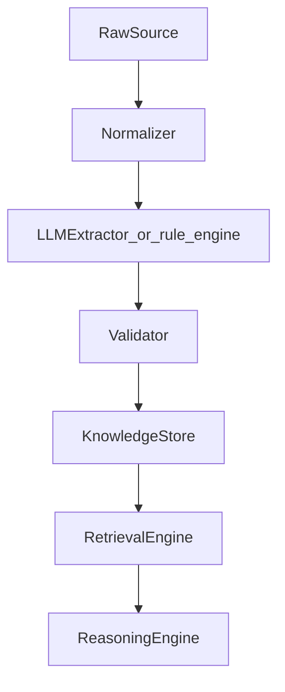
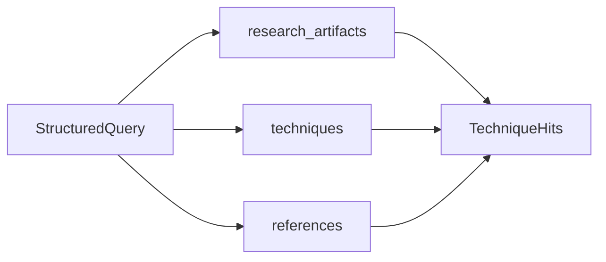
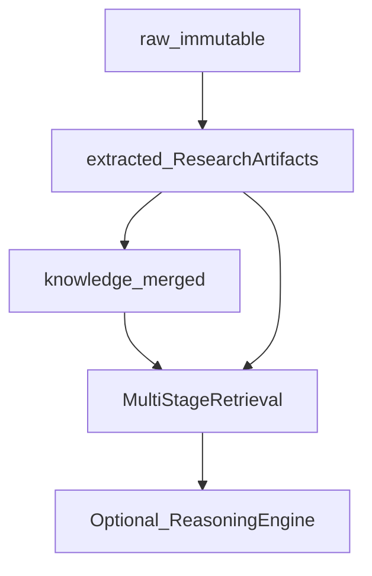
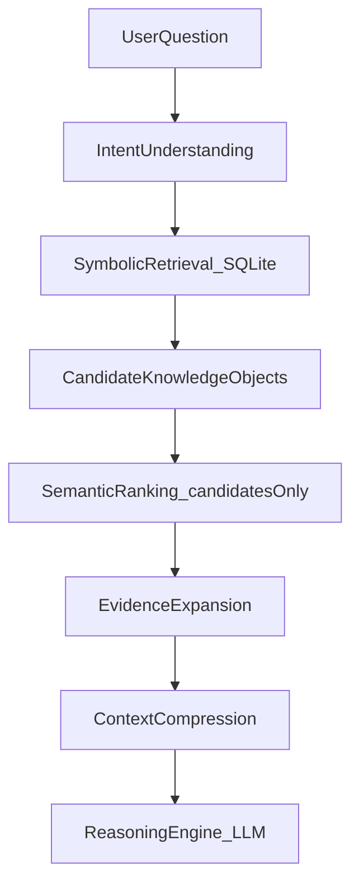
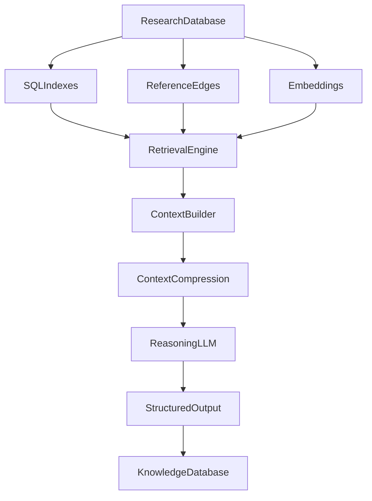

# Knowledge System — storage architecture

Canonical storage and retrieval design for Milestone 3 Research Intelligence.
Product / plugin framing lives in [README.md](README.md); **this file is the SoR for how
knowledge is stored and how it reaches the LLM.**

Deep dive (future): [Appendix A — SQLite vs Knowledge Graph vs GraphRAG](#appendix-a-sqlite-vs-knowledge-graph-vs-graphrag).

---

## 1. Framing (locked)

- **Don't store documents as the product. Store knowledge.**
- **Everything becomes a `ResearchArtifact`** — one interface for every source.
- **Raw → Extracted → Knowledge are different** directories and jobs.
- **Explicit Knowledge Extraction Pipeline** — every source flows through the same stages.
- **Never ask the LLM to remember anything.** Persist knowledge in our data model; the LLM
  only interprets / reasons over retrieved structured context. Expertise accumulates over
  years of stored objects — not chat sessions.
- **Never let the LLM search the knowledge base directly.** Only **Context Builder** /
  Retrieval / Query Planner touch the store. LLM sees typed `ResearchContext` (L1–L3) only.
- **Knowledge Engine is the center; LLM is an attached reasoner** — not a chatbot that owns search.
- **Progressive Context** + **Query Planner** (optimizer-style) over prompt-engineering theater.
- Reject RAG-first: User → vector top-20 chunks → LLM. Noisy and lossy at research scale.
- **SQLite** for queryable joins (v1). Neo4j / ArangoDB only later if needed. Embeddings only
  as candidate re-rank — never first gate, never SoR.

---

## 2. Knowledge Extraction Pipeline (locked)

The consistency that turns a Kaggle assistant into an ML Research Engineer:

```text
Raw Source
    → Normalizer
    → LLM Extractor          # optional Micro Agent; else rule_engine
    → Validator
    → Knowledge Store
    → Retrieval Engine
    → Reasoning Engine
```



| Stage | Job | Maps to |
|-------|-----|---------|
| Raw Source | Immutable originals | `research/raw/` |
| Normalizer | Provider blobs → common shape | fetch / normalize — still not knowledge |
| LLM Extractor | Populate typed `ResearchArtifact` / technique fields | Micro Agents / `rule_engine` |
| Validator | Schema + reject free-form / garbage | Pydantic; soft-fail |
| Knowledge Store | Upsert artifacts + merge objects | `extracted/` + `knowledge/` + `knowledge.db` |
| Retrieval Engine | Multi-stage narrow context (symbolic first) | Intent → Symbolic → … → Compression |
| Reasoning Engine | Suggest / reflect over **compressed** context only | Optional Micro Agents — **last** |

Every source — papers, GitHub repositories, forum posts, **own experiments** — uses this
pipeline. No special-case “chat about this PDF” path that bypasses store + retrieve.

**Hard rules:**

1. Reasoning Engine input = Retrieval Engine output (typed, compressed).
2. No conversation memory as SoR; no “remind the model what we found last week.”
3. System works **without** Micro Agents — `rule_engine` / heuristics fill Extractor and
   Reasoning stages when no LLM is configured.

---

## 3. The most important abstraction: `ResearchArtifact`

Paper, GitHub repo, forum, experiment, winning solution — **all** are `ResearchArtifact`.

```python
class ResearchArtifact(BaseModel):
    id: str
    type: ResearchArtifactType  # paper | repository | discussion | experiment | winning_solution | …
    source: str                 # provider / URL / run id provenance
    metadata: dict              # type-specific extras (title may live here or first-class)
    summary: str                # short card — not a full-document TL;DR
    techniques: list[str]
    models: list[str]
    datasets: list[str]
    claims: list[str]
    references: list[str]       # ids of related artifacts / evidence
    confidence: float
```

| Thing | Is |
|-------|-----|
| Paper | `ResearchArtifact` |
| GitHub repo | `ResearchArtifact` |
| Forum | `ResearchArtifact` |
| Experiment | `ResearchArtifact` |
| Winning solution | `ResearchArtifact` |

**Why this is useful:** one query engine over a uniform table/index. See also
[README.md](README.md) §3.1 (aligned field set).

### Structured query engine (flagship)

Not: hope vector search retrieves the right chunks.

```text
Find techniques that improve Macro F1
  on Audio Classification
  supported by at least 3 papers
  and 2 successful experiments
```

Answer by **joining** `research_artifacts` + merged `techniques` + `references` /
experiment outcomes in SQLite.



---

## 4. Canonical on-disk layout (locked)

Competition-scoped, **local only / gitignored** (replaces prior `intelligence/` tree name):

```text
knowledge/<slug>/research/

    raw/                            # Layer 1 — immutable originals
        papers/
        repositories/
        discussions/

    extracted/                      # Layer 2 — ResearchArtifact JSON per source
        papers/
        repositories/
        forums/

    knowledge/                      # Layer 3 — merged knowledge objects
        techniques/
        datasets/
        architectures/
        tasks/

    experiments/                    # Experiment artifacts / pipeline membership
    reports/                        # analyze.json + rollups
    embeddings/                     # Future optional — unused / empty in M3 v1

    knowledge.db                    # SQLite — artifacts + knowledge + joins
```



**Notice: Raw, Extracted, and Knowledge are different.**

| Dir | Holds | Example |
|-----|--------|---------|
| `raw/` | Original blobs — never the product | PDF, README dump, `discussion_1023.json` |
| `extracted/` | One `ResearchArtifact` per source | Paper card with `techniques` / `claims` |
| `knowledge/` | **Merged** objects across sources | One SpecAugment technique + evidence |

`raw/discussions` vs `extracted/forums` naming is intentional (provider raw vs forum extract).

### Authority

| Kind | Authority |
|------|-----------|
| Blobs | `raw/` files (immutable / versioned append; `--refresh` adds a version) |
| Per-source cards | `extracted/` JSON + `research_artifacts` rows |
| Merged knowledge | `knowledge/` + SQLite technique/dataset/… tables |
| CLI rollup | `reports/analyze.json` — **projection**, not a second SoR |
| Query | **`knowledge.db` wins** for joins / retrieval |

Re-extract rebuilds `extracted/` from `raw/` without re-fetch when blobs exist.

### SQLite (`knowledge.db`)

Tables (v1):

| Table | Role |
|-------|------|
| `research_artifacts` | Uniform `ResearchArtifact` columns |
| `techniques` | Merged knowledge objects |
| `datasets` | Dataset / benchmark refs |
| `architectures` | Model / architecture refs |
| `tasks` | Task / problem framings |
| `references` | Evidence links (artifact ↔ technique / finding / hyp) |
| `experiments` | Outcomes + pipeline technique membership |
| `hypotheses` | Draft / ranked recommendations |
| `beliefs` | Competition trust overlay |
| `findings` | `ResearchFinding`-shaped rows |
| `discussions` | Forum artifacts (or type filter on `research_artifacts`) |
| `ideas` / `idea_links` | Research Memory — designed now; populate Future |

Type-specific detail lives in `metadata` JSON. Query engine filters the common interface first.

### Merge flagship (not four summaries)

BirdCLEF + SpecAugment from paper / experiment / forum / repo → **one** knowledge object:

```text
Technique: SpecAugment
Evidence:  Paper · Experiment (+0.006) · Repository · Forum
Confidence: 0.96
```

One `knowledge/techniques/…` file (and one `techniques` row); many `references` rows.

---

## 5. Multi-stage retrieval — how knowledge reaches the LLM (locked)

**Never** pass the whole store. **Never** “LLM, search my KB.” **Never** RAG-first top-20 chunks.
**The LLM is the last step, not the first.**

At scale (e.g. 3k papers / 20k experiments / 50k knowledge objects), top-20 chunks are both
**noisy and lossy**. Act like a **database query optimizer**: indexes and filters first, then
narrow, then compress.

```text
User Question
    → Intent Understanding
    → Symbolic Retrieval
    → Candidate Knowledge Objects
    → Semantic Ranking / Embeddings   # candidates only
    → Evidence Expansion
    → Context Compression             # ⭐ critical
    → LLM                             # LAST
```



### Stage 1 — Intent Understanding

The first LLM call (or a **deterministic classifier**) must **not** answer the question.
It **classifies** it into structured intent so retrieval is precise.

Example — “How can I improve BirdCLEF?”:

```json
{
  "task": "Audio Classification",
  "dataset": "BirdCLEF",
  "goal": "Improve Macro F1",
  "query_type": "Hypothesis Generation",
  "need_experiments": true,
  "need_papers": true,
  "need_repositories": true
}
```

```python
class RetrievalIntent(BaseModel):
    """Structured intent — output of Stage 1; input to Symbolic Retrieval."""

    task: str | None = None
    dataset: str | None = None
    goal: str | None = None              # e.g. Improve Macro F1
    query_type: str                      # Hypothesis Generation | Explain | Compare | …
    need_experiments: bool = True
    need_papers: bool = True
    need_repositories: bool = True
    need_forums: bool = False
    current_pipeline: list[str] = Field(default_factory=list)  # ConvNeXt, EMA, Mixup
```

Phase 1: prefer rules / templates from competition profile + CLI context; optional small LLM
only to fill `RetrievalIntent` — never to invent answers.

### Stage 2 — Symbolic Retrieval

**Do not search embeddings first.** Use the structured database (indexes), like SQL:

```sql
SELECT technique FROM techniques WHERE domain = 'Audio';
SELECT * FROM experiments WHERE technique = 'SpecAugment';
SELECT * FROM research_artifacts
 WHERE type = 'paper' AND id IN (
   SELECT artifact_id FROM references WHERE technique_id = 'tech_specaugment'
 );
```

Pipeline-diff queries (flagship improve): similar pipelines by technique-set overlap →
**missing techniques** relative to current stack.

This stage should remove ~99% of irrelevant information before any embedding work.

### Stage 3 — Semantic Ranking / Embeddings

Embeddings become useful **only after** symbolic filtering.

Example: symbolic returns 120 papers / 60 experiments / 30 repos → embed **only those
candidates** → rank → keep a small top set (e.g. 8 papers / 5 experiments / 3 repos).

| Do | Do not |
|----|--------|
| Re-rank within the candidate set | Embed / search the entire corpus first |
| Optional in M3 Phase 1 (stub / skip) | Replace Symbolic Retrieval |

### Stage 4 — Evidence Expansion

When a knowledge object is selected (e.g. Technique = SpecAugment), **automatically expand**
along `references` / evidence links — a **graph walk over SQLite joins** (v1), not Neo4j:

```text
Technique: SpecAugment
    → Experiments
    → Papers
    → GitHub repositories
    → Forum discussions
    → Winning solutions
```

Everything connected to that technique. This is why a graph *model* (edges in `references`)
matters even while storage stays SQLite. Neo4j/Arango only later if multi-hop joins hurt.

### Stage 5 — Context Compression ⭐

**Most important stage for LLM quality.** Never send raw documents (15-page papers, full
threads). Compress to typed knowledge cards first.

Instead of Paper A (15 pages), send ~80 tokens:

```text
Technique: SpecAugment
Evidence: Paper A · Paper B · Experiment 12 · BirdCLEF Winner
Benefits: Improves generalization
Known Issues: Heavy masking hurts small datasets
Confidence: 0.93
```

### LLM context contract (locked shape)

**Not** a pile of papers / forums / experiments.

**Yes** — compressed research brief:

```text
Current Competition
    BirdCLEF

Current Pipeline
    ConvNeXt
    EMA
    Mixup

Current Results
    Macro F1  0.842

Relevant Knowledge
    Technique: SpecAugment
    Confidence: 0.93
    Supported by: 4 papers · 12 experiments · winning solution
    Known Tradeoffs: Training +15% time
    Relevant Failures: Large masking decreased recall

Question
    Suggest next experiments.
```

That is an excellent Reasoning Engine prompt. Hypothesis Assistant / `HypothesisGeneratorAgent`
consumes **this** shape — not raw `raw/` blobs.

### Flagship improve path (sits inside the stages)

```text
Intent: Hypothesis Generation + current pipeline
  → Symbolic: similar pipelines → missing techniques
  → Rank / Expand / Compress
  → LLM: Suggest next experiments
```

### Structured query path

Macro F1 / Audio / ≥3 papers / ≥2 experiments is primarily **Symbolic** — may skip
Semantic Ranking when the join is sufficient; still **Compress** before any LLM drafting.

---

## 5b. Progressive Context (locked)

**Do not** give the LLM everything in one shot. Reason in steps; **each step uses a
different context**.

Example — “Suggest high-impact experiments for BirdCLEF”:

| Step | Ask / do | Context focus |
|------|----------|---------------|
| 1 | What techniques are relevant? | Intent + symbolic technique hits (small) |
| 2 | Retrieve evidence only for those techniques | Evidence expansion for chosen ids only |
| 3 | Which techniques fit the current pipeline? | Current pipeline + technique cards + failures |
| 4 | Retrieve implementation details | Repo / transfer effort for survivors only |
| 5 | Generate experiments | Compressed brief → structured hyp output |

A later step may trigger **another retrieval round** (planner decides) before the final
answer. This is progressive narrowing — not one mega-prompt.

---

## 5c. Research Context Builder (locked)

The LLM **never sees the database**. Only the **Context Builder** (and Query Planner)
touches stores.

```python
class ContextBuilder:
    """Sole bridge from Knowledge Store → Reasoning Engine."""

    def build(self, query: str | RetrievalIntent, *, plan: QueryPlan | None = None) -> ResearchContext:
        """Intent → Retrieve → Rank → Expand → Compress → Validate → Prompt-ready context."""
        ...
```

Internal pipeline (always):

```text
Intent → Retrieve → Rank → Expand → Compress → Validate → Prompt
```

### Typed context — do not concatenate free text

```python
class ResearchContext(BaseModel):
    """Typed context for Reasoning — serialize to prompt; keep prompts consistent/testable."""

    competition: dict[str, Any] | str
    experiments: list[dict[str, Any]] = Field(default_factory=list)
    techniques: list[dict[str, Any]] = Field(default_factory=list)
    papers: list[dict[str, Any]] = Field(default_factory=list)
    repositories: list[dict[str, Any]] = Field(default_factory=list)
    failures: list[dict[str, Any]] = Field(default_factory=list)
    constraints: list[str] = Field(default_factory=list)
    question: str = ""
    # Progressive: which step this context is for
    step: str | None = None  # e.g. relevant_techniques | fit_pipeline | generate_experiments
```

Serialize `ResearchContext` → prompt string (or structured prompt parts). Unit-test the
builder without calling an LLM.

---

## 5d. Hierarchical memory (CPU-cache model) (locked)

| Level | Holds | Typical budget | Into LLM context? |
|-------|--------|----------------|-------------------|
| **L1** | Current experiment / pipeline / metrics | ~200 tokens | **Yes** |
| **L2** | Competition knowledge (beliefs, local hyps, profile) | ~1000 tokens | **Yes** |
| **L3** | Domain slice (e.g. Audio / BirdCLEF-relevant techniques) | ~3000 tokens | **Yes** (compressed) |
| **L4** | Entire research database | unbounded | **Never** — query on demand via Retrieval |

The LLM only sees **L1–L3** (after Compression). L4 is always accessed through Symbolic /
Expansion under the Query Planner — never dumped into the window.

```text
L1 Current Experiment     (~200 tok)
        ↓
L2 Competition Knowledge  (~1000 tok)
        ↓
L3 Domain Knowledge       (~3000 tok, compressed)
        ↓
L4 Entire Research DB     — never in context; on-demand only
```

---

## 5e. Knowledge Engine at the center (locked)

**The LLM is not the center of the system. The Knowledge Engine is.** The LLM is one
reasoning component attached to it.

```text
                    Research Database
                           │
        ┌──────────────────┼──────────────────┐
        │                  │                  │
  SQL Indexes       Graph Relationships   Embeddings
  (symbolic)        (references edges)    (candidate re-rank)
        │                  │                  │
        └──────────────────┼──────────────────┘
                           │
                    Retrieval Engine
                           │
                    Context Builder
                           │
                 Context Compression
                           │
                     Reasoning LLM
                           │
                    Structured Output
                           │
                   Knowledge Database  (write back hyps / beliefs)
```



Stop optimizing “prompt engineering” as the product. Invest in a **Query Planner**
(relational-optimizer style) as the real intelligence of the platform.

---

## 5f. Query Planner (locked direction; Phase 1 stub → Future depth)

Given: “Suggest three high-impact experiments for BirdCLEF.”

The planner decides:

- Which tables to query
- Which graph relationships (`references`) to traverse
- Whether / which embeddings to use (candidates only)
- How many artifacts to retrieve
- How to compress them
- Which reasoning model / Micro Agent to invoke
- Whether **another retrieval round** is needed before the answer (Progressive Context)

```python
class QueryPlan(BaseModel):
    tables: list[str]
    traversals: list[str]           # e.g. technique→experiments→repos
    use_embeddings: bool = False
    limits: dict[str, int] = Field(default_factory=dict)
    compress: bool = True
    reasoning_agent: str | None = None  # e.g. HypothesisGeneratorAgent
    rounds: list[str] = Field(default_factory=list)  # progressive steps
```

Phase 1: fixed plans per `query_type` (Hypothesis Generation → improve path). Future: richer
planner. The LLM interprets evidence and generates hypotheses — it is **not** the search
engine.

---

## 6. Mapping to prior README §8 layers

| Knowledge System | Prior §8 name | On disk / DB |
|------------------|---------------|--------------|
| Raw Sources | (was `cache/`) | `research/raw/` |
| Structured Artifacts (`ResearchArtifact`) | Documents | `research/extracted/` + `research_artifacts` |
| Knowledge Objects + evidence links | Knowledge + Evidence | `research/knowledge/` + `references` |
| Research Memory | Beliefs (+ Idea graph Future) | `beliefs` / `hypotheses` + Future ideas |

Canonical detail for product modules remains in [README.md](README.md); when paths conflict,
**this file wins** for storage layout and retrieval-to-LLM contract.

---

## 7. Phase 1 vs Future

| Phase 1 (M3) | Future |
|--------------|--------|
| Full `raw/` / `extracted/` / `knowledge/` / `experiments/` / `reports/` + `knowledge.db` | Populate `embeddings/` for Stage 3 |
| Stages 1–2–4–5 + **ContextBuilder** + typed `ResearchContext` + L1–L3 budgets | Full Progressive multi-round by default |
| Fixed QueryPlan per `query_type` (stub planner) | Rich Query Planner (optimizer-depth) |
| Pipeline-diff + structured joins | Full Idea / Research Memory graph |
| Beliefs + hypotheses write-back | Neo4j / ArangoDB if multi-hop joins insufficient |
| Intent via rules / competition profile | Richer intent + planner models |
| **SQLite + ontology + join tables** as SoR | See [Appendix A](#appendix-a-sqlite-vs-knowledge-graph-vs-graphrag) — Neo4j / hybrid retrieval later; **skip GraphRAG as storage** |

Works without Micro Agents — Context Builder still emits `ResearchContext`; reasoning uses
`rule_engine` templates.

---

## 8. Non-goals (storage)

- Vector DB / chunk RAG as the knowledge system of record
- **GraphRAG-style pipelines as Phase 1 storage** (chunk → entity discovery → Leiden clusters
  as SoR) — borrow ideas only; see [Appendix A](#appendix-a-sqlite-vs-knowledge-graph-vs-graphrag)
- LLM searching or browsing the KB directly (only Context Builder / Retrieval do)
- LLM as the **center** of the architecture (Knowledge Engine is center)
- LLM as the **first** step (answering before classify / retrieve / compress)
- One-shot mega-context with all candidates (use Progressive Context)
- Untyped string concatenation as the only prompt path (use `ResearchContext`)
- Putting L4 (entire DB) into the LLM window
- Embedding search over the entire corpus before symbolic filters
- Graph DB as a Phase 1 dependency (graph *edges* via `references` / join tables in SQLite)
- Collapsing raw / extracted / knowledge into one folder
- Conversation memory as the place expertise lives
- Treating `reports/analyze.json` as a second write SoR that drifts from `knowledge.db`
- Prompt-engineering theater without a Query Planner / Context Builder investment

---

## Appendix A — SQLite vs Knowledge Graph vs GraphRAG

**Future / deep-dive.** The sophisticated solution is not the right **first** solution.
References conceptually: GraphRAG-style pipelines (e.g. community detection / Leiden
clustering patterns such as those discussed in breakdowns like
[ALucek/GraphRAG-Breakdown](https://github.com/ALucek/GraphRAG-Breakdown)).

### A.1 What GraphRAG-style systems typically do

```text
Documents
    → Chunk
    → LLM Extraction
    → Entity Extraction
    → Knowledge Graph
    → Community Detection
    → Leiden Clustering
    → Cluster Summaries
    → GraphRAG Retrieval
```

Excellent for **large, unstructured corpora** where you do **not** know the schema
beforehand (enterprise docs, legal, medical literature, Wikipedia-scale search). GraphRAG
**discovers** structure.

### A.2 Our data is already structured

LabPilot entities are known up front:

Paper · Experiment · GitHub Repository · Technique · Dataset · Competition · Model ·
Loss · Augmentation · Observation · Hypothesis · Evidence · Finding · Failure · Discussion

We do **not** need an LLM to discover that SpecAugment is a Technique or ConvNeXt is a Model —
we define those types explicitly. Micro Agents / extractors **populate** the ontology; they
do not invent the type system.

Our system **creates** knowledge:

```text
Paper → Extract Technique → Store Technique → Run Experiment
  → Generate Evidence → Update Confidence
```

Relationships are known because we wrote them.

### A.3 Separate storage from retrieval

| Concern | Job |
|---------|-----|
| **Knowledge Storage** | Source of truth: Technique, Experiment, Paper, Evidence, Hypothesis, … |
| **Knowledge Retrieval** | How the LLM finds relevant information (multi-stage / Query Planner) |

Graph DB, embeddings, and SQL are **retrieval strategies** (and optional later stores) —
not interchangeable with “having knowledge.”

### A.4 Phase 1 recommendation — SQLite + ontology

Use **SQLite**. Seriously.

Entity tables (illustrative):

`papers` · `repositories` · `experiments` · `techniques` · `models` · `datasets` ·
`competitions` · `findings` · `hypotheses` · `evidence` · …

Relationship tables (a **graph stored relationally**):

`paper_techniques` · `experiment_techniques` · `paper_models` · `experiment_models` ·
`hypothesis_evidence` · …

Example query — experiments where SpecAugment improved Macro F1 — is a join. Instant. No
graph database required.

Invest in an **ontology** before a graph product:

```text
Competition · Dataset · Task · Metric · Technique · Model · Loss · Augmentation
Experiment · Hypothesis · Evidence · Finding · Paper · Repository · Discussion
```

Typed edges, e.g.:

```text
Paper —introduces→ Technique
Technique —used_by→ Experiment
Experiment —supports→ Hypothesis
Hypothesis —improves→ Metric
```

Once every artifact maps into the ontology, exporting to Neo4j (or exposing a graph view)
later is straightforward because semantics are already explicit.

### A.5 When Neo4j (or similar) becomes worth it

Introduce a graph database only when query patterns need multi-hop traversal, e.g.:

```text
Find techniques connected to BirdCLEF through repositories within 3 hops,
excluding failed experiments.
```

You are not there in Milestone 3 Phase 1.

### A.6 Why not GraphRAG as storage?

GraphRAG builds graphs **from text**. We already have structured extraction:

```json
{
  "techniques": ["SpecAugment", "EMA"],
  "models": ["ConvNeXt"],
  "datasets": ["BirdCLEF"]
}
```

Asking GraphRAG to rediscover those relationships is redundant. Prefer:

```text
Paper → LLM Extractor → Structured Artifact → Knowledge Normalizer → Knowledge Store
```

**No graph product yet.** Borrow GraphRAG *ideas* (entity/relationship extraction,
hierarchical summaries) where they help Compression / Research Memory — do **not** adopt
the full chunk→Leiden→cluster-summary architecture as the SoR.

### A.7 Evolution path (locked recommendation)

```text
Phase 1  SQLite + ontology + structured extraction
            (+ embeddings later for candidate semantic ranking — not SoR)

Phase 2  SQLite + Embeddings (Stage 3 re-rank)

Phase 3  SQLite + Knowledge Graph view / Neo4j + Embeddings
            (when multi-hop queries dominate)

Phase 4  Hybrid Retrieval Engine
            (Query Planner chooses SQL | Graph | Embedding per question)
```

Eventual hybrid (graph is **one retrieval strategy**, not the center):

```text
                Query
                  │
        Intent Classifier
                  │
        Query Planner
                  │
    ┌─────────────┼─────────────┐
    ▼             ▼             ▼
 SQL          Graph         Embedding
 Search       Search         Search
    └─────────────┼─────────────┘
                  ▼
        Candidate Objects
                  │
         Context Builder
                  │
              LLM
```

Two years later (5k papers / 30k experiments / 1.5k techniques / …), technique→BirdCLEF→
ConvNeXt→paper→experiment→repo walks become valuable — but that graph is **materialized
from our ontology**, not rediscovered by GraphRAG over PDFs.

### A.8 Principal-engineer verdict

| Now (Phase 1) | Later |
|---------------|--------|
| SQLite + well-designed ontology + structured extraction | Graph view / Neo4j when multi-hop queries dominate |
| Embeddings for semantic ranking **inside candidates** | Hybrid retrieval under Query Planner |
| Skip GraphRAG as architecture | Borrow ideas only (extraction, hierarchical summaries) |

The technically sophisticated GraphRAG/cluster stack solves a different problem than LabPilot’s
“generate structured research knowledge from day one.”
