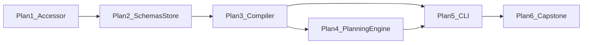

# Research Planner

Back to [MILESTONES.md](../../MILESTONES.md).

**Status:** Phase B **implemented** — plan-only MVP shipped (Plans 1–6).
**Depends on:** Experiment Scientist
([../experiment-scientist/](../experiment-scientist/)) and Research Intelligence
([../research-intelligence/](../research-intelligence/)).
**CLI:** `research plan create` / `show` / `list` — Hypothesis → durable research DAG
(no `--execute`).

This directory holds the architecture/design workspace and Phase B plans for the Research
Planner:


| Doc                                    | Role                                                     |
| -------------------------------------- | -------------------------------------------------------- |
| **This README**                        | Product shape, compiler metaphor, OS fit, CLI, non-goals |
| [schema.md](schema.md)                 | DB tables + Pydantic shapes + PlanStore API              |
| [package-layout.md](package-layout.md) | `research_engine/planner/` tree + import hygiene         |


Phase B plans 1–6 are complete (§14). Future work (helper micro-agents, competing
planners, budget allocator, capability executors) stays backlog-only.

---


## 1. What this milestone is (and isn't)

Research Intelligence shipped **understand + recommend**: `research analyze` → knowledge →
beliefs → hypotheses → Research Brief. A human still decides what to run via
`research improve` / `research run`.

What is still missing: a durable, inspectable **plan** that turns one hypothesis into a
graph of typed work — without writing code or starting training.

```
Experiment Scientist (shipped)     Research Intelligence (shipped)
──────────────────────────────     ──────────────────────────────
Local experiment memory       →    External + local intelligence
Graph / compare / KB / rank   →    Analyze landscape + propose hypotheses
                                   Still: human picks → improve / run

Research Planner (this doc)
───────────────────────────
Hypothesis → Planning Compiler → Executable DAG (ResearchPlan + ResearchTasks)
Still: no autonomous execution; human (or future executor) consumes the DAG
```

**This is plan-only.** The planner never writes source, never trains, never calls
`improve` / `run`. It emits a structured execution graph. That separation is the point.

### Capstone vision (after implementation)

```
$ research plan create birdclef-2026 --hypothesis H-003

Research Plan P-001  (hypothesis H-003)
───────────────────────────────────────
Goal: Test SpecAugment on rare classes
Status: ready · estimated_gain: 0.003 · risk: medium

DAG (topological levels)
  L0  read_code (augmentation.py)
  L1  write_code → modify_config
  L2  run_unit_test ∥ run_smoke_test
  L3  run_training (smoke, 1 epoch)
  L4  evaluate → compare
  L5  generate_report → update_belief → reflect

Success criteria
  • Config loads; unit tests pass; smoke loss decreases
  • If CV improves vs parent → full train (gated task)

Artifacts written
  knowledge/.../knowledge.db  (research_plans + research_tasks)
  knowledge/.../plans/P-001.json
  knowledge/.../plans/P-001.md
```

Notice: **no code yet. Only planning.**

---


## 2. Research OS — where the planner sits

```
               Research OS

        analyze
            │
            ▼
       knowledge graph
            │
            ▼
         planner          ← this milestone
            │
            ▼
      execution graph
            │
            ▼
         executor         ← future (out of scope)
            │
            ▼
        reflection
            │
            ▼
      belief updater
```

Still **no "agent" as the product noun** — only capabilities. Analyze / knowledge / planner /
executor are stages of a Research Operating System for ML experiments.

### Event-driven entity chain

```
Artifact
    ↓
Belief
    ↓
Hypothesis
    ↓
Research Plan          ← first-class DB entity (new)
    ↓
Research Tasks         ← DAG nodes (new)
    ↓
Execution              ← future capability executors
    ↓
Experiment
    ↓
Reflection
    ↓
Belief Update
```

Existing entities (`Artifact`, `Belief`, `Hypothesis`) stay excellent. The missing central
object that ties them to execution is `ResearchPlan`.

---


## 3. Architecture metaphor — planner as compiler

Do **not** think: `Hypothesis → GPT → Code`.

Think: `Hypothesis → Planning Compiler → Executable DAG`.

The LLM is **one stage** inside the compiler. The compiler owns the pipeline.

```
                    Research Planner (compiler)

                            │
        ┌───────────────────┴───────────────────┐
        │                                       │
 Structured State                      Knowledge Retrieval
 (hypothesis, beliefs,                 (deterministic load /
  prior plans — from DB)                 bounded assemble)
        │                                       │
        └───────────────────┬───────────────────┘
                            ▼
              [optional] Micro-helpers (stateless)
              Risk / Dependency / Evidence Summary
                            ▼
                 Planning Engine (ONE LLM)
                            ▼
              Structured Research Plan (draft)
                            ▼
               Validation / Optimizer / Scheduler
                            ▼
                      Executable DAG
                            ▼
                   PlanStore + derived MD/JSON
```

Exactly **one** primary reasoning step (Planning Engine). Everything else is deterministic
Python — or, later, tiny stateless micro-helpers that feed *into* that one step.

### Deterministic vs reasoning (hard split)

**Deterministic (never ask the LLM):**

- retrieve hypothesis / load beliefs / search experiment history
- assemble bounded planning context
- estimate GPU hours / cost calculation (schema hooks; formulas later)
- dependency resolution, task-graph construction, scheduling order
- DAG validation (ids, cycles, missing deps), retry defaults, runtime selection hooks
- persist plan/tasks, status transitions, derive markdown/JSON

**Reasoning (exactly ONE Planner LLM — the Planning Engine):**

- judgement: risky assumptions, missing prerequisites, overengineering, easier validation
- which task types to include and how to order them for *this* hypothesis
- fill structured fields (`goal`, `risk`, `success_criteria`, task descriptions, verification hints)

If the LLM is unavailable or returns invalid structure → `rule_engine` template path produces
a valid plan (same soft-fail posture as Research Brief / analyze Micro Agents).

### Structured output is primary

Resist natural-language-only plans. The **primary** output is a structured, executable plan
(database-backed DAG + JSON projection). Human-readable markdown is **generated from** that
structure. That enables inspect, diff, resume, optimize, and eventually competing planners —
without changing any executor.

---


## 4. Roles ≠ agents; capabilities execute tasks

Forbidden shape:

```
Planner Agent → Coder Agent → Reviewer Agent → Executor Agent → Reflection Agent
```

Correct shape:

```
Planner (compiler) → ResearchPlan / ResearchTasks → Capability executors (future)

  WRITE_CODE     → Code capability
  RUN_UNIT_TEST  → Testing capability
  RUN_TRAINING   → Training capability
  …
```

The future executor does **not** think; it dispatches by `task_type`. Those capabilities are
**out of planner scope** — the planner only emits typed instruction nodes
(`WRITE_CODE`, `RUN_TRAINING`, …). Emitting a `WRITE_CODE` node is not writing code.

### Micro-agents (only place for LLM helpers)

- **Planning Engine** (required): one Micro Agent = the single Planner LLM stage. Typed draft
in/out; mandatory `rule_engine` fallback. Lives under `planner/micro_agents/planning_engine/`.
- **Helper micro-agents** (optional, later): e.g. Risk Checker, Dependency Checker, Evidence
Summary — **stateless**, no memory, no autonomy, no tools, no loops. LLM-powered helper
functions inside the compiler front-end; they return small typed artifacts into the Planning
Engine context.

Not a multi-agent system. Not ReAct. Not tool-calling loops.

---


## 5. Memory and context

The planner has **no session memory** and **no chat history**.


| Kind      | Where                                                                                |
| --------- | ------------------------------------------------------------------------------------ |
| Long-term | `knowledge.db` — artifacts, beliefs, hypotheses, **research_plans / research_tasks** |
| Working   | ephemeral `PlanningContext` / `StructuredContext` for one compile                    |
| LLM       | single system + user prompt from that envelope; parse JSON; done                     |


Context budget (deterministic assembly before any LLM):

1. **L1** — hypothesis core (observation / reason / prediction / impact / tags)
2. **L2** — bounded beliefs + Research Brief snippets
3. **L3** — optional prior plan / experiment deltas

Never dump the SoR or full `analyze.json` into the prompt.

---


## 6. Compiler control flow

```
research plan create <competition> --hypothesis H-xxx
  → Structured State + Knowledge Retrieval     # deterministic
  → (optional) micro-helper summaries          # stubs / later
  → Planning Engine (ONE LLM | rule_engine)
  → merge type-default verification / costs    # deterministic
  → Validation → Optimizer → Scheduler         # DAG gate + order
  → PlanStore.upsert_plan → derive JSON/MD
```

Invalid LLM JSON or failed DAG validation → soft-fail to `rule_engine` template. No multi-turn
"fix your plan" agent loop in v1.

Example template shape (SpecAugment-style):

```
read_code → write_code → modify_config
                 ↘ run_unit_test ↘
                                   run_smoke_test → evaluate → compare
                 ↘ (integration) ↗
                                   → run_training (gated) → evaluate
                                   → generate_report → update_belief → reflect
```

"If better, continue training" is encoded as `success_criteria` + a dependent `RUN_TRAINING`
task with verification — **described, not executed**.

---


## 7. CLI sketch

```bash
research plan create <competition> --hypothesis H-xxx [--priority N] [--format text|json|markdown]
research plan show <competition> <plan-id> [--format text|json|markdown]
research plan list <competition> [--status draft|ready|...]
```

- Load hypothesis; fail clearly if missing.
- Persist to `knowledge.db`; write derived `plans/<plan_id>.json` + `.md`.
- Print topological DAG summary.
- **No** `--execute` **flag.**

Details of schemas and on-disk layout: [schema.md](schema.md). Package tree:
[package-layout.md](package-layout.md).

---


## 8. Package placement

**Sibling** under `research_engine/` — parallel to `intelligence/` and `execution/`. Not nested
in either.

```
research_engine/
  intelligence/   # analyze → knowledge → hypothesize
  planner/        # Hypothesis → ResearchPlan DAG   ← this milestone
  execution/      # future: capability executors
```

Infrastructure (SQLite client, LLM client, shared helpers) is factored into a shared
`accessor` layer, so the planner reaches SQLite/LLM without importing `intelligence`.
`schema.sql` lives under `sqlite/` (with the client + migrator); `commons/` holds
non-client shared logic (ids, JSON helpers):

```
accessor/
  sqlite/    # SqliteClient + schema.sql (unified SoR) + migrate
  llm/       # LLM client
  commons/   # id allocators, JSON-in-TEXT helpers
```

Rationale, import hygiene, and the (deferred) refactor to move today's schema/clients into
`accessor`: [package-layout.md](package-layout.md).

---


## 9. Relationship to existing "plans"


| Object            | Layer                  | Role                                                |
| ----------------- | ---------------------- | --------------------------------------------------- |
| `ImprovementPlan` | Execution (P3)         | One child-run strategy about to execute             |
| `QueryPlan`       | Intelligence retrieval | Fixed/stub retrieval plan — not experiment planning |
| `ResearchPlan`    | **Planner (new)**      | Durable DAG from a hypothesis — plan-only           |


Do not overload `ImprovementPlan` or `QueryPlan`. The Research Plan sits **between** a durable
`Hypothesis` and any future executor / `improve` path.

---


## 10. Success criteria

### Design Phase A (this directory)

- [x] README + schema + package-layout authored
- [x] Hard decisions locked: compiler (not multi-agent); one Planning Engine LLM;
      `research_*` tables (not Layer-3 `tasks`); sibling `planner/` package; accessor layer
- [x] Non-goals explicit (no code gen, no training, no `--execute`)
- [x] Phase B implementation plans authored (§14)

### MVP (after Phase B **code** — Plans 1–6)

- [x] `research plan create` writes `research_plans` + `research_tasks` + deps in `knowledge.db`
- [x] Derived JSON/MD under `plans/`; markdown regenerated from structure
- [x] Works with LLM disabled (`rule_engine` templates)
- [x] DAG validation rejects cycles / missing deps
- [x] No `runs/` created; no source/config mutated by the planner

**Status:** Phase B implemented — plan-only MVP shipped.

---

## 11. Explicit non-goals

| Non-goal | Why |
|----------|-----|
| Multi-agent / ReAct / tool-calling planner | Compiler owns control flow |
| Planner writes code or configs | Capability executors (future) own `WRITE_CODE` |
| Planner starts training | Emits `RUN_TRAINING` nodes only |
| Autonomous `improve` / `run` from analyze | Human (or later executor) still decides |
| Experiment budget allocator / cost optimizer | Schema hooks only in v1 |
| Runtime dispatch (Kaggle/Docker/GPU pick) | Columns/hooks; P2 execution remains separate |
| Belief-updater wiring / reflection loop | Downstream of executor |

---

## 12. Design decisions (locked)

1. Planner as **compiler**, not multi-agent system.
2. Exactly **one** Planning Engine LLM; deterministic retrieve / validate / schedule / persist.
3. First-class DB entities: `research_plans`, `research_tasks`, `research_task_deps`.
4. Structured DAG is source of truth; markdown/JSON are derived.
5. Package: `research_engine/planner/` sibling pillar.
6. Keep Layer-3 knowledge table `tasks`; do **not** store plan nodes there.
7. Micro-helpers optional/stateless; capability executors are future and outside the planner.
8. Shared **`accessor`** layer owns the SQLite client (with `schema.sql` + migrate under
   `sqlite/`), the LLM client, and (in `commons`) shared non-client helpers; pillars depend
   on `accessor`, never on each other for infrastructure. Plan 1 performs that refactor.

---

## 13. Milestone plan (Phase B)

| # | Plan | Depends on | Doc |
|---|------|------------|-----|
| 1 | Accessor layer (SQLite + LLM + commons) | RI shipped | [plan-1-accessor.md](plan-1-accessor.md) |
| 2 | Schemas, DDL, PlanStore | 1 | [plan-2-schemas-store.md](plan-2-schemas-store.md) |
| 3 | Deterministic compiler (`rule_engine`) | 2 | [plan-3-compiler.md](plan-3-compiler.md) |
| 4 | Planning Engine Micro Agent (ONE LLM) | 3 | [plan-4-planning-engine.md](plan-4-planning-engine.md) |
| 5 | CLI `research plan` | 3–4 | [plan-5-cli.md](plan-5-cli.md) |
| 6 | Capstone + docs polish | 5 | [plan-6-capstone.md](plan-6-capstone.md) |



**Implementation order:** Plan 1 first (blast radius), then 2 → 3 → 4 → 5 → 6. Plan 5 can
start once Plan 3 works offline; Plan 4 can land in parallel with early CLI wiring if needed.

**Future (not in Plans 1–6):** helper micro-agents, competing planners, cost/budget optimizer,
capability executors.

---

## 14. Phase B — how to ship

1. Implement [Plan 1](plan-1-accessor.md) as its own PR (infra only).
2. Plans 2–3 deliver a working offline compiler + DB.
3. Plan 4 upgrades quality when LLM is configured.
4. Plan 5 exposes `research plan create|show|list`.
5. Plan 6 is the acceptance gate — then mark MVP shipped in MILESTONES / IN-PROGRESS.

