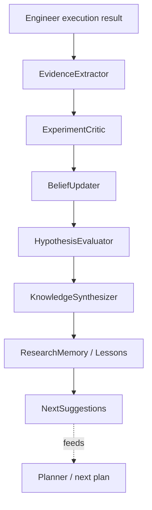

# Research Reflection — Architecture

Back to [README](README.md).

---

## 1. Placement

New pillar under `src/labpilot/research_engine/reflection/`, peer of
`intelligence/`, `planner/`, `execution/`.

| Rule | Choice |
|------|--------|
| Trigger | After Engineer execution (Reporting TaskTypes) + CLI `research reflect` / `journal` |
| Capabilities | Deterministic extractors + belief/hypothesis writers; LLM only in Critic / synthesis / lessons / recommendations |
| No | Standalone “reflection agent” that owns control flow |
| Import hygiene | `reflection` → `accessor`, `experiments` helpers (today `labpilot.experiments`; target `research_engine.shared.experiments`), planner/execution **read** APIs; execution may call reflection library; intelligence may **read** claims/beliefs — reflection does not deep-import intelligence analyzers |

---

## 2. Pipeline

Bayesian posture: each experiment updates understanding of the world (beliefs,
claims, lessons), with an audit trail (`belief_updates`).

---

## 3. Component contracts

| Component | Input | Output | LLM? |
|-----------|-------|--------|------|
| **EvidenceExtractor** | Execution evidence, metrics, config, comparison | `ExperimentEvidence` rows | No |
| **ExperimentCritic** | Evidence + plan/hypothesis context | Assessment, confidence, recommendation | Yes (+ rule_engine) |
| **BeliefUpdater** | Critic verdict + prior beliefs | Updated `beliefs` + `belief_updates` audit | No (arithmetic) |
| **HypothesisEvaluator** | Critic + plan `hypothesis_id` | Status + why (`confirmed`/`rejected`/…) | No status; yes why text optional |
| **KnowledgeSynthesizer** | Beliefs + evidence + claims | “Current Understanding” rollup | Optional |
| **Lessons** | Cross-competition patterns | `lessons` rows | Yes (+ rule_engine) |
| **ClaimPromoter** | Strong beliefs + evidence | `research_claims` (+ edges) | Optional narrative |
| **Journal** | Projection over SoR | Human-readable research journal | Assembly only |
| **Recommend** | Journal + open questions | Next-experiment suggestion | Yes (+ rule_engine) |

---

## 4. Engineer hook

Existing Reporting TaskTypes in
`execution/capabilities/reporting/capability.py`:

- `REFLECT`
- `UPDATE_BELIEF`
- `CREATE_HYPOTHESIS`

**Today:** workspace JSON stubs — no durable DB mutation.  
**After Plan 5:** call into `research_engine.reflection` library; auto-run on
execution success/fail when those tasks are in the plan DAG.

`ReflectionGeneratorAgent` (under `execution/micro_agents/`) is promoted into
`reflection/critic/` and wired from Reporting (unused today).

---

## 5. LLM boundary (locked)

| Use LLM | Keep deterministic |
|---------|-------------------|
| Root cause / critic reasoning | Metric deltas, ranking, storage |
| Contradiction narrative | Statistical/confidence math (rules) |
| Lesson generation | Evidence extraction |
| Hypothesis revision text | Belief confidence arithmetic |
| Next-experiment recommendation prose | History queries / journal assembly |

Offline: every LLM stage has a `rule_engine` path (same posture as other Micro Agents).

---

## 6. Reuse (don’t rewrite)

| Asset | Role |
|-------|------|
| `experiments/comparator.py` | Deterministic critic **input** |
| `experiments/hypothesis.py` + models | Hypothesis SoR |
| `experiments/knowledge.py` | File KB — migrate writers into reflection; dual-write briefly if needed |
| SQLite `beliefs` / `experiments` / `evidence_links` | Extend; add reflection tables |
| M2 `StructuredReflection` + top-level `reflection/` | Schema/prompts migrate; delete top-level after Plan 9 |

Today these live at `labpilot.experiments`. Design target (separate move):
`labpilot.research_engine.shared.experiments` — see [package-layout.md](package-layout.md) §2.

---

## 7. Belief-graph note

Technique ↔ effects ↔ experiments/papers as an **explicit graph UI** can be
Plan 7b or follow-on. Schema uses `evidence_links` / claim edges so the graph is
a **projection**, not a second SoR.
