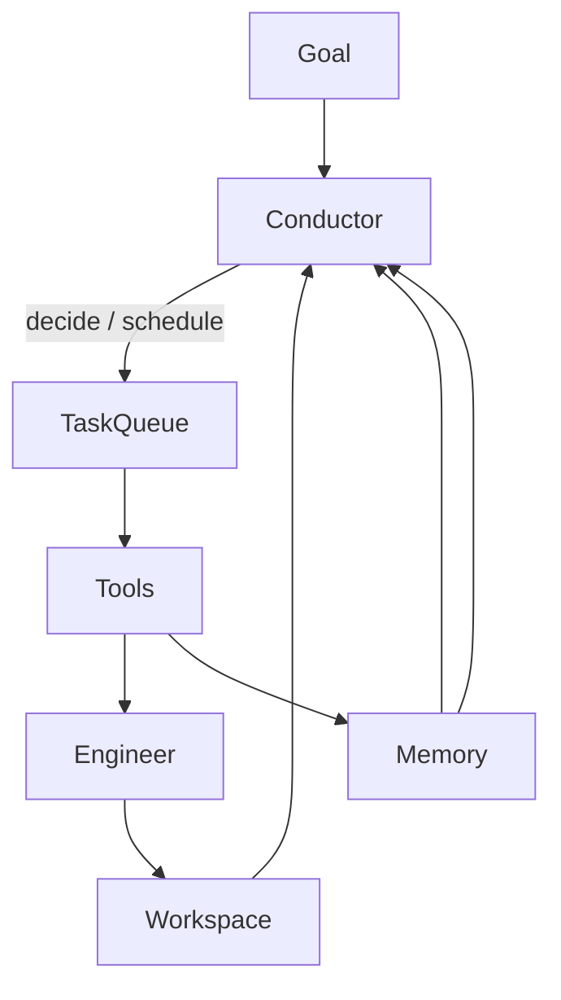

# Research OS — Architecture principles

Back to [README.md](README.md) (product roadmap) · [execution-plan.md](execution-plan.md).

**Status:** Design.

The **roadmap** (what ships when, with which tech) lives in [README.md](README.md).
This file locks **principles** and the **target** shape — not an upfront shopping
list of every future database.

---

## 1. Two generations, one codebase

| Generation | Control |
|------------|---------|
| **V1 Research Pipeline** ([../research-pipeline/](../research-pipeline/)) | Human + stage CLIs; Planner compiles DAG; Engineer walks it |
| **Research OS** | Conductor decides; tools/agents perform; memory feeds the next decision |

V1 is the **kernel**. OS milestones change orchestration; they do not discard
Analyzer / Planner / Engineer / Reflection.

---

## 2. Tech philosophy (locked)

> **Build our own Research OS. Use libraries for primitives, not orchestration.**

Claude Code / Codex / Cursor are custom runtimes, not LangGraph workflows. Same here:
**we own the execution loop.**

| Custom (always) | Libraries (when a milestone needs them) |
|-----------------|----------------------------------------|
| Conductor, scheduler, tool semantics, workspace, context engine, memory manager, agent runtime, event integration | LiteLLM, Pydantic / PydanticAI, SQLite→Postgres, Kuzu, Qdrant, asyncio, Blinker→NATS, later Ray/Temporal |

**Avoid:** LangGraph, CrewAI, or any framework that owns the control graph.

Architecture and stack **co-evolve** — see each milestone’s “Tech that ships” in
[README.md](README.md). Do not adopt Temporal, Ray, Neo4j, or Qdrant before that
milestone’s simpler default hurts.

---

## 3. Control plane vs data plane (build vs reuse)

> **Build the control plane. Reuse the data plane.**

A common failure mode: “our agent runtime is the moat, so we must build every
tool.” Wrong. The moat is **research intelligence + memory + orchestration** —
not terminals, editors, browsers, or sandboxes.

Think OS kernel vs drivers:

| Plane | Own it? | Examples |
|-------|---------|----------|
| **Control plane** | **Build** | Goal, Conductor, task planning, agent selection, memory, experiment strategy, reflection, context engine, research knowledge graph |
| **Data plane** | **Reuse** | Write/edit code, run Python, shell, git, browse web, train on GPU, object storage, LLM HTTP APIs, vector DB engines |

```text
User Goal
    → Research Conductor / Agent Runtime / Memory / Context   ← BUILD (moat)
    → Tool adapters
         → Coding agents (Claude Code / Aider / OpenHands / …)  ← REUSE
         → Docker / Ray / K8s jobs                              ← REUSE
         → Playwright / Browserbase / MCP browser               ← REUSE
         → arXiv / Semantic Scholar / OpenAlex                  ← REUSE providers
         → git / GitPython                                      ← REUSE
         → LiteLLM                                              ← REUSE
```

**Startup differentiation:** Not “another Claude Code.” Claude Code is the
researcher’s **hands**. LabPilot is the researcher’s **brain + memory + strategy** —
what to try, why, what failed, what next.

| Component | Build? | Notes |
|-----------|--------|-------|
| Research Conductor | Yes | Core intelligence |
| Agent runtime / scheduler | Yes | Long-running autonomy |
| Memory + context engine | Yes | Research-specific (not generic Mem0/Zep as SoR) |
| Knowledge / Evidence graph | Customize | Domain research memory |
| Coding agent | **No (initially)** | Adapter over Claude Code / Aider / OpenHands / Codex-style |
| Code editor | No | Commodity |
| Browser automation | No | Playwright / Browserbase / MCP |
| Python sandbox | No | Docker → K8s/Ray jobs |
| Git | No | CLI + GitPython |
| Experiment tracker | **Hybrid** | MLflow (or similar) under our Hypothesis/Decision/Reflection layer |
| LLM gateway | No | LiteLLM |
| Vector DB | No | Qdrant when needed |

**Coding path (phased):**

1. **Phase A** — `CodingTool` / Implementation agent is a **black box adapter**:
   task + workspace context in → changed files, test report, commit hash out.
   Swap Claude Code / Aider / OpenHands without changing the Conductor.
2. **Phase B** — Build a LabPilot coding agent **only after** production gaps are clear.

V1 Code Engineering capability remains valid until replaced by the adapter; do not
rewrite it into a Claude Code clone.

Tool-level detail: [design/02-tools.md](design/02-tools.md).  
Agent-level detail: [design/08-agents.md](design/08-agents.md).

---

## 4. Responsibility split



| Component | Owns | Must not |
|-----------|------|----------|
| **Conductor** | Objective, next action, priorities, stops, approvals | Train / write experiment code |
| **Tools** | Concrete capabilities | Choose overall strategy |
| **Research Engineer** | Correct execution of approved work | Choose techniques |
| **Memory** | Durable evidence | Drive control flow alone |
| **Workspace** | Files, artifacts, env, logs, data, models | Hide side effects outside the facade |

Agents (M5) are Conductor-scheduled skill bundles — not peer managers.

---

## 5. Target runtime shape (end state)

```text
                     CLI / IDE / API
                            │
                   Research Conductor
                            │
              Planner • Scheduler • Router
                            │
                   Event Bus & Task Queue
                            │
        ┌──────────┬────────┴────────┬──────────┐
   Paper/Plan   Code/Impl    Experiment     Reflection
                            │
                      Tool Runtime
                            │
                    Context Builder
                            │
                     Memory Manager
              (short / working / episodic /
               semantic graph / long-term)
```

Storage engines appear **when milestones introduce them** (SQLite first; Kuzu /
Qdrant / object store / Postgres as those milestones require).

---

## 6. Engineer lock

[Engineer architecture](../research-pipeline/milestones/research-engineer/architecture.md):
Engineer never LLM-picks **in-plan** tasks. Conductor picks **high-level** work.
Reflection updates memory; Conductor (with approvals) chooses the next plan.

---

## 7. Clients

CLI, VS Code / Cursor, Claude Desktop, web UI → one Research Runtime. Do not fork
orchestration per UI.

---

## 8. Anti-goals

- Big-bang rewrite of `research_engine/`
- Framework-owned execution graphs
- Deciding the full multi-year stack in M1
- Peer agents before context (M4 → M5)
- Building a Claude Code competitor as the product moat
- Reimplementing browsers, sandboxes, or git
- Unattended LB spam before approval ladder
