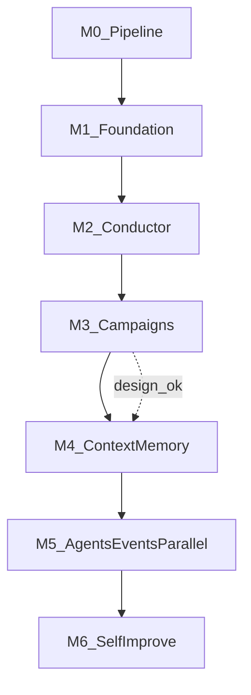

# Research OS — Execution Plan

Back to [README.md](README.md) (roadmap) · [architecture.md](architecture.md).

**Purpose:** Ops view of **sequence vs parallel** — not a second architecture doc.
Product intent and per-milestone tech live in the [roadmap README](README.md).

---

## 1. Critical path (Orchestrator)

```text
M1 Platform Foundation → M2 Conductor → M3 Campaigns
```

Until M3 merges, there is no durable goal-driven autonomy. M4–M6 deepen the OS
(context, agents/events/parallel, transfer).

---

## 2. Milestone DAG



| Edge | Rule |
|------|------|
| M1→M2→M3 | **Hard** — impl order |
| M4 after M3 | **Hard** for impl; context needs task/campaign APIs |
| M5 after M4 | **Hard** — agents need context builder |
| M6 after M5 | Prefer after events/agents; narrow transfer can start after M4 |

---

## 3. Within M1 parallelism

```text
plan-1 artifacts → (plan-2a tools ∥ plan-2b workspace) → plan-3 CLI strangler → plan-4 capstone
```

All on branch `research-os-m1-foundation`.

---

## 4. Must not parallelize (impl)

| Forbidden | Why |
|-----------|-----|
| M2 before M1 | No stable artifacts/tools/workspace |
| M3 before M2 | No durable queue / decisions |
| M5 before M4 | Blind specialists |
| Full bus before M2 log | Need append-only log first |
| Temporal/Ray/Qdrant/Kuzu before the milestone that needs them | Stack co-evolves with roadmap |

---

## 5. Branch / PR order

| Branch | After |
|--------|-------|
| `research-os-design` | Docs anytime |
| `research-os-m1-foundation` | Design agreed + V1 base |
| `research-os-m2-conductor` | M1 merged |
| `research-os-m3-campaigns` | M2 merged |
| `research-os-m4-context` | M3 merged |
| `research-os-m5-agents` | M4 merged |
| `research-os-m6-transfer-memory` | M5 preferred |

---

## 6. Parallel design (allowed)

Author all design satellites + stubs on `research-os-design` in one pass.
**Implementation** remains one branch per milestone.
