# LabPilot Architecture

## Overview

LabPilot is a **plan-driven research OS** (Version 1 kernel). System of record for
execution:

```bash
research analyze <slug>
research plan create <slug> --baseline   # or --hypothesis H-xxx
research run --plan P-001 --competition <slug>
research resume --execution E-001 --competition <slug>
```

**Docs split:** this file lives under the **research-pipeline** tree. Evolution toward
a Conductor-led Research OS is designed in
[../research-os/](../research-os/) ([architecture](../research-os/architecture.md),
[execution plan](../research-os/execution-plan.md)). V1 stays the kernel; OS milestones
change orchestration via Strangler Fig — they do not discard Analyzer / Planner /
Engineer / Reflection.

Prefer a **client-owned competition workspace** (`research init` → `cd ~/kaggle/<slug>`)
so artifacts stay out of the LabPilot clone. Design:
[design/competition-workspace.md](design/competition-workspace.md).

The Research Engineer walks an approved ResearchPlan via stable capabilities
(workspace, code, review, verify, runtime, train, eval, submit, report) under
`research_engine/execution/`. Artifacts land in the competition workspace root
(`pipeline/`, `data/`, …) or legacy `competitions/<slug>/`, plus
`knowledge/<slug>/research/`.

The historical linear Pipeline (`build` / `improve`, and the old Pipeline-era
`research init`) has been **removed**. The current `research init` scaffolds a
competition workspace only — see
[milestones/research-engineer/pipeline-deprecation.md](milestones/research-engineer/pipeline-deprecation.md).

This document covers **current-state** design. History lives under
[milestones/](milestones/); start at [MILESTONES.md](MILESTONES.md).

**Operator docs:** [CLI.md](CLI.md), [SOP.md](SOP.md).
**Workspace design:** [design/competition-workspace.md](design/competition-workspace.md).
**Causal learning:** [design/evidence-card.md](design/evidence-card.md),
[design/research-graph.md](design/research-graph.md).

### Post-run learning (Evidence Card → Research Graph)

```mermaid
flowchart TD
  artifacts[Artifacts techniques] --> hyps[Hypotheses]
  hyps --> run[Plan run treatment E]
  run --> metrics[Rich metrics]
  metrics --> compare[COMPARE vs control E]
  compare --> card[Evidence Card]
  card --> graph[Research Graph edges]
  card --> beliefs[Beliefs confidence]
  card --> claims[Claims confidence]
  graph --> query[Graph query for planner]
  beliefs --> artifacts
  query --> hyps
```

Canonical evidenced path:

```text
Technique --supports--> Claim --used_in--> Hypothesis
  --executed_as--> Execution --produced--> Evidence Card --updates--> Belief
```

COMPARE is parent-vs-child (not score-only). See [design/evidence-card.md](design/evidence-card.md).

---

## Execution Flow (Research Engineer)

```mermaid
flowchart LR
    Analyze[research analyze]
    Plan[plan create]
    Eng[Research Engineer]
    WS[Workspace]
    Code[Code Engineering]
    Ver[Verification]
    Train[Training]
    Eval[Evaluation]
    Sub[Submission]
    Rep[Reporting]

    Analyze --> Plan --> Eng
    Eng --> WS --> Code --> Ver --> Train --> Eval --> Sub --> Rep
```



| Capability | Typical TaskTypes | Outputs |
|------------|-------------------|---------|
| Workspace | `prepare_workspace` | `competitions/<slug>/` dirs, data, `profile.json`, `competition.json` |
| Code Engineering | `write_code` / `modify_config` | `pipeline/`, `baseline_choice.json` |
| Verification | `run_unit_test` / `run_smoke_test` | smoke gate |
| Training | `run_training` | metrics / models |
| Evaluation | `evaluate` / `compare` | `metrics.json`, experiments row |
| Submission | `build_submission` | `artifacts/submission.csv` (+ upload if `--submit`) |
| Reporting | `reflect` / `generate_report` | knowledge reports |

Historical `runs/<run_id>/` manifests remain readable via `research status` /
`research report` for older artifacts (`experiments/manifest.py`).

---

## Run Artifact Layout

Every run writes to `runs/<run_id>/`:

```
runs/<run_id>/
├── manifest.json              # Stage status, timestamps, errors, lineage metadata
├── config.json                # Snapshot of the AppConfig used for this run (secrets excluded)
├── competition.json           # Parsed competition metadata
├── data/
│   ├── raw/                   # Downloaded competition files
│   └── processed/             # Reserved for future preprocessing
├── profile.json               # Structured dataset profile
├── profile.md                 # Human-readable profile
├── brief.md                   # AI-generated research brief
├── baseline_choice.json       # Selected template + target/id columns
├── training_overrides.json    # (child runs) model_params + feature recipes
├── improvement_plan.json      # (child runs) structured improvement plan
├── pipeline/                  # Generated training code
│   ├── train.py
│   └── config.yaml
├── models/                    # Trained fold models
├── oof.csv                    # Out-of-fold predictions
├── metrics.json               # CV scores
├── submission.csv             # Kaggle submission file
├── kernel/                    # (kernel-only comps) exported notebook
├── submission_result.json     # Upload result + LB score
├── training.log               # Subprocess stdout/stderr
├── experiment/
│   └── record.json            # Params, metrics, artifact paths
└── reflection.json            # Structured reflection (Milestone 2, Plan 4)
└── reflection.md              # Markdown view of reflection.json + submission links
└── report.html                # Standalone HTML report (brief + reflection + metrics)
```

Run IDs follow the pattern `{timestamp}-{competition-slug}` (e.g. `20260711-143022-<slug>`).

**Child run lineage** (set by `research improve`) lives in `manifest.json` metadata:

| Field | Meaning |
|-------|---------|
| `parent_run_id` | Run this iteration forked from |
| `iteration` | Parent iteration + 1 (root runs default to `0`) |
| `improvement_strategy` | `auto`, `tune`, or `features` |
| `git_commit` | Best-effort `git rev-parse HEAD` at run start; `None` outside a git checkout |
| `hypothesis_id` | Optional link to `knowledge/<slug>/hypotheses/H-NNN.json` (Plan 2) |

Child improves also write `comparison.json` + `comparison.md` (Plan 3) whenever both
parent and child can be assembled — even if a later pipeline stage fails.

See [milestones/experiment-scientist/plan-1-experiment-graph.md](milestones/experiment-scientist/plan-1-experiment-graph.md)
for how `config.json`/`git_commit` and the parent/child graph are assembled into a read-side
`Experiment` model, viewable via `research experiments graph`/`research experiments show`.

---

## Module Catalog

### 1. CLI / Orchestrator

| | |
|---|---|
| **Path** | `cli/main.py`, `experiments/manifest.py` |
| **Responsibility** | Entry point, stage sequencing, run state |
| **Input** | `--competition`, config file |
| **Output** | `manifest.json`, stage logs |
| **Status** | Implemented |

Commands:

- `research run --competition <slug>` — full pipeline
- `research init --competition <slug>` / `research build --run-id <id>` — two-step workflow
- `research resume --run-id <id>` — resume failed/incomplete stages
- `research improve --run-id <parent>` — fork + plan + retrain (P3)
- `research runs diff --base <a> --compare <b>` — cross-run experiment comparison (P3)
- `research run --competition <slug> --submit` — full pipeline plus Kaggle upload
- `research status --run-id <id>` — inspect stage progress
- `research list-runs` — list all runs
- `research experiments graph --competition <slug>` / `research experiments show <run_id>` — experiment lineage graph (Milestone 2)
- `research experiments compare <base> <compare>` — categorized A/B comparison + verdict (Milestone 2)
- `research experiments knowledge list --competition <slug>` — accumulated technique knowledge (Milestone 2)
- `research experiments rank --competition <slug>` — ranked hypothesis backlog (Milestone 2)
- `research experiments search --competition <slug> [filters]` — filter experiments (Milestone 2)
- `research experiments report|dashboard --competition <slug>` — competition rollup (Milestone 2)
- `research hypothesize <slug>|list|show|update` — generate and manage structured hypotheses under `knowledge/` (Milestone 2–3)
- `research doctor` — environment diagnostics

### 2. Competition Parser

| | |
|---|---|
| **Path** | `research_engine/intelligence/competition/parser.py`, `…/models.py` |
| **Responsibility** | Fetch and structure competition metadata |
| **Input** | Competition slug |
| **Output** | `competition.json` (`CompetitionSpec`) |
| **Status** | Implemented via a local, per-competition contract at `configs/competitions/<slug>.yaml` |

`CompetitionSpec` fields include `slug`, `title`, `evaluation_metric`, `problem_type`,
`submission_columns`, URLs, deadline, and tags. Competitions without a local contract
file fail clearly in P0. See `configs/competitions/README.md` for the schema; long
term this should be resolved automatically from the Kaggle URL/slug instead of a
locally authored file.

### 3. Data Manager

| | |
|---|---|
| **Path** | `accessor/data/downloader.py`, `accessor/data/layout.py` |
| **Responsibility** | Download and organize competition datasets |
| **Input** | Competition slug, Kaggle credentials |
| **Output** | `data/raw/`, `data/processed/` |
| **Status** | Implemented through the official Kaggle API |

### 4. Dataset Profiler

| | |
|---|---|
| **Path** | `accessor/profiler/tabular.py`, `accessor/profiler/report.py` |
| **Responsibility** | Schema, stats, distributions, target/id detection |
| **Input** | `data/raw/` paths |
| **Output** | `profile.json`, `profile.md` |
| **Status** | Implemented for one train, test, and sample-submission CSV |

`DatasetProfile` records file roles, train/test row counts, column profiles,
`target_column`, `id_column`, and the expected submission columns.

### 5. Research Brief Generator

| | |
|---|---|
| **Path** | `research_engine/intelligence/brief/generator.py`, `research_engine/intelligence/brief/prompts/` |
| **Responsibility** | AI problem framing, risks, strategy |
| **Input** | `CompetitionSpec` + `DatasetProfile` |
| **Output** | `brief.md` |
| **Status** | Implemented — OpenAI or Gemini via `llm/client.py`; falls back to template text if no key/package/call succeeds |

### 6. Baseline Selector

| | |
|---|---|
| **Path** | `research_engine/execution/baseline/selector.py`, `…/baseline/registry.py` |
| **Responsibility** | Map problem type to template |
| **Input** | `CompetitionSpec` + `DatasetProfile` |
| **Output** | `baseline_choice.json` |
| **Status** | Implemented — rule-based, defaults to tabular classification |

Selection rules use competition `problem_type` when known, otherwise infer from target column dtype.

### 7. Code Generator

| | |
|---|---|
| **Path** | `research_engine/execution/capabilities/code_engineering/offline_codegen/renderer.py`, `…/validators.py` |
| **Responsibility** | Render training pipeline from Jinja2 templates |
| **Input** | `BaselineChoice`, training config, optional `TrainingOverrides` |
| **Output** | `pipeline/train.py`, `pipeline/config.yaml` |
| **Status** | Implemented |

Templates live in `capabilities/code_engineering/templates/` (Jinja offline scaffolds). The renderer passes `data_dir`, `output_dir`, `cv_folds`, `random_seed`, `model_params`, and `feature_recipes` as template context. Tabular templates read `MODEL_PARAMS` for LightGBM and optionally inject target-encoding / log1p recipe blocks.

### 8. Trainer

| | |
|---|---|
| **Path** | `research_engine/execution/training/runner.py`, `…/training/artifacts.py` |
| **Responsibility** | Execute generated pipeline as subprocess |
| **Input** | `pipeline/train.py` |
| **Output** | `models/`, `oof.csv`, `metrics.json`, `training.log` |
| **Status** | Implemented with fold-fitted preprocessing and serialized models |

### 9. Evaluator

| | |
|---|---|
| **Path** | `research_engine/execution/metrics.py` |
| **Responsibility** | CV metrics aligned to competition metric |
| **Input** | OOF predictions, metric spec |
| **Output** | `metrics.json` |
| **Status** | Validates the metric artifact produced by training |

Supported metrics: AUC, log loss, accuracy, RMSE.

### 10. Submission Generator

| | |
|---|---|
| **Path** | `research_engine/execution/submission/formatter.py`, `…/validator.py` |
| **Responsibility** | Format and validate submission file |
| **Input** | Predictions, id/target columns |
| **Output** | `submission.csv` |
| **Status** | Validates schema, row count, nulls, and integer labels |

### 11. Kaggle Client

| | |
|---|---|
| **Path** | `accessor/kaggle/client.py` |
| **Responsibility** | Upload submission, fetch score |
| **Input** | `submission.csv`, competition slug |
| **Output** | `submission_result.json` |
| **Status** | Implemented; upload requires explicit `--submit` |

### 12. Experiment Tracker

| | |
|---|---|
| **Path** | `experiments/logger.py`, `experiments/store.py`, `experiments/index.py` |
| **Responsibility** | Log params, metrics, artifact paths; compare runs across the runs directory |
| **Input** | Run context |
| **Output** | `experiment/record.json`; diff reports via CLI |
| **Status** | Implemented — local JSON store + cross-run index (P3) |

`ExperimentLogger` writes per-run records. `experiments/index.py` scans `runs/*/experiment/record.json` and manifest metadata to build a lightweight index and compute metric/param deltas for `research runs diff`.

### 13. Reflection Generator

| | |
|---|---|
| **Path** | `reflection/generator.py`, `reflection/prompts/`, `llm/json_utils.py` |
| **Responsibility** | Structured post-mortem (`StructuredReflection`) + markdown view; optional hypothesis side effects |
| **Input** | Experiment (+ parent), best-effort `ExperimentComparison`, tagged `Hypothesis`, profile/metrics/submission/brief |
| **Output** | `reflection.json`, `reflection.md` |
| **Status** | Implemented — LLM JSON via `llm/client.py` + `parse_json_object`; template fallback if no key/package/call/parse succeeds |

See [milestones/experiment-scientist/plan-4-reflection-engine.md](milestones/experiment-scientist/plan-4-reflection-engine.md).
`Experiment.reflection` is loaded from `reflection.json` at assemble time (Plan 4).

### 14. HTML Report Generator

| | |
|---|---|
| **Path** | `report/generator.py`, `report/templates/report.html.j2` |
| **Responsibility** | Standalone HTML report bundling brief, profile, metrics, reflection, and stage status |
| **Input** | Run directory artifacts + `manifest.json` |
| **Output** | `report.html` |
| **Status** | Implemented — pipeline stage `write_report` and `research report --run-id` |

### 15. Improvement Loop

| | |
|---|---|
| **Path** | `improvement/fork.py`, `improvement/planner.py`, `improvement/models.py`, `improvement/tuner.py`, `improvement/recipes.py` |
| **Responsibility** | Fork completed runs, plan improvements, apply tuning/recipes, record lineage |
| **Input** | Completed parent run dir, `--strategy` (`auto` \| `tune` \| `features`) |
| **Output** | Child run dir, `improvement_plan.json`, `training_overrides.json` |
| **Status** | Implemented (tabular-first) |

| Component | Role |
|-----------|------|
| `fork.py` | Copy init artifacts; pre-complete stages through `select_baseline`; write lineage metadata |
| `planner.py` | LLM JSON plan from reflection + metrics (fallback: tune); deterministic tune/features paths |
| `models.py` | `ImprovementPlan`, `TrainingOverrides`, persistence helpers |
| `tuner.py` | Small LightGBM grid (`learning_rate`, `num_leaves`, `n_estimators`, ≤12 combos) |
| `recipes.py` | Predefined tabular recipes: `target_encoding`, `log_numeric` |

`Pipeline.improve()` is CLI orchestration over existing stages — no new pipeline stage in `configs/default.yaml`.

### 16. Experiment Graph (Milestone 2, Plan 1)

| | |
|---|---|
| **Path** | `experiments/models.py`, `experiments/graph.py` |
| **Responsibility** | Assemble a read-side `Experiment` model per run from existing artifacts, and the parent/child graph across a competition's runs |
| **Input** | `runs/<id>/` (manifest, `config.json`, `baseline_choice.json`, `improvement_plan.json`, metrics, artifacts) |
| **Output** | `Experiment`, `ExperimentGraph` (in-memory; nothing new written to disk) |
| **Status** | Implemented |

Not a new writer — every field is either already written elsewhere (`manifest.json`,
`config.json`, `baseline_choice.json`, ...) or computed at read time (`progress`, `description`,
`artifacts`, `runtime_seconds`). `experiments/index.py:scan_runs()` reuses `assemble_experiment()`
instead of its own directory walk. See
[milestones/experiment-scientist/plan-1-experiment-graph.md](milestones/experiment-scientist/plan-1-experiment-graph.md)
for the full design.

Commands: `research experiments graph --competition <slug> [--metric <key>]` (ASCII lineage
tree), `research experiments show <run_id> [--format table|json]` (single-experiment detail view).

### 17. Structured Hypothesis (Milestone 2, Plan 2)

| | |
|---|---|
| **Path** | `experiments/models.py` (`Hypothesis`), `experiments/hypothesis.py` |
| **Responsibility** | Per-competition hypothesis CRUD under `knowledge/`, link runs via `manifest.metadata["hypothesis_id"]`, derive linked experiments from the graph |
| **Input** | CLI authoring; optional `--hypothesis` on `run`/`improve` |
| **Output** | `knowledge/<slug>/hypotheses/H-NNN.json`; `hypothesis_id` in run manifests |
| **Status** | Implemented |

One file per hypothesis. Attaching a hypothesis to a run auto-transitions `proposed` →
`testing`. Status updates with `--evidence-run` append to `evidence_for` (`confirmed`) or
`evidence_against` (`rejected`). `Experiment.description` prefers `hypothesis.prediction`
when the link resolves. See
[milestones/experiment-scientist/plan-2-hypothesis.md](milestones/experiment-scientist/plan-2-hypothesis.md).

Commands: `research hypothesize <slug>` to generate, and `research hypothesize
list|show|update` (all require `--competition`) to manage, plus `--hypothesis H-NNN` on
`research run` / `research improve`.

### 18. Automatic Comparator (Milestone 2, Plan 3)

| | |
|---|---|
| **Path** | `experiments/models.py` (`ExperimentComparison`), `experiments/comparator.py` |
| **Responsibility** | Deterministic A/B comparison: categorized config changes, metric/runtime deltas, threshold verdict; persist `comparison.json`/`.md` on improve |
| **Input** | Two assembled `Experiment`s (+ comparator thresholds from config) |
| **Output** | `runs/<child>/comparison.json`, `comparison.md`; CLI `research experiments compare` |
| **Status** | Implemented |

No LLM. Verdicts: `worth_keeping` / `not_worth_keeping` / `regression` / `inconclusive`.
`research runs diff` is unchanged for callers — it reuses comparator metric deltas under the
hood while keeping its legacy `RunDiff` shape. See
[milestones/experiment-scientist/plan-3-comparator.md](milestones/experiment-scientist/plan-3-comparator.md).

### 19. Structured Reflection (Milestone 2, Plan 4)

| | |
|---|---|
| **Path** | `experiments/models.py` (`StructuredReflection`), `reflection/generator.py` |
| **Responsibility** | LLM structured reflection; update tagged hypothesis; propose new drafts under `knowledge/` |
| **Input** | Run artifacts + Plan 1–3 context |
| **Output** | `reflection.json`/`.md`; optional hypothesis store side effects |
| **Status** | Implemented |

Markdown is a deterministic view of the JSON (not a second independent LLM call). Side effects
run only for successful LLM generations when comparison context is healthy (roots always;
children need a comparison). Cap: `experiments.reflection.max_new_hypotheses` (default 3).

### 20. Knowledge Base (Milestone 2, Plan 5)

| | |
|---|---|
| **Path** | `experiments/models.py` (`KnowledgeEntry`), `experiments/knowledge.py` |
| **Responsibility** | Accumulate technique×metric effects from comparisons (+ optional UNKNOWN from reflection tags) |
| **Input** | `ExperimentComparison` after improve; `StructuredReflection.new_hypotheses[].tags` |
| **Output** | `knowledge/<slug>/knowledge_base.json`; CLI `research experiments knowledge list` |
| **Status** | Implemented |

Keyed by `(technique, metric_key)`. Technique names come from field/recipe short names.
Comparator updates use signed primary-metric deltas; reflection adds UNKNOWN entries (confidence
≤ 0.4) only when that technique is not already corroborated. See
[milestones/experiment-scientist/plan-5-knowledge-base.md](milestones/experiment-scientist/plan-5-knowledge-base.md).

### 21. Experiment Ranking (Milestone 2, Plan 6)

| | |
|---|---|
| **Path** | `experiments/models.py` (`RankedCandidate`), `experiments/ranking.py` |
| **Responsibility** | Deterministic scoring of proposed hypotheses (recommendation backlog) |
| **Input** | Hypothesis store + knowledge base + graph artifacts |
| **Output** | CLI `research experiments rank` |
| **Status** | Implemented |

### 22. Experiment Search (Milestone 2, Plan 7)

| | |
|---|---|
| **Path** | `experiments/search.py` |
| **Responsibility** | Composable AND filters over the experiment graph (+ comparisons) |
| **Input** | `ExperimentGraph`, optional `comparison.json` files |
| **Output** | CLI `research experiments search` |
| **Status** | Implemented |

### 23. Experiment Dashboard & Report (Milestone 2, Plan 8)

| | |
|---|---|
| **Path** | `experiments/models.py` (`ExperimentReport`), `experiments/report.py`, `report/templates/experiments_dashboard.html.j2` |
| **Responsibility** | Competition rollup (terminal + static HTML) composing graph, KB, ranking |
| **Input** | Plans 1/5/6 (+ comparison links for dashboard rows) |
| **Output** | CLI `research experiments report`, `research experiments dashboard` → `knowledge/<slug>/dashboard.html` |
| **Status** | Implemented |

The whole `knowledge/` directory remains gitignored (local research memory, like `runs/`).
Dashboard is regenerated on demand. Per-run `report.html` links to the competition dashboard
when that file exists; dashboard rows link back to per-run reports and `comparison.md`.

### 24. Research Intelligence (Milestone 3)

| | |
|---|---|
| **Path** | `research_engine/intelligence/` |
| **Responsibility** | Understand the problem before experimentation |
| **CLI** | `research analyze`, `research fetch`, `research ingest`, `research retrieve`, `research hypothesize` |
| **Status** | Implemented (Phase 1) |

`research analyze` is the “understand the problem” command. It produces six products:

| Product | Durable home |
|---------|--------------|
| Competition artifact | `knowledge.db` + `reports/analyze.json` |
| Dataset artifact | `knowledge.db` + `reports/analyze.json` (default analyzer) |
| Research artifacts (papers, repos, experiments, …) | `knowledge.db` + `reports/analyze.json` |
| Beliefs | `knowledge.db` (Knowledge Hub) |
| Hypotheses | `hypotheses/H-*.json` + `knowledge.db` |
| Research Brief | `reports/research_brief.md` + `analyze.json` → `research_brief` |

Flow: analyzers → optional `--fetch-kaggle` (kernels votes×5 + score×5 + discussions×5) →
upsert **all** analyzer artifacts (including `DATASET` and `EXPERIMENT`) → Knowledge Hub →
Hypothesis Assistant → Research Brief. Kernels/discussions default to `research fetch`;
analyze only pulls them when `--fetch-kaggle` is set.

Design detail: [milestones/research-intelligence/README.md](milestones/research-intelligence/README.md).

### Research Planner

| | |
|---|---|
| **Path** | `research_engine/planner/` (+ shared `labpilot.accessor`) |
| **Responsibility** | Hypothesis → planning compiler → durable task DAG (plan-only) |
| **CLI** | `research plan create` / `show` / `list` |
| **Status** | MVP shipped (Plans 1–6) |

Compiler (not multi-agent): deterministic retrieve/context/template → optional one-shot
Planning Engine LLM revision → validate/schedule → `PlanStore` + derived `plans/*.json|md`.
Never writes code, mutates configs, or creates `runs/`. Design:
[milestones/research-planner/README.md](milestones/research-planner/README.md).

### Research Engineer

| | |
|---|---|
| **Path** | `research_engine/execution/` (+ shared `labpilot.accessor`) |
| **Responsibility** | Approved ResearchPlan → implemented, verified experiment (own the work) |
| **CLI (target)** | `research run --plan P-001` / `research resume --execution E-xxx` |
| **Status** | Design Phase A |

Not a thin DAG walker — an **Autonomous Research Engineer**: workspace, controlled code
engineering + research review, verification (unit + smoke gate), runtime dispatch,
train/eval/submit, evidence, recovery, reflection. One deterministic orchestrator;
stable **capabilities** (not per-task agents). Baseline path: Analyze →
`plan create --baseline` (**P-001**) → `run --plan P-001`. Design:
[milestones/research-engineer/README.md](milestones/research-engineer/README.md).

## Repository Structure

```
labpilot/
├── pyproject.toml
├── README.md
├── .env.example
├── .gitignore
│
├── src/labpilot/
│   ├── cli/                   # Typer CLI entry point
│   ├── accessor/              # Shared SQLite + Kaggle + data/profiler + common helpers
│   │   ├── kaggle/            # Kaggle API client + CompetitionMetadata + kernel exporter
│   │   ├── data/              # Download + directory layout
│   │   ├── profiler/          # Tabular EDA + profile.json helpers
│   │   └── common/            # ids, JSON-in-TEXT, Micro Agent contract
│   ├── llm/                   # Task-routed LLM (OpenAI, Gemini, Ollama) + cache/router
│   ├── improvement/           # Legacy improve path (slim/delete in Reflection Plan 9)
│   ├── experiments/           # Graph, hypotheses, comparator + logger/store/index
│   ├── research_engine/       # Intelligence + Planner + Engineer
│   │   ├── intelligence/      # analyze → knowledge → hypothesize
│   │   │   ├── competition/   # Parser + CompetitionSpec (fetch/normalize)
│   │   │   └── brief/         # ResearchBrief + legacy per-run BriefGenerator
│   │   ├── planner/           # Hypothesis / baseline → ResearchPlan DAG
│   │   └── execution/         # Research Engineer SoR (capabilities, templates,
│   │                          #   code_engineering, training, metrics, runtimes, submission)
│   ├── reflection/            # Reflection generation + prompts
│   └── config.py              # AppConfig + Settings
│
│   # (removed Pipeline + top-level kaggle/competition/brief/… — see package-layout.md)
│
├── configs/
│   ├── default.yaml           # Default pipeline + training config
│   └── competitions/
│       ├── README.md          # Contract schema; files below are not committed
│       └── <slug>.yaml        # Created locally per competition, git-ignored
│
├── tests/
│   ├── unit/
│   └── integration/           # Mocked end-to-end pipeline run
│
└── docs/
    ├── ARCHITECTURE.md        # This file — current-state module/pipeline reference only
    ├── MILESTONES.md          # Roadmap index
    └── milestones/
        ├── COMPLETED.md       # Shipped milestones (P0–P4) + per-milestone architecture changes
        ├── IN-PROGRESS.md     # Active work (Research Engineer Design A)
        ├── TODO.md            # Post-1.0 planned
        ├── backlog.md         # Unscheduled future work
        ├── experiment-scientist/   # Experiment Scientist — shipped
        ├── research-intelligence/  # Research Intelligence — Phase 1 shipped
        ├── research-planner/       # Research Planner — MVP shipped (Plans 1–6)
        └── research-engineer/      # Research Engineer — Design Phase A
```

---

## Configuration

Configuration merges two sources:

1. **YAML file** (`configs/default.yaml`) — training/profiler limits, LLM mode/tasks/models
2. **Environment variables** (`.env`) — API credentials and optional overrides

| Variable | Purpose |
|----------|---------|
| `KAGGLE_API_TOKEN` | Preferred Kaggle API token |
| `KAGGLE_USERNAME` | Legacy Kaggle API username |
| `KAGGLE_KEY` | Legacy Kaggle API key |
| `OPENAI_API_KEY` | LLM key when cloud provider is `openai` |
| `GEMINI_API_KEY` | LLM key when cloud provider is `gemini` |
| `OLLAMA_HOST` | Override `llm.ollama_base_url` (default `http://localhost:11434`) |
| `LABPILOT_RUNS_DIR` | Override runs directory |
| `LABPILOT_LLM_MODE` | Override `llm.mode` (`auto` \| `local` \| `cloud`) |
| `LABPILOT_LLM_PROVIDER` | Override `llm.provider` (`openai` \| `gemini` \| `ollama`) |
| `LABPILOT_LLM_MODEL` | Override LLM model name |

Neither cloud keys nor Ollama are required — `resolve_llm_client()` / `LLM.generate()` soft-fail
when no provider is available (missing key/package, or Ollama down). Micro Agents and narrative
generators fall back to `rule_engine` / template text. Per-task models live under `llm.tasks`
(e.g. `planning` / `coding` / `summary`); `force_local: true` always uses Ollama for that task.
Prompt responses are cached in `.cache/llm.sqlite` when `llm.cache.enabled` is true.

`Settings` reads `.env`; `load_config()` merges environment credentials and overrides
into the YAML-backed application config. Secrets are excluded from serialized config output.

---

## Baseline Templates

Templates are Jinja2 files in `capabilities/code_engineering/templates/`, rendered into the competition workspace `pipeline/`.

| Template | Model | CV | Metric |
|----------|-------|-----|--------|
| `tabular_classification` | LightGBM classifier | StratifiedKFold (5) | Accuracy |
| `tabular_regression` | LightGBM regressor | KFold (5) | RMSE |
| `text_classification` | TF-IDF + LogisticRegression | StratifiedKFold | Accuracy / F1 |
| `image_classification` | ResNet18 + LightGBM | StratifiedKFold | AUC |
| `*_deep` | Fine-tuned DistilBERT / ResNet18 | Reduced folds on CPU | Problem-dependent |

Preprocessing in tabular templates:

- Fold-fitted ordinal encoding with unknown-category handling
- Fold-fitted numeric median and categorical most-frequent imputation
- Optional P3 recipes: target encoding (high-cardinality categoricals), log1p (skewed numerics)
- Hyperparameters from `training_overrides.json` → `MODEL_PARAMS` in generated code

Templates are executed as a subprocess with `cwd=pipeline/`. Paths to `data/raw/` and the run output directory are injected at render time.

---

## Tech Stack

| Layer | Choice | Rationale |
|-------|--------|-----------|
| Language | Python 3.11+ | Kaggle ecosystem |
| CLI | Typer | Typed, simple |
| Schemas | Pydantic v2 | Module contracts |
| Templates | Jinja2 | Baseline codegen |
| ML | LightGBM + scikit-learn | Fast tabular baselines |
| LLM | OpenAI, Gemini, or local Ollama | Optional; task-routed via `labpilot.llm`; soft-fails to templates |
| Kaggle | `kaggle` Python API | Download + submit |
| Tracking | Local JSON (P0) | No MLflow dependency |
| Testing | pytest | Per-module + integration |
| Linting | ruff | Fast Python linter |

### Optional dependency extras

Defined in `pyproject.toml` — not required for tabular-only runs. Install with
`uv sync --extra <name>` (see [README.md](../../README.md#optional-installs) for full details).

| Extra | Packages | Purpose |
|-------|----------|---------|
| `llm` | `openai`, `google-genai` | AI-generated `brief.md` / `reflection.md` |
| `image` | `torch`, `torchvision`, `pillow` | Lightweight `image_classification` baseline |
| `deep` | above + `transformers` | Opt-in `*_deep` transfer-learning templates |
| `dev` | `pytest`, `pytest-cov`, `ruff` | Local development and CI |

---

## Design Principles

1. **Linear pipeline, not agents** — fixed DAG; orchestrator calls modules in order.
2. **Artifacts over state** — every stage writes files; easy to inspect and resume.
3. **Templates over generation** — LLM optionally writes brief/reflection (falls back to template text without one); training code always comes from Jinja2 templates.
4. **Subprocess training** — generated `pipeline/` runs in isolation; failures are contained.
5. **Fail loud, log everything** — manifest records per-stage status; no silent fallbacks.
6. **One competition archetype first** — tabular proved the loop; P1 expanded to text/image; P3 adds iteration on tabular first.

---

## Module Dependency Graph

Modules depend only on artifacts from prior stages, never on in-memory shared state:

```
competition.json ──────────────────────────┐
                                           ├──► brief.md
profile.json ──────────────────────────────┤
                                           ├──► baseline_choice.json
                                           ├──► training_overrides.json (child runs)
                                           ├──► improvement_plan.json (child runs)
                                           ├──► pipeline/
                                           │         │
                                           │         ▼
                                           │    models/, oof.csv, metrics.json
                                           │         │
                                           │         ▼
                                           ├──► submission.csv
                                           │         │
                                           │         ▼
                                           └──► submission_result.json
                                                     │
                                                     ▼
                                                reflection.md
                                                     │
                                                     ▼ (research improve)
                                                child run (fork + retrain)
```

This artifact-driven design means any stage can be re-run independently once its inputs exist on disk. Child runs inherit init artifacts from the parent and only re-execute downstream stages defined in `ImprovementPlan.stages_to_run`.

---

## Looking ahead: Milestone 2 — Experiment Scientist

Everything above describes the shipped P0–P4 pipeline. The next milestone doesn't change this
pipeline — it adds a memory/reasoning layer on top of it (an `experiments/` package plus a new
per-competition `knowledge/` data directory) so that dozens or hundreds of runs accumulate into
a queryable, comparable, rankable research history instead of a flat list of directories. See
[milestones/experiment-scientist/README.md](milestones/experiment-scientist/README.md) for the full design. This
section will be expanded into the Module Catalog and Repository Structure above once
implementation begins.
