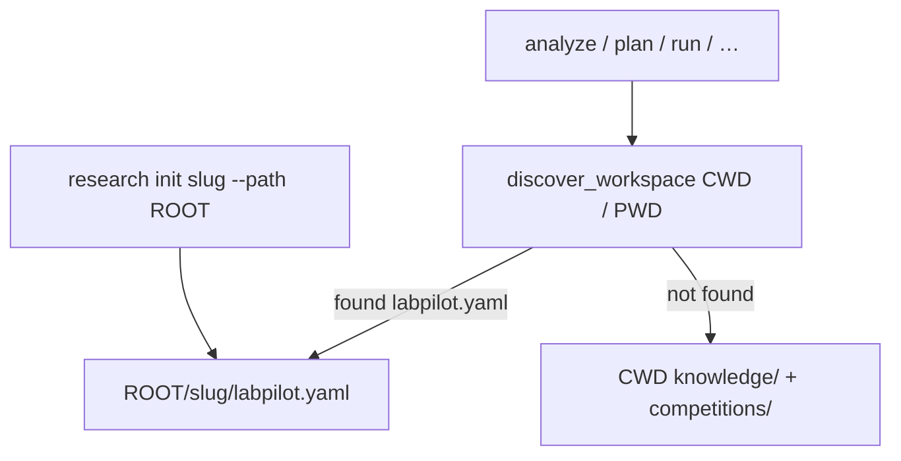

# Competition workspace design

Design reference for client-owned competition folders created by `research init`.
Operator how-to: [SOP.md](../SOP.md). Command flags: [CLI.md](../CLI.md#2-competition-workspace).

Status: **shipped (v1)**. Installable CLI packaging is deferred (see § Deferred).

---

## Problem

Running `analyze` / `plan` / `run` from the LabPilot clone wrote into the package tree:

```
labpilot/                 ← product repo (should stay clean)
  knowledge/<slug>/…
  competitions/<slug>/…   ← sibling of knowledge_dir
  runs/…                  ← legacy
  .cache/…
```

There was no project root, no `init`, and no way to treat one competition as its own folder you `cd` into.

---

## Target model

Client picks a **root path** (e.g. `~/kaggle`). LabPilot creates **one folder per competition**:

```
~/kaggle/<slug>/                    ← competition workspace (git optional)
  labpilot.yaml                     ← marker + resolved paths (SoR for discovery)
  .gitignore                        ← data/, .cache/, large artifacts, secrets
  README.md                         ← short “how to run commands here”
  configs/
    default.yaml                    ← thin overlay (paths relative to this root)
    competition.yaml                ← optional local contract (was configs/competitions/<slug>.yaml)
  knowledge/                        ← ResearchPaths root for this slug only
    <slug>/research/…               ← plans, executions, reports, knowledge.db
    hypotheses/
  pipeline/                         ← train.py, config (not under competitions/)
  data/
    raw/                            ← downloaded competition data (gitignored)
    processed/
  artifacts/                        ← submissions, smoke markers, reports copies
  logs/
  models/
  .cache/                           ← kaggle download + llm cache (gitignored)
```

### Locked defaults (v1)

- Layout is **`<root>/<slug>/`**, not a shared multi-slug `knowledge/` under root.
- Everything for that competition lives **inside** the slug folder (no sibling `competitions/` outside it).
- LabPilot **product repo** stays clean when a workspace is active.
- **Command invocation:** `uv run --project <labpilot-clone> research …` from a shell whose CWD is the competition folder. Discovery uses **shell CWD** (and shell `PWD` when tools chdir). Prefer `--project` over `--directory` — the latter changes process CWD into the clone.
- **Backward compat:** if no `labpilot.yaml` is found walking up from CWD/`PWD`, keep CWD-relative `knowledge/` + `competitions/` behavior.



---

## `research init`

```bash
# v1: from LabPilot clone (installable CLI deferred)
cd /path/to/labpilot
uv run research init <slug-or-kaggle-url> --path ~/kaggle
# prompts: Initialize git repo in ~/kaggle/<slug>? [y/N]
# flags: --git / --no-git to skip prompt
```

**Behavior**

1. Resolve slug (URL → slug, same helper analyze uses).
2. Create `Path(root) / slug` (fail if non-empty without `--force`).
3. Write `labpilot.yaml`:

```yaml
schema_version: 1
competition: rogii-wellbore-geology-prediction
created_at: …
paths:
  knowledge: knowledge          # relative to workspace root
  data: data
  pipeline: pipeline
  artifacts: artifacts
  cache: .cache
  config: configs/default.yaml
```

4. Scaffold dirs + `configs/default.yaml` overlay that only sets relative roots (inherits package/repo defaults for LLM/training via merge).
5. Write `.gitignore` (at least): `data/`, `.cache/`, `**/knowledge.db-journal`, `.env`, `models/`, `__pycache__/`, `.DS_Store`.
6. If git yes: `git init`, initial commit of scaffold (no data).
7. Print next steps: `cd <workspace>` and example commands **without** `--knowledge-dir`.

`init` does **not** download data or run analyze (keeps init fast/idempotent). Download stays on `prepare_workspace` / first `run`.

> Note: this is **not** the retired Pipeline-era `research init` (download + scaffold under the clone). See [pipeline-deprecation.md](../milestones/research-engineer/pipeline-deprecation.md).

---

## How every command works inside the workspace

### Discovery (single mechanism)

Implemented in [`src/labpilot/workspace.py`](../../../src/labpilot/workspace.py):

1. Start at CWD (or `--workspace PATH`); also try shell `PWD` when it differs (e.g. `uv run --directory`).
2. Walk parents looking for `labpilot.yaml`.
3. If found → load `CompetitionWorkspace(root, competition, paths…)`.
4. Else → legacy mode.

CLI load path:

```
load_config(--config or workspace configs/default.yaml)
  → apply Workspace path overrides (knowledge_dir, cache, …)
  → apply explicit --knowledge-dir if still passed (wins)
```

Package defaults load from the **repo** `configs/default.yaml` (not CWD), so a workspace overlay can merge cleanly.

**Credentials:** load only from the **competition workspace** `.env` (or legacy CWD `.env` when no `labpilot.yaml`). Never from the LabPilot package/repo `.env`. `research init` writes `.env.example`; on auth failure the CLI prints the setup SOP (see [SOP.md](../SOP.md) § Credentials).

### Command UX after `cd ~/kaggle/<slug>`

| Command | Inside workspace |
|---------|------------------|
| `uv run --project <labpilot> research analyze` | Slug defaulted from `labpilot.yaml`; writes under `./knowledge/` |
| `… analyze competition` / `… analyze dataset` | Same |
| `… fetch` / `… ingest` / `… hypothesize` | Same; no slug required |
| `… plan create --baseline` | Same |
| `… run --plan P-001` | Same; workspace root = this folder |
| `… resume -e E-001` | Same |
| `… hypothesize list` / `experiments rank` / … | Same discovery |

When workspace is active, positional competition / `-c` is optional and must match yaml if provided.

**v1 convenience:**

```bash
alias research='uv run --project ~/workspace/labpilot research'
```

### Path rewiring

| Legacy | Workspace mode |
|--------|----------------|
| `competition_workspace_path` = `knowledge_dir.parent / "competitions" / slug` | `workspace.root` (the slug folder itself) |
| `ResearchPaths` under `knowledge/<slug>/research` | Keep `ResearchPaths(knowledge_dir=ws/knowledge, competition=slug)` → `knowledge/<slug>/…` inside the workspace |
| `.cache/kaggle` CWD-relative | `workspace.root / ".cache" / "kaggle"` |
| `configs/competitions/<slug>.yaml` | `workspace/configs/competition.yaml` |

**Locked for v1:** collapse code workspace to the slug root (`pipeline/` / `data/` at top level). Keep `knowledge/<slug>/…` nested one level.

---

## Git policy

- Prompt on init; `--git` / `--no-git` for CI/scripts.
- Commit scaffold only.
- `.gitignore` must exclude `data/` (100GB-safe), `.cache/`, local secrets.
- Later (out of v1): `research push` / sync helpers — design note only; init just creates the repo.

---

## Doctor / help

- `research doctor` reports active workspace root + slug when discovered.
- `research init --help` documents layout and “cd then run” flow.

---

## Migration / non-goals (v1)

- **Non-goals:** globally installable packaging (see Deferred); moving existing in-repo `knowledge/` automatically; Colab/remote mounts; multi-competition monorepos under one git root.
- **Compat:** no workspace marker → current behavior.
- **Deprecation:** writing into the LabPilot clone is legacy; recommend `init` for new comps.

---

## Implementation map

| Piece | Location |
|-------|----------|
| Model + discovery + scaffold | `src/labpilot/workspace.py` |
| CLI helpers | `src/labpilot/cli/config_helpers.py` |
| `research init` | `src/labpilot/cli/init_workspace.py` + `cli/main.py` |
| Engineer code root | `competition_workspace_path()` (workspace module; used by ExecutionStore / Engineer) |
| Tests | `tests/unit/test_competition_workspace.py` |

---

## End-to-end happy path (v1)

```bash
cd /path/to/labpilot
uv run research init biohub-cell-tracking-during-development --path ~/kaggle --git
cd ~/kaggle/biohub-cell-tracking-during-development
uv run --project /path/to/labpilot research analyze
uv run --project /path/to/labpilot research plan create --baseline
uv run --project /path/to/labpilot research run --plan P-001
```

Artifacts stay under `~/kaggle/<slug>/` only.

---

## Deferred — installable CLI

Not in the v1 ship. When picked up:

- `uv tool install "labpilot[llm]"` / editable `-e ".[llm]"` so `research` is on PATH from any directory.
- Alias entry point `labpilot = "labpilot.cli.main:app"`.
- Package `configs/default.yaml` (and verify non-`.py` prompts) into the wheel; load defaults via `importlib.resources` instead of CWD-relative paths.
- Config merge: packaged defaults → workspace overlay → `--config` → env / workspace `.env`.
- Upgrade story: editable install sees code changes immediately; frozen tool install needs `uv tool upgrade` / `--reinstall`.
- `research doctor` prints install mode (`editable` vs `site-packages`) and version.
