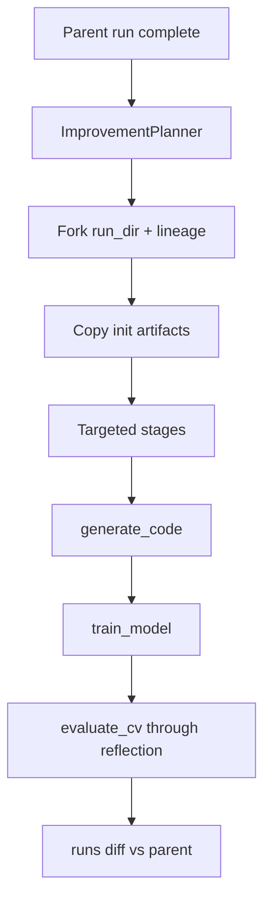

---
todos:
  - id: branch-v04
    status: completed
    content: 'Create branch cursor/research-engine-v0.4-iteration-loop from cursor/research-engine-v0.1-scaffold; update MILESTONES/IN-PROGRESS docs (P2 deferred, P3 active)'
  - id: fork-lineage
    status: completed
    content: 'Implement improvement/fork.py + manifest metadata (parent_run_id, iteration); research improve skeleton re-running generate_code→reflection'
  - id: improvement-plan
    status: completed
    content: 'Add ImprovementPlan model, planner.py (auto LLM JSON + tune fallback), persist improvement_plan.json'
  - id: template-tuning
    status: completed
    content: Parameterize tabular templates via training_overrides.json; implement improvement/tuner.py grid search for LightGBM params
  - id: feature-recipes
    status: completed
    content: 'Add improvement/recipes.py (target_encoding, log_numeric) + template hooks; --strategy features support'
  - id: runs-diff
    status: completed
    content: Extend tracking with cross-run index; add research runs diff --base/--compare CLI
  - id: smoke-docs
    status: completed
    content: Integration test + titanic/spaceship smoke; README + COMPLETED.md; bump pyproject.toml to 0.4.0
name: P3 Iteration Loop v0.4
overview: 'Skip P2 for now and deliver P3 v0.4: a `research improve` iteration loop that forks runs from reflection, applies structured improvements (hyperparameter tuning first, light feature recipes), and compares runs via an experiment diff command — all on a new `cursor/research-engine-v0.4-iteration-loop` branch.'
isProject: false
---

# P3 — v0.4 Iteration Loop

## Scope decision

- **P2 (Remote Runtime & Scheduling) is deferred** — no `configs/runtimes/`, no `--remote-train` in this milestone.
- **P3 becomes the active milestone** per [docs/milestones/TODO.md](docs/milestones/TODO.md).
- **Branch:** create `cursor/research-engine-v0.4-iteration-loop` from current `cursor/research-engine-v0.1-scaffold` (contains P1 + kernel submission work). Do not branch from `main` alone.

## North-star UX

After a completed baseline run, the user iterates without re-running init:

```bash
# Auto-plan from reflection + metrics, fork run, retrain
research improve --run-id 20260712-014250-spaceship-titanic

# Explicit tuning strategy
research improve --run-id <parent> --strategy tune --submit

# Compare parent vs child
research runs diff --base <parent> --compare <child>
```

Init artifacts (`competition.json`, `data/`, `profile.json`, `brief.md`) are **reused** from the parent run. Only downstream stages re-execute based on the improvement plan.



---

## Current gaps (what P3 must add)

| Area | Today | P3 target |
|------|-------|-----------|
| Iteration entrypoint | Only `resume` / full `build` | `research improve` forks a child run |
| Reflection | Free-text markdown ([reflection_system.md](src/labpilot/reflection/prompts/reflection_system.md)) | Structured `improvement_plan.json` driving actions |
| Hyperparameters | Hardcoded in templates (e.g. `n_estimators=300` in [tabular_classification/train.py.j2](templates/tabular_classification/train.py.j2)) | Template params from `model_params` in plan |
| Experiment tracking | Per-run `experiment/record.json` only ([store.py](src/labpilot/tracking/store.py)) | Cross-run index + diff |
| Run lineage | None in [manifest.py](src/labpilot/orchestrator/manifest.py) | `parent_run_id`, `iteration` in manifest metadata |

---

## Architecture

### 1. Run fork + lineage

New module: `src/labpilot/improvement/fork.py`

- `fork_run(parent_run_dir, runs_dir) -> (child_run_id, child_run_dir)`
- Copy (or hardlink where safe): `competition.json`, `data/`, `profile.json`, `profile.md`, `brief.md`, `baseline_choice.json` (as starting point)
- Write fresh `manifest.json` with:
  - `metadata.parent_run_id`
  - `metadata.iteration` (parent iteration + 1, default 1)
  - `metadata.improvement_strategy`
- Pre-seed manifest stages through `generate_brief` as `completed` (copied artifacts), remainder `pending`

### 2. Improvement plan model

New: `src/labpilot/improvement/models.py`

```python
class ImprovementAction(StrEnum):
    RETRAIN = "retrain"
    TUNE_HYPERPARAMS = "tune_hyperparams"
    APPLY_FEATURE_RECIPE = "apply_feature_recipe"

class ImprovementPlan(BaseModel):
    parent_run_id: str
    strategy: str  # auto | tune | features
    actions: list[ImprovementAction]
    model_params: dict[str, Any] = {}      # e.g. learning_rate, num_leaves, n_estimators
    feature_recipes: list[str] = []        # e.g. target_encoding, log_numeric
    stages_to_run: list[str] = []          # default: generate_code → write_reflection
    rationale: str = ""
```

Persist to `runs/<child>/improvement_plan.json`.

### 3. Improvement planner

New: `src/labpilot/improvement/planner.py`

Two paths (mirror brief/reflection LLM optional pattern):

| Mode | Behavior |
|------|----------|
| `--strategy tune` | Deterministic: grid/random over 2–3 LightGBM params for tabular templates |
| `--strategy auto` (default) | LLM reads `reflection.md` + metrics; outputs JSON `ImprovementPlan` (fallback: tune strategy) |

**v0.4 tuning scope (tabular only):** `learning_rate`, `num_leaves`, `n_estimators` — small grid (≤12 combos) using existing CV in generated `train.py`, not a separate AutoML framework.

**v0.4 feature scope (semi-auto):** predefined recipes in `improvement/recipes.py`, not LLM-generated arbitrary code:
- `target_encoding` — high-cardinality categoricals (uses profile cardinality from [profiler](src/labpilot/profiler/tabular.py))
- `log_numeric` — log1p on skewed numeric columns

Recipes inject Jinja2 context flags consumed by updated tabular templates.

### 4. Template + codegen changes

Minimal template parameterization (tabular classification/regression first):

- Add to [CodeRenderer context](src/labpilot/codegen/renderer.py): `model_params`, `feature_recipes`
- Update [tabular_classification/train.py.j2](templates/tabular_classification/train.py.j2) and [tabular_regression/train.py.j2](templates/tabular_regression/train.py.j2):
  - `LGBMClassifier(**MODEL_PARAMS)` where `MODEL_PARAMS` comes from rendered constants
  - Optional recipe blocks (target encoding / log transform) guarded by `feature_recipes`

Extend [BaselineChoice](src/labpilot/baseline/selector.py) or add sibling `TrainingOverrides` saved alongside `baseline_choice.json` — prefer **separate `training_overrides.json`** to avoid breaking existing runs.

### 5. Pipeline integration

Extend [Pipeline](src/labpilot/orchestrator/pipeline.py):

```python
def improve(self, parent_run_id: str, strategy: str = "auto", submit: bool = False) -> RunManifest
```

- Validates parent run is `completed`
- Calls planner → fork → writes `improvement_plan.json`
- Runs `stages_to_run` (default: `generate_code` through `write_reflection`)
- `log_experiment` records `parent_run_id`, `model_params`, `feature_recipes` in params

No new pipeline stage in `configs/default.yaml` for v0.4 — `improve` is a CLI orchestration layer over existing stages.

### 6. Experiment diff

Extend tracking:

- `src/labpilot/tracking/index.py` — scan `runs/*/experiment/record.json` + manifest metadata; build lightweight index
- `research runs diff --base <id> --compare <id>` in [cli/main.py](src/labpilot/cli/main.py)
- Output: side-by-side metrics, params delta, template/strategy changes, CV vs public score if submitted

### 7. CLI commands

Add to [cli/main.py](src/labpilot/cli/main.py):

| Command | Purpose |
|---------|---------|
| `research improve --run-id <parent>` | Fork + plan + retrain |
| `research improve --run-id <parent> --strategy tune` | Skip LLM; grid tune |
| `research improve --run-id <parent> --submit` | Pass through to upload stage |
| `research runs diff --base <a> --compare <b>` | Experiment comparison |

Reuse existing `--yes`, `--force-submit`, `--runs-dir` flags.

---

## Deliverable phases (reviewable PRs)

### P3a — Fork + lineage + improve skeleton
- `improvement/fork.py`, manifest metadata, `research improve` creates child run and copies init artifacts
- Re-runs `generate_code` → `write_reflection` with unchanged params (proves fork path)
- Unit tests: fork copies artifacts, lineage metadata, parent must be completed

### P3b — Improvement planner + structured plan
- `ImprovementPlan` model, `planner.py`, `improvement_plan.json`
- LLM JSON planner + deterministic `--strategy tune` fallback
- Reflection prompt tweak: encourage machine-readable next steps (optional section in [reflection_system.md](src/labpilot/reflection/prompts/reflection_system.md))

### P3c — Hyperparameter tuning (tabular)
- `training_overrides.json` + template parameterization
- `improvement/tuner.py` — small grid over LightGBM params
- Integration test: parent Titanic run → `improve --strategy tune` → child has different `model_params` and new `metrics.json`

### P3d — Feature recipes (tabular, semi-auto)
- `improvement/recipes.py` + template hooks for `target_encoding` / `log_numeric`
- `--strategy features` or planner action `apply_feature_recipe`

### P3e — Experiment diff + docs
- `tracking/index.py`, `research runs diff`
- Update [docs/milestones/TODO.md](docs/milestones/TODO.md) (mark P3 in progress), [IN-PROGRESS.md](docs/milestones/IN-PROGRESS.md), [COMPLETED.md](docs/milestones/COMPLETED.md) after smoke
- README section for iteration workflow
- Bump `version` in [pyproject.toml](pyproject.toml) to `0.4.0` on completion

### P3f — Smoke validation
- `spaceship-titanic` or `titanic`: baseline run → `improve --strategy tune` → verify child CV metric logged → `runs diff` shows param delta
- Document results in COMPLETED.md

---

## Explicitly out of scope (v0.4)

- P2 remote runtimes / Colab / `--remote-train`
- AutoML / neural architecture search
- LLM-generated arbitrary Python feature code
- Multi-model ensembles
- Text/image template tuning (defer to P3.1 follow-up; tabular-first)
- Kernel slug fix ([backlog.md](docs/milestones/backlog.md)) — separate small PR if needed before kernel improve tests

---

## Milestone doc updates (first PR on v0.4 branch)

- [docs/MILESTONES.md](docs/MILESTONES.md): P2 → **Deferred**; P3 → **In progress**
- [docs/milestones/IN-PROGRESS.md](docs/milestones/IN-PROGRESS.md): P3 v0.4 active
- [docs/milestones/TODO.md](docs/milestones/TODO.md): add note under P2 "deferred, superseded by P3 priority"

---

## Risk mitigations

| Risk | Mitigation |
|------|------------|
| LLM plan not parseable | Strict JSON schema + fallback to `--strategy tune` |
| Template drift breaks CV eval | Keep `metric_name` on BaselineChoice; only override model_params |
| Disk duplication on fork | Copy init artifacts only (~data dir largest); reuse parent `data/raw` via symlink optional optimization later |
| Improve on incomplete parent | Fail fast: parent manifest must be `completed` |
