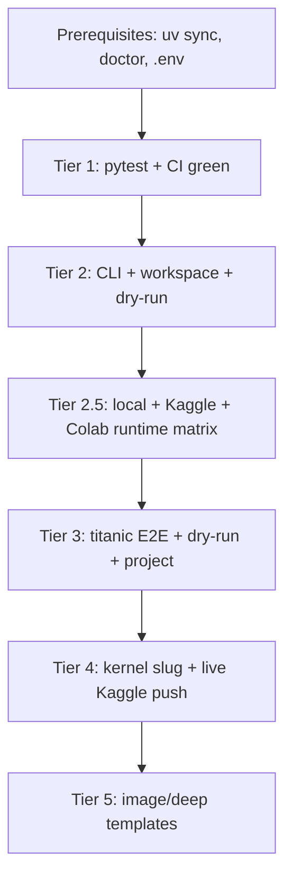

---
todos:
  - id: smoke-tier1-auto
    status: completed
    content: 'Run Tier 1 automated tests (tabular + optional llm/image/deep) and confirm CI green on PR #14'
  - id: smoke-tier2-cli
    status: completed
    content: 'Run Tier 2 CLI smokes: templates, workspace init/status, dry-run flag checks'
  - id: smoke-tier2-runtime
    status: completed
    content: 'Run Tier 2.5 runtime integration matrix: local + kaggle_kernel + google_colab register/show/doctor (credentialed via .env)'
  - id: smoke-tier3-e2e
    status: completed
    content: 'Run Tier 3 E2E: titanic full run, dry-run artifacts, project-scoped run, init/build/improve dry-run, runs diff'
  - id: smoke-tier4-kernel
    status: completed
    content: Verify Tier 4 kernel slug fix + Kaggle kernel runtime alignment (live kernel push with .env creds)
  - id: smoke-checklist
    status: completed
    content: 'Complete pass/fail checklist and post results to PR #14'
name: P4 Smoke Test Plan
overview: 'A structured smoke test plan to validate P4 v1.0 (PR #14): CI parity, new CLI commands, workspace/dry-run, **local + Kaggle + Colab runtime integration**, kernel slug fix, and regression checks — with automated and manual tiers, clear pass/fail criteria, and credentialed steps using `.env`.'
isProject: false
---
# P4 v1.0 Smoke Test Plan

Validate [PR #14](https://github.com/sadiq18/labpilot/pull/14) on branch `cursor/research-engine-v1.0-production-6ae3` before merge. Target: **~30 min automated + ~30 min manual** (excluding full Titanic train runs).

### v1.0 runtime scope (read first)

P4 ships **runtime configuration and validation**, not remote training dispatch. These smokes verify:

- All three provider types register, load, and pass `research runtime doctor`
- Kaggle credentials from `.env` flow into `kaggle_kernel` doctor checks
- Colab auth env vars flow into `google_colab` doctor checks
- Pipeline runs still **train locally** (`mode: local` in `runtime.json`) regardless of registered runtimes

These smokes do **not** expect `--remote-train` or training on Kaggle/Colab GPUs (P2 execution deferred).

---

## Prerequisites

```bash
git checkout cursor/research-engine-v1.0-production-6ae3
uv sync --extra dev
uv run research doctor          # core checks must pass
uv run research --help          # version 1.0.0 in pyproject.toml
```

| Requirement | Notes |
|-------------|-------|
| Python 3.11+ | Required |
| `libgomp` / OpenMP | LightGBM on Linux |
| **`.env` with Kaggle creds** | **Required** for runtime + E2E smokes (`KAGGLE_API_TOKEN`; also `KAGGLE_USERNAME` for kaggle_kernel doctor) |
| **Colab env (for Colab smoke pass)** | Add to `.env`: `COLAB_AUTH_TOKEN=<token>`; optional `LABPILOT_COLAB_DRIVE_FOLDER=<id>` |
| LLM keys | Optional — use `OPENAI_API_KEY= GEMINI_API_KEY=` + `--yes` to skip LLM |
| `image` / `deep` extras | Only for template-family smokes Tier 5 |

**Clean slate:** Run smokes in a temp directory or ensure no stray `project.yaml` in cwd (workspace auto-detect can change paths).

---

## Tier 1 — Automated (required gate)

Mirror [`.github/workflows/ci.yml`](.github/workflows/ci.yml). All must pass before merge.

| # | Command | Expected |
|---|---------|----------|
| 1.1 | `uv run pytest -m "not llm and not image and not deep" -q` | **116+ passed**, 0 failed |
| 1.2 | `uv sync --extra llm && uv run pytest -m llm -q` | LLM unit tests pass |
| 1.3 | `uv sync --extra image && uv run pytest -m image -q` | Image integration pass (or skip if no torch) |
| 1.4 | `uv sync --extra deep && uv run pytest -m deep -q` | Deep integration pass (or skip if no transformers) |

**P4-specific automated coverage to confirm green:**

| Area | Test file |
|------|-----------|
| Dry-run + kernel slug | [`tests/integration/test_pipeline_dry_run.py`](tests/integration/test_pipeline_dry_run.py) |
| Workspace | [`tests/unit/test_workspace.py`](tests/unit/test_workspace.py) |
| Runtimes | [`tests/unit/test_runtimes.py`](tests/unit/test_runtimes.py) |
| Text template | [`tests/integration/test_pipeline_text.py`](tests/integration/test_pipeline_text.py) |
| Image template | [`tests/integration/test_pipeline_image.py`](tests/integration/test_pipeline_image.py) |
| Deep templates | [`tests/integration/test_pipeline_text_deep.py`](tests/integration/test_pipeline_text_deep.py), [`test_pipeline_image_deep.py`](tests/integration/test_pipeline_image_deep.py) |
| Regression (tabular) | [`tests/integration/test_pipeline_titanic.py`](tests/integration/test_pipeline_titanic.py), improve/resume/init-build |

**CI on PR:** Confirm GitHub Actions tabular job green on PR #14.

---

## Tier 2 — CLI smoke (no Kaggle network)

Run from repo root. Each command should exit 0 unless noted.

### 2a — New commands exist

```bash
uv run research templates
uv run research workspace --help
uv run research runtime --help
```

**Pass:** Tables render; 6 templates listed; subcommands `init`, `status`, `list`, `show`, `register`, `doctor` visible.

### 2b — Project workspace

```bash
rm -rf /tmp/lp-project && mkdir /tmp/lp-project && cd /tmp/lp-project
uv run research workspace init --name smoke-test
uv run research workspace status
```

**Pass:** Creates `project.yaml`, `runs/`, `competitions/`, `configs/runtimes/`, `configs/default.yaml`. Status shows resolved paths and `Runs: 0`.

**Config layering spot-check:**

```bash
grep cv_folds configs/default.yaml
uv run python -c "
from labpilot.config import load_config
c = load_config(project_dir='.')
print('cv_folds', c.training.cv_folds)
print('runs_dir', c.runs_dir)
"
```

**Pass:** `runs_dir` resolves to project `runs/`; project config applied.

### 2c — Dry-run flag validation

```bash
cd /workspace   # back to repo root (no project.yaml)
OPENAI_API_KEY= GEMINI_API_KEY= \
  uv run research run --competition titanic --dry-run --yes 2>&1 | head -30
```

**Pass (with Kaggle creds):** Pipeline starts; prints dry-run banner; stops before training.

**Pass (without Kaggle creds):** Fails at download with clear auth error — still validates CLI wiring; use Tier 3 mocked path instead.

**Mutual exclusion:**

```bash
uv run research run --competition titanic --dry-run --submit 2>&1
```

**Pass:** Exits non-zero; message that `--dry-run` and `--submit` are mutually exclusive.

**Negative (P2 boundary):**

```bash
uv run research run --help | grep remote-train
```

**Pass:** `--remote-train` **not** present (execution deferred).

---

## Tier 2.5 — Runtime integration matrix (required, credentialed)

Uses [`.env`](.env) Kaggle credentials already configured. Run from repo root unless noted.

### Setup — register all three providers in project workspace

```bash
rm -rf /tmp/lp-runtime-smoke && mkdir /tmp/lp-runtime-smoke && cd /tmp/lp-runtime-smoke
uv run research workspace init --name runtime-smoke
cd /tmp/lp-runtime-smoke

# Register Kaggle + Colab runtimes (local-default already in configs/runtimes/)
uv run research runtime register --provider kaggle_kernel --id kaggle-gpu-free
uv run research runtime register --provider google_colab --id colab-pro

# Optional: copy tuned examples over scaffolds
cp /path/to/repo/configs/runtimes/examples/kaggle-gpu.yaml configs/runtimes/kaggle-gpu-free.yaml
cp /path/to/repo/configs/runtimes/examples/google-colab.yaml configs/runtimes/colab-pro.yaml
```

**Pass:** Three runtime YAML files exist under `configs/runtimes/`; `research runtime list` shows `local-default`, `kaggle-gpu-free`, `colab-pro`.

### 2.5a — Local runtime (`provider: local`)

```bash
cd /tmp/lp-runtime-smoke
uv run research runtime show --runtime local-default
uv run research runtime doctor --runtime local-default
```

**Pass:**

| Check | Expected |
|-------|----------|
| `show` | `provider: local`, `enabled: true`, no secrets |
| `doctor` exit 0 | Python executable OK |
| `doctor` | LightGBM import OK |
| Priority | `0` (fallback) |

### 2.5b — Kaggle kernel runtime (`provider: kaggle_kernel`)

Relies on [`runtimes/doctor.py`](src/labpilot/runtimes/doctor.py): `_check_kaggle_credentials()` + username from runtime YAML or `KAGGLE_USERNAME` in `.env`.

```bash
cd /tmp/lp-runtime-smoke
# Confirm .env loads (do not print token)
uv run research doctor | grep -i kaggle

uv run research runtime show --runtime kaggle-gpu-free
uv run research runtime doctor --runtime kaggle-gpu-free
```

**Pass:**

| Check | Expected |
|-------|----------|
| `research doctor` | Kaggle credentials ✔ |
| `runtime doctor` exit 0 | Kaggle credentials ✔ |
| `runtime doctor` | Kaggle username ✔ (from `.env` or set `username:` in YAML) |
| `show` | `accelerator: gpu`, `push_dir: kernel`, `slug_template` present |
| Secrets | Token never printed in `show` output |

**If username check fails:** Uncomment/set `KAGGLE_USERNAME=` in `.env` or add `username: your_kaggle_handle` to `configs/runtimes/kaggle-gpu-free.yaml`.

**Kaggle API connectivity spot-check (optional but recommended):**

```bash
cd /workspace   # repo with kaggle package
uv run python -c "
from labpilot.config import load_config
from labpilot.kaggle.client import KaggleClient
c = load_config()
client = KaggleClient(c.kaggle)
meta = client.fetch_competition_metadata('titanic')
print('kaggle_api_ok', meta is not None or True)
"
```

**Pass:** No auth exception; confirms `.env` token works beyond doctor static checks.

### 2.5c — Google Colab runtime (`provider: google_colab`)

Doctor checks env vars only (no OAuth flow in v1.0). Add to `.env` before this smoke:

```bash
# .env (add if missing)
COLAB_AUTH_TOKEN=your_colab_token_or_placeholder_for_smoke
# optional:
# LABPILOT_COLAB_DRIVE_FOLDER=your_drive_folder_id
```

```bash
cd /tmp/lp-runtime-smoke
uv run research runtime show --runtime colab-pro
uv run research runtime doctor --runtime colab-pro
```

**Pass (with token set):**

| Check | Expected |
|-------|----------|
| `show` | `runtime_type: gpu`, `auth.token_env: COLAB_AUTH_TOKEN`, `install_extras: [deep]` |
| `doctor` exit 0 | Colab auth token ✔ |
| Drive folder | ✔ if `LABPILOT_COLAB_DRIVE_FOLDER` set; skipped/warn if `drive_sync` null |

**Pass (without token — documents validation works):** `doctor` exits non-zero; prints `Set COLAB_AUTH_TOKEN in the environment.` This is an acceptable smoke outcome if you lack Colab creds, but **full matrix pass requires the token**.

### 2.5d — Doctor all runtimes at once

```bash
cd /tmp/lp-runtime-smoke
uv run research runtime doctor
```

**Pass:** Summary for all three providers; local + kaggle pass; colab pass if token configured.

### 2.5e — Default runtime config + `runtime.json` on pipeline run

Edit `/tmp/lp-runtime-smoke/project.yaml` — set `default_runtime: local-default` (default). Run a short pipeline:

```bash
cd /tmp/lp-runtime-smoke
OPENAI_API_KEY= GEMINI_API_KEY= \
  uv run research run --competition titanic --yes --project-dir .
```

**Pass:**

```bash
RUN=$(ls -t runs | head -1)
cat runs/$RUN/runtime.json
```

| Field | Expected (v1.0) |
|-------|-----------------|
| `runtime_id` | `local-default` |
| `provider` | `local` |
| `mode` | `local` (always — remote dispatch not implemented) |

**Regression:** Training still completes locally with `metrics.json` even when `kaggle-gpu-free` and `colab-pro` are registered.

### 2.5f — Runtime registry merge (project overrides global)

```bash
# Copy repo shipped local-default into project runtimes (already there after init)
# Add a custom label to project copy:
python -c "
import yaml
p = 'configs/runtimes/local-default.yaml'
d = yaml.safe_load(open(p))
d['labels'] = ['cpu', 'local', 'smoke-tested']
yaml.dump(d, open(p, 'w'))
"
uv run research runtime show --runtime local-default | grep smoke-tested
```

**Pass:** Project-local runtime YAML shadows global; merged registry reflects project file.

---

## Tier 3 — End-to-end pipeline smokes

### 3a — Legacy flat layout (regression)

From repo root, no `project.yaml`:

```bash
OPENAI_API_KEY= GEMINI_API_KEY= \
  uv run research run --competition titanic --yes
```

**Pass criteria:**

| Artifact | Check |
|----------|-------|
| `runs/<run_id>/runtime.json` | `{ "runtime_id": "local-default", "provider": "local", "mode": "local" }` |
| `runs/<run_id>/metrics.json` | Contains `cv_accuracy` |
| `runs/<run_id>/submission.csv` | Valid columns |
| `runs/<run_id>/manifest.json` | Status `completed` |

Record `<run_id>` for improve smoke.

### 3b — Dry-run full artifact check

```bash
OPENAI_API_KEY= GEMINI_API_KEY= \
  uv run research run --competition titanic --dry-run --yes
```

**Pass:**

| Artifact | Present | Absent |
|----------|---------|--------|
| `pipeline/train.py` | yes | |
| `dry_run.json` | yes (`dry_run: true`, `completed_through: generate_code`) | |
| `metrics.json` | | yes |
| `manifest.json` | `train_model` stage `skipped` | |

### 3c — Project-scoped run

```bash
cd /tmp/lp-project
OPENAI_API_KEY= GEMINI_API_KEY= \
  uv run research run --competition titanic --yes --project-dir .
```

**Pass:** Run directory under `/tmp/lp-project/runs/<run_id>/`, not repo `runs/`.

### 3d — Init / build / dry-run on build

```bash
OPENAI_API_KEY= GEMINI_API_KEY= \
  uv run research init --competition titanic --yes
# note run_id from output
uv run research build --run-id <run_id> --dry-run --yes
```

**Pass:** Init completes to `partial`; build dry-run produces `pipeline/train.py` without `metrics.json`.

### 3e — Improve + dry-run (uses parent from 3a)

```bash
OPENAI_API_KEY= GEMINI_API_KEY= \
  uv run research improve --run-id <parent_from_3a> --strategy tune --dry-run --yes
```

**Pass:** Child run forked; `improvement_plan.json` + `training_overrides.json` present; training skipped; `runtime.json` on child.

### 3f — Runs diff (regression + P3)

```bash
uv run research runs diff --base <parent> --compare <child>
```

**Pass:** Metrics table, param changes, lineage rendered without error.

---

## Tier 4 — Kernel slug fix + Kaggle kernel runtime alignment

Links **kaggle_kernel runtime config** (Tier 2.5b) to the existing kernel submit path (`export_kernel` + `--submit`). Still trains locally; push validates slug + Kaggle API integration.

### 4a — Unit (required)

Covered by Tier 1 test `test_kernel_exporter_writes_valid_slug` and `test_build_kernel_metadata_uses_username_prefix`.

Manual spot-check after a completed kernel-mode run:

```bash
uv run python -c "
import json
from pathlib import Path
# After aerial-cactus or any kernel export run:
p = sorted(Path('runs').glob('*/kernel/kernel-metadata.json'))[-1]
m = json.loads(p.read_text())
print(m['id'])
assert len(m['id']) < 60
assert 'labpilot-baseline' not in m['id'] or '/' in m['id']
"
```

**Pass:** `id` is short slug or `{username}/{slug}`; not `{competition}-labpilot-baseline` (43+ char invalid form).

### 4b — Live kernel push (required with Kaggle `.env`)

Prerequisites: Tier 2.5b passed; joined `aerial-cactus-identification` on Kaggle.

```bash
cd /workspace
OPENAI_API_KEY= GEMINI_API_KEY= \
  uv run research run --competition aerial-cactus-identification --yes --submit
```

**Pass:**

| Check | Expected |
|-------|----------|
| Kernel push | No "Invalid slug" error |
| `kernel/kernel-metadata.json` | `id` matches `{username}/<short-slug>` from Tier 4a rules |
| `runtime.json` | Still `mode: local` (train local, submit via kernel API) |
| `submission_result.json` | Status progresses past `kernel_pushed` |

Document run_id in smoke log.

---

## Tier 5 — Template family spot checks (optional extras)

Run only if extras installed; CI image/deep jobs use `continue-on-error`.

| Modality | Command | Pass |
|----------|---------|------|
| Text | `uv run pytest tests/integration/test_pipeline_text.py -q` | pass |
| Image | `uv sync --extra image && uv run pytest tests/integration/test_pipeline_image.py -q` | pass |
| Deep text | `uv sync --extra deep && uv run pytest tests/integration/test_pipeline_text_deep.py -q` | pass |
| Deep image | `uv run pytest tests/integration/test_pipeline_image_deep.py -q` | pass |

---

## Tier 6 — Regression / non-goals

Confirm deferred features do **not** accidentally appear:

| Check | Expected |
|-------|----------|
| `pip install labpilot` from PyPI | Not documented as supported; clone + `uv sync` only |
| `--remote-train` flag | Absent from CLI |
| Training on registered Kaggle/Colab runtime | Still local (`TrainingRunner`); `runtime.json` mode always `local` |
| Flat `runs/` without project | Still works (Tier 3a) |

---

## Smoke test flow (recommended order)



---

## Pass/fail checklist

Copy into PR #14 comment or smoke log:

- [ ] Tier 1.1 tabular pytest green (116+)
- [ ] Tier 1 CI tabular job green on PR
- [ ] Tier 2a `research templates` lists 6 templates
- [ ] Tier 2b workspace init/status + config merge
- [ ] Tier 2c dry-run mutual exclusion with `--submit`
- [ ] **Tier 2.5a local runtime doctor pass**
- [ ] **Tier 2.5b kaggle_kernel runtime doctor pass (`.env` creds)**
- [ ] **Tier 2.5c google_colab runtime doctor pass (`COLAB_AUTH_TOKEN` in `.env`)**
- [ ] **Tier 2.5d `research runtime doctor` all three providers**
- [ ] **Tier 2.5e pipeline `runtime.json` + local training with all runtimes registered**
- [ ] Tier 3a legacy titanic full run + `runtime.json`
- [ ] Tier 3b dry-run artifacts (`train.py` yes, `metrics.json` no)
- [ ] Tier 3c project-scoped run under project `runs/`
- [ ] Tier 3d init + build dry-run
- [ ] Tier 3e improve dry-run + lineage
- [ ] Tier 3f runs diff
- [ ] Tier 4 kernel slug unit tests pass
- [ ] **Tier 4b live Kaggle kernel push (credentialed)**
- [ ] Tier 6 no `--remote-train`; flat layout regression OK

**Optional:**
- [ ] Tier 1.3–1.4 image/deep pytest
- [ ] Tier 2.5b Kaggle API connectivity spot-check

---

## Troubleshooting

| Symptom | Likely cause | Fix |
|---------|--------------|-----|
| Runs land in wrong directory | Stray `project.yaml` in cwd | `cd` to clean dir or use explicit `--runs-dir` |
| LLM quota prompt blocks run | OpenAI 429 | Clear keys + `--yes` |
| LightGBM import fail | Missing libgomp | `apt install libgomp1` or macOS `brew install libomp` |
| Image/deep tests skip | Extra not installed | `uv sync --extra image` / `--extra deep` |
| Kaggle download fail | Not joined competition | Accept rules on Kaggle for titanic |
| `kaggle_kernel` doctor: username fail | `KAGGLE_USERNAME` unset | Set in `.env` or runtime YAML `username:` |
| `google_colab` doctor fail | `COLAB_AUTH_TOKEN` missing | Add to `.env` (config-only check; no live Colab session in v1.0) |
| Expecting remote GPU training | P2 not shipped | v1.0 only validates runtime config; `runtime.json` mode stays `local` |
