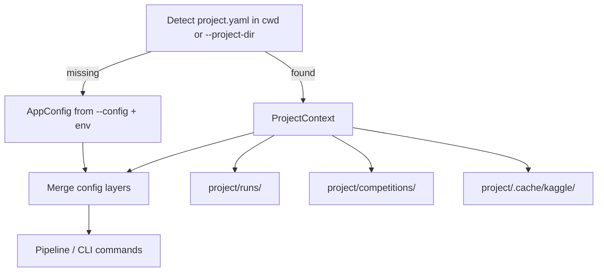

# P4 — v1.0 Production Quality

## Scope decision

| In P4 v1.0 | Out of scope (unchanged) |
|------------|--------------------------|
| CI workflow + template matrix tests | P2 remote runtimes / `--remote-train` |
| Optional project workspace | AutoML / pick-best grid search (P3.1 backlog) |
| Config layering + `--dry-run` | LLM-generated feature code, ensembles |
| Kernel slug fix (production hardening) | Text/image template tuning (P3.1) |
| Docs + bump to **1.0.0** | Async kernel watcher (backlog) |

**Already shipped (do not re-implement):** `--config`, `--submit`, `--force-submit`, `--runs-dir`, per-competition YAML ([configs/competitions/README.md](configs/competitions/README.md)).

**Branch:** `cursor/research-engine-v1.0-production` from `main` (after P3 PR #13 merges).

---

## North-star UX

Repeated competition work inside a named project, with CI confidence and safe validation:

```bash
research workspace init --name kaggle-2026
research run --competition titanic --dry-run          # validate through codegen, no train
research run --competition spaceship-titanic          # full run under project runs/
research improve --run-id <parent> --strategy tune
research runs diff --base <a> --compare <b>
```

Flat `runs/` at repo root continues to work when no `project.yaml` is detected.

---

## Current gaps (baseline)

| Area | Today | P4 target |
|------|-------|-----------|
| CI | No `.github/workflows/` | pytest on every PR; optional matrix for extras |
| Template tests | Tabular strong (8 integration tests); text/image/deep manual smoke only | Automated integration per template family |
| Workspace | Flat `runs/<run_id>/` | Optional `project.yaml` groups configs, runs, cache |
| Dry-run | Not implemented | Stop after `generate_code` + validation |
| Kernel submit | Invalid slug in [kernel/exporter.py](src/labpilot/kernel/exporter.py) | Valid `{username}/{slug}` metadata |
| Version | `0.4.0` in [pyproject.toml](pyproject.toml) | `1.0.0` |

---

## Architecture

### Project workspace (optional overlay)



**New files:**

- `src/labpilot/workspace/models.py` — `ProjectConfig` (name, runs_dir, competitions_dir, config_path)
- `src/labpilot/workspace/discover.py` — walk up from cwd for `project.yaml`; `--project-dir` override
- `project.yaml` schema (example):

```yaml
name: kaggle-2026
config: configs/default.yaml      # project-local override of global defaults
competitions_dir: competitions/
runs_dir: runs/
cache_dir: .cache/kaggle
competitions: []                  # optional registry / notes
```

**CLI additions** ([cli/main.py](src/labpilot/cli/main.py)):

| Command | Purpose |
|---------|---------|
| `research workspace init [--name]` | Create `project.yaml` + dirs |
| `research workspace status` | Show resolved paths and active competitions/runs count |

Global flag: `--project-dir` on existing commands (alternative to auto-detect).

**Config merge order** ([config.py](src/labpilot/config.py)):

1. Package default (`configs/default.yaml`)
2. Project `config` (if workspace active)
3. CLI `--config` (explicit file wins)
4. Env vars (`LABPILOT_*`, credentials)

### Dry-run mode

**Behavior:** Execute pipeline through `generate_code` + syntax validation; mark `train_model` and later stages as `skipped` with reason `dry_run`. Still downloads/profiles/briefs unless `--dry-run` scope is tightened to post-init only.

**Integration point:** [pipeline.py](src/labpilot/orchestrator/pipeline.py) — `Pipeline(dry_run=True)`; `_execute` skips stages after `generate_code`.

**CLI:** `--dry-run` on `run`, `init`, `build`, `improve` (improve: fork + plan + codegen only).

**Artifacts:** `manifest.json` status `partial`; `dry_run.json` optional summary of what would run.

---

## Deliverable phases (reviewable PRs)

### P4a — CI foundation

- Add [.github/workflows/ci.yml](.github/workflows/ci.yml):
  - `uv sync --extra dev` + `pytest` on push/PR
  - Job 1: tabular (default deps, fast)
  - Job 2: `llm` extra (mock LLM tests only)
  - Job 3 (optional/nightly or `continue-on-error`): `image` + `deep` extras with `@pytest.mark.deep` / `@pytest.mark.image`
- Add pytest markers in [pyproject.toml](pyproject.toml): `slow`, `image`, `deep`
- Document local CI parity in [README.md](README.md)

### P4b — Template integration test matrix

Extend [tests/conftest.py](tests/conftest.py) with lightweight fixtures (no live Kaggle):

| Template | New integration test | Fixture strategy |
|----------|-------------------|------------------|
| `text_classification` | `tests/integration/test_pipeline_text.py` | Small CSV with `text` column + local contract |
| `image_classification` | `tests/integration/test_pipeline_image.py` | Tiny synthetic image dir + labels CSV; skip if no `image` extra |
| `text_classification_deep` | `tests/integration/test_pipeline_text_deep.py` | `@pytest.mark.deep`; clamp epochs/samples like production |
| `image_classification_deep` | `tests/integration/test_pipeline_image_deep.py` | `@pytest.mark.deep`; minimal images |

Reuse `FakeKaggleGateway` pattern from [test_pipeline_titanic.py](tests/integration/test_pipeline_titanic.py).

Add `research templates list` (optional thin CLI) reading [baseline/registry.py](src/labpilot/baseline/registry.py) — helps users and docs.

### P4c — Project workspace

- Implement `workspace/` module + `project.yaml` discovery
- Wire `--project-dir` into `load_config()` and all pipeline commands
- `research workspace init` / `status`
- Unit tests: discovery, config merge, runs_dir resolution
- Update [ARCHITECTURE.md](docs/ARCHITECTURE.md) artifact layout for project-scoped runs

### P4d — Config layering + dry-run

- Refactor [load_config](src/labpilot/config.py) for layered merge + explicit precedence tests
- Implement `Pipeline(dry_run=True)` skip logic after `generate_code`
- Add `--dry-run` to CLI; document vs `--submit` (orthogonal)
- Integration test: dry-run produces `pipeline/train.py` but no `metrics.json`

### P4e — Production hardening + 1.0 release

**Kernel slug fix** ([backlog.md](docs/milestones/backlog.md)):

- [kernel/exporter.py](src/labpilot/kernel/exporter.py): short slugify from title; set `id` to `{username}/{slug}` when username known
- Extend [test_kernel_exporter.py](tests/unit/test_kernel_exporter.py) + [test_kaggle_kernel_submit.py](tests/unit/test_kaggle_kernel_submit.py)
- Re-smoke `aerial-cactus-identification` if credentials available (document in COMPLETED.md)

**Release:**

- Bump [pyproject.toml](pyproject.toml) to `1.0.0`
- Update [MILESTONES.md](docs/MILESTONES.md), [IN-PROGRESS.md](docs/milestones/IN-PROGRESS.md), [COMPLETED.md](docs/milestones/COMPLETED.md), [TODO.md](docs/milestones/TODO.md)
- README: project workflow, dry-run, CI badge

---

## Risk mitigations

| Risk | Mitigation |
|------|------------|
| Deep/image tests slow or flaky in CI | Markers + separate job; minimal fixtures; CPU clamps |
| Workspace breaks flat `runs/` users | Auto-detect only; no project.yaml = current behavior |
| Dry-run confusion with `--submit` | Mutually exclusive flags; clear manifest `skipped` reason |
| Kernel slug rules change on Kaggle | Unit tests with recorded error responses; short slug + username prefix |

---

## Success criteria (v1.0)

- GitHub Actions green on tabular integration suite for every PR
- Each of 6 registered templates has at least one automated integration or marked optional test
- `research workspace init` + `run` stores runs under project without breaking legacy flat layout
- `research run --dry-run` completes through codegen without training
- Kernel metadata passes Kaggle push validation (unit-tested)
- Version `1.0.0` documented in COMPLETED.md
