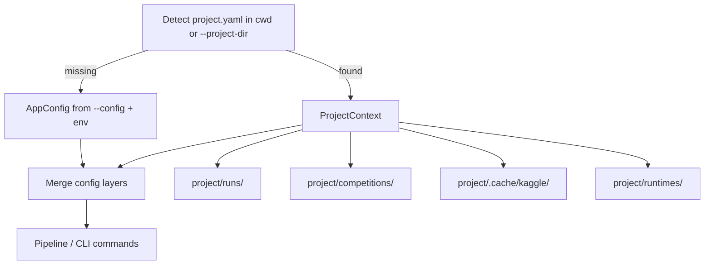
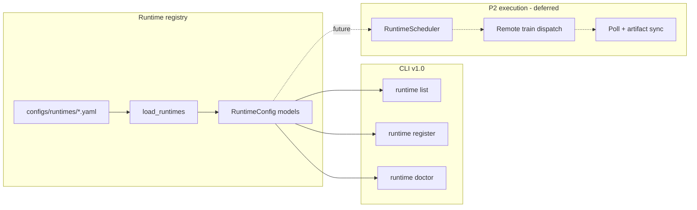

---
todos:
  - id: p4a-ci
    status: completed
    content: Add GitHub Actions CI workflow + pytest markers (tabular/llm/image/deep jobs)
  - id: p4b-template-tests
    status: completed
    content: 'Add integration tests + fixtures for text, image, and deep template families'
  - id: p4c-workspace
    status: completed
    content: 'Implement optional project workspace (project.yaml, discover, workspace init/status, --project-dir, runtimes_dir)'
  - id: p4d-dry-run
    status: completed
    content: Config layering refactor + Pipeline/CLI --dry-run through generate_code
  - id: p4f-runtime-config
    status: completed
    content: 'P2 runtime config slice: runtimes/ module, configs/runtimes/, research runtime list|show|register|doctor, runtime.json on runs'
  - id: p4e-hardening-release
    status: completed
    content: 'Kernel slug fix, milestone docs (P2 config vs execution split), README, bump to 1.0.0'
name: P4 v1.0 Production
overview: 'P4 v1.0 makes LabPilot production-ready: CI, template integration tests, optional project workspace, config layering + dry-run, P2 runtime configuration (local/Kaggle/Colab/other — config and validation only, no remote dispatch), production hardening, and 1.0.0 release.'
isProject: false
---
# P4 — v1.0 Production Quality

## Scope decision

| In P4 v1.0 | Out of scope (deferred) |
|------------|-------------------------|
| CI workflow + template matrix tests | **P2 execution:** `--remote-train`, remote job dispatch, polling, artifact sync |
| Optional project workspace | **P2 scheduling:** `RuntimeScheduler`, quota-aware runtime picking |
| Config layering + `--dry-run` | AutoML / pick-best grid search (P3.1 backlog) |
| **P2 runtime configuration** (local, Kaggle, Colab, other) | LLM-generated feature code, ensembles |
| Kernel slug fix (production hardening) | Text/image template tuning (P3.1) |
| Docs + bump to **1.0.0** | Async kernel watcher (backlog) |
| | **Packaging & PyPI** — bundle templates/configs in wheel, path resolution, `pip install labpilot` (deferred; clone + `uv sync` remains the install path for v1.0) |

**P2 split for v1.0:** Ship the **runtime registry and config layer** now so users can register and validate runtimes before remote training lands. Execution hooks (`TrainingRunner` → remote adapter, `training_job.json`, poll/resume loop) stay in a follow-up **P2 execution** milestone.

**Already shipped (do not re-implement):** `--config`, `--submit`, `--force-submit`, `--runs-dir`, per-competition YAML ([configs/competitions/README.md](configs/competitions/README.md)).

**Install path for v1.0:** Clone repo + `uv sync` (or `pip install -e .` from repo root). PyPI publish and install-from-anywhere packaging are explicitly deferred to a post-1.0 milestone.

**Branch:** `cursor/research-engine-v1.0-production` from `main` (after P3 PR #13 merges).

---

## North-star UX

Repeated competition work inside a named project, with CI confidence, safe validation, and runtime profiles ready for future remote training:

```bash
research workspace init --name kaggle-2026
research runtime list                              # show registered runtimes
research runtime register --provider kaggle_kernel # interactive or template
research runtime doctor --runtime colab-pro        # validate credentials/connectivity
research run --competition titanic --dry-run       # validate through codegen, no train
research run --competition spaceship-titanic       # trains locally (default runtime)
research improve --run-id <parent> --strategy tune
research runs diff --base <a> --compare <b>
```

**Not in v1.0:** `research build --run-id <id> --remote-train` (errors with clear "P2 execution not yet implemented" if attempted later via stub, or flag omitted entirely).

Flat `runs/` at repo root continues to work when no `project.yaml` is detected.

---

## Current gaps (baseline)

| Area | Today | P4 target |
|------|-------|-----------|
| CI | No `.github/workflows/` | pytest on every PR; optional matrix for extras |
| Template tests | Tabular strong; text/image/deep manual smoke only | Automated integration per template family |
| Workspace | Flat `runs/<run_id>/` | Optional `project.yaml` groups configs, runs, cache |
| Dry-run | Not implemented | Stop after `generate_code` + validation |
| **Runtimes** | Training always local via [TrainingRunner](src/labpilot/training/runner.py) | Registry in `configs/runtimes/` + `research runtime` CLI |
| Kernel submit | Invalid slug in [kernel/exporter.py](src/labpilot/kernel/exporter.py) | Valid `{username}/{slug}` metadata |
| Version | `0.4.0` in [pyproject.toml](pyproject.toml) | `1.0.0` |

---

## Architecture

### Project workspace (optional overlay)



**New files:**

- [src/labpilot/workspace/models.py](src/labpilot/workspace/models.py) — `ProjectConfig` (name, runs_dir, competitions_dir, config_path, **runtimes_dir**)
- [src/labpilot/workspace/discover.py](src/labpilot/workspace/discover.py) — walk up from cwd for `project.yaml`; `--project-dir` override
- `project.yaml` schema (example):

```yaml
name: kaggle-2026
config: configs/default.yaml
competitions_dir: competitions/
runs_dir: runs/
cache_dir: .cache/kaggle
runtimes_dir: runtimes/          # optional; defaults to configs/runtimes/
default_runtime: local-default   # optional override
competitions: []
```

**CLI additions** ([cli/main.py](src/labpilot/cli/main.py)):

| Command | Purpose |
|---------|---------|
| `research workspace init [--name]` | Create `project.yaml` + dirs |
| `research workspace status` | Show resolved paths and active competitions/runs count |

Global flag: `--project-dir` on existing commands.

**Config merge order** ([config.py](src/labpilot/config.py)):

1. Package default (`configs/default.yaml`)
2. Project `config` (if workspace active)
3. CLI `--config` (explicit file wins)
4. Env vars (`LABPILOT_*`, credentials)

### Runtime configuration (P2 config slice)



**New module:** `src/labpilot/runtimes/`

| File | Purpose |
|------|---------|
| `models.py` | Pydantic models: discriminated union by `provider` |
| `registry.py` | Load/merge YAML from `runtimes_dir`; built-in `local-default` |
| `doctor.py` | Provider-specific validation (credentials, paths, optional connectivity) |
| `templates.py` | Scaffolds for `register` command |

**Directory layout** (mirrors [configs/competitions/](configs/competitions/README.md) pattern):

```
configs/runtimes/
  README.md                 # schema docs + examples
  local-default.yaml        # shipped default (local subprocess)
  examples/
    kaggle-gpu.yaml         # documented example, not auto-loaded
    google-colab.yaml
```

Project workspace can override with `project/runtimes/*.yaml` (same merge: project runtimes shadow global by `id`).

**Provider schemas** (discriminated on `provider`):

**Common fields (all providers):**

- `id`, `provider`, `enabled`, `priority`, `labels` (e.g. `gpu`, `free-tier`)
- `quotas` — **config-only** in v1.0 (stored for future `RuntimeProfiler`; no enforcement)
- `artifacts` — list of paths to sync back when execution lands
- `poll` — `interval_seconds`, `timeout_seconds` (mirrors [KaggleConfig](src/labpilot/config.py) kernel poll pattern)

**`local`:**

```yaml
id: local-default
provider: local
enabled: true
priority: 0
python: null              # default: sys.executable
timeout_seconds: null
env: {}
```

**`kaggle_kernel`:**

```yaml
id: kaggle-gpu-free
provider: kaggle_kernel
enabled: true
priority: 10
labels: [gpu, free-tier]
username: null            # fallback to KaggleConfig.username
kernel_type: script
accelerator: gpu          # none | gpu | tpu
language: python
push_dir: kernel
slug_template: "{competition}-lp-{run_suffix}"
poll:
  timeout_seconds: 3600
  interval_seconds: 15
quotas:
  daily_gpu_hours: 30
  concurrent_jobs: 1
```

**`google_colab`:**

```yaml
id: colab-pro
provider: google_colab
enabled: true
priority: 20
labels: [gpu, paid]
runtime_type: gpu         # cpu | gpu | tpu
auth:
  token_env: COLAB_AUTH_TOKEN
drive_sync:
  folder_id_env: LABPILOT_COLAB_DRIVE_FOLDER
install_extras: [deep]
poll:
  timeout_seconds: 14400
  interval_seconds: 30
```

**`other` (extensibility):**

```yaml
id: ssh-box
provider: other
adapter: labpilot.runtimes.adapters.ssh:SSHAdapter  # not implemented in v1.0
host: gpu.example.com
user: lab
key_env: SSH_PRIVATE_KEY_PATH
remote_runs_dir: /data/labpilot/runs
sync_method: rsync
```

`other` provider: config validates schema; `doctor` reports adapter not installed until P2 execution.

**AppConfig extension** ([config.py](src/labpilot/config.py)):

```python
class RuntimeDefaults(BaseModel):
    runtimes_dir: Path = Path("configs/runtimes")
    default_runtime: str = "local-default"

class AppConfig(BaseModel):
    # ...existing fields...
    runtime: RuntimeDefaults = Field(default_factory=RuntimeDefaults)
```

Env override: `LABPILOT_DEFAULT_RUNTIME`, `LABPILOT_RUNTIMES_DIR`.

**CLI: `research runtime` subcommand group** ([cli/main.py](src/labpilot/cli/main.py)):

| Command | Behavior (v1.0) |
|---------|-----------------|
| `research runtime list [--enabled-only]` | Table: id, provider, enabled, priority, labels |
| `research runtime show --runtime <id>` | Resolved config (secrets redacted) |
| `research runtime register [--provider local\|kaggle_kernel\|google_colab\|other] [--id]` | Write scaffold YAML to runtimes dir |
| `research runtime doctor [--runtime <id>]` | Validate all or one; reuse patterns from [diagnostics.py](src/labpilot/diagnostics.py) |

**Doctor checks by provider:**

- `local`: Python executable exists; optional LightGBM import
- `kaggle_kernel`: Kaggle credentials (reuse `_check_kaggle_credentials`); username resolvable
- `google_colab`: token env var present; optional Drive folder env
- `other`: schema valid; warn adapter execution deferred

**Manifest hook (config-only):** When a run starts, write `runs/<id>/runtime.json` with `{ "runtime_id": "local-default", "provider": "local", "mode": "local" }` — prepares P2 execution without changing training behavior.

**Explicit v1.0 boundary:** [Pipeline._train_model](src/labpilot/orchestrator/pipeline.py) continues to use `TrainingRunner` locally. No `training_job.json`, no remote polling, no `--remote-train`.

### Dry-run mode

**Behavior:** Execute pipeline through `generate_code` + syntax validation; mark `train_model` and later stages as `skipped` with reason `dry_run`.

**Integration point:** [pipeline.py](src/labpilot/orchestrator/pipeline.py) — `Pipeline(dry_run=True)`; `_execute` skips stages after `generate_code`.

**CLI:** `--dry-run` on `run`, `init`, `build`, `improve`.

**Artifacts:** `manifest.json` status `partial`; optional `dry_run.json` summary.

---

## Deliverable phases (reviewable PRs)

### P4a — CI foundation

- Add [.github/workflows/ci.yml](.github/workflows/ci.yml): `uv sync --extra dev` + pytest; tabular / llm / image+deep jobs
- Pytest markers in [pyproject.toml](pyproject.toml): `slow`, `image`, `deep`
- Document local CI parity in [README.md](README.md)

### P4b — Template integration test matrix

Extend [tests/conftest.py](tests/conftest.py):

| Template | Test file | Notes |
|----------|-----------|-------|
| `text_classification` | `tests/integration/test_pipeline_text.py` | Small CSV + local contract |
| `image_classification` | `tests/integration/test_pipeline_image.py` | Skip if no `image` extra |
| `text_classification_deep` | `tests/integration/test_pipeline_text_deep.py` | `@pytest.mark.deep` |
| `image_classification_deep` | `tests/integration/test_pipeline_image_deep.py` | `@pytest.mark.deep` |

Optional: `research templates list` reading [baseline/registry.py](src/labpilot/baseline/registry.py).

### P4c — Project workspace

- Implement `workspace/` module + `project.yaml` discovery
- Wire `--project-dir` into `load_config()` and pipeline commands
- Include `runtimes_dir` in project resolution
- `research workspace init` / `status`
- Unit tests: discovery, config merge, runs_dir resolution

### P4d — Config layering + dry-run

- Refactor [load_config](src/labpilot/config.py) for layered merge + precedence tests
- Implement `Pipeline(dry_run=True)` skip logic after `generate_code`
- Add `--dry-run` to CLI
- Integration test: dry-run produces `pipeline/train.py` but no `metrics.json`

### P4f — Runtime configuration (P2 config slice)

- Add `src/labpilot/runtimes/` module (models, registry, doctor, templates)
- Ship [configs/runtimes/README.md](configs/runtimes/README.md) + `local-default.yaml` + `examples/`
- Extend `AppConfig` with `RuntimeDefaults`
- CLI: `research runtime list|show|register|doctor`
- Write `runtime.json` on run init (local-default)
- Unit tests: schema validation, registry merge, doctor per provider (mocked creds)
- Update [ARCHITECTURE.md](docs/ARCHITECTURE.md) with runtime registry diagram; update [TODO.md](docs/milestones/TODO.md) to split P2 into **config (done in P4)** vs **execution (deferred)**

### P4e — Production hardening + 1.0 release

**Kernel slug fix** ([backlog.md](docs/milestones/backlog.md)):

- [kernel/exporter.py](src/labpilot/kernel/exporter.py): short slugify; `id` = `{username}/{slug}`
- Extend kernel unit tests

**Release:**

- Bump [pyproject.toml](pyproject.toml) to `1.0.0`
- Update [MILESTONES.md](docs/MILESTONES.md), [IN-PROGRESS.md](docs/milestones/IN-PROGRESS.md), [COMPLETED.md](docs/milestones/COMPLETED.md), [TODO.md](docs/milestones/TODO.md), [backlog.md](docs/milestones/backlog.md)
- README: project workflow, dry-run, runtime config, CI badge (keep Quick Start as clone + `uv sync`; no PyPI install docs)
- TODO.md / backlog: add **Packaging & PyPI** as deferred post-1.0 item (bundle `templates/` + default configs, `importlib.resources` path helper, release workflow)

---

## Risk mitigations

| Risk | Mitigation |
|------|------------|
| Users expect `--remote-train` to work | Clear docs + doctor output; no flag in v1.0; TODO.md splits P2 config vs execution |
| Runtime schema churn before P2 execution | Version field in YAML (`schema_version: 1`); examples in repo, not auto-loaded |
| Colab auth complexity | Doctor checks env vars only; no OAuth flow in v1.0 |
| Deep/image tests slow in CI | Markers + separate job |
| Workspace breaks flat `runs/` | Auto-detect only; no project.yaml = current behavior |
| Users expect `pip install labpilot` | Document clone + `uv sync` only; defer PyPI until packaging fixes land |

---

## Success criteria (v1.0)

- GitHub Actions green on tabular integration suite for every PR
- Each of 6 registered templates has at least one automated integration or marked optional test
- `research workspace init` + `run` stores runs under project without breaking legacy flat layout
- `research run --dry-run` completes through codegen without training
- **`research runtime list` shows built-in `local-default`; `register` + `doctor` work for Kaggle/Colab configs**
- **`configs/runtimes/README.md` documents all four provider types**
- Kernel metadata passes Kaggle push validation (unit-tested)
- Version `1.0.0` documented in COMPLETED.md
- P2 execution (`--remote-train`, scheduler, sync) explicitly listed as next milestone in TODO.md
- Packaging & PyPI explicitly deferred in TODO.md / backlog (not a v1.0 blocker)
